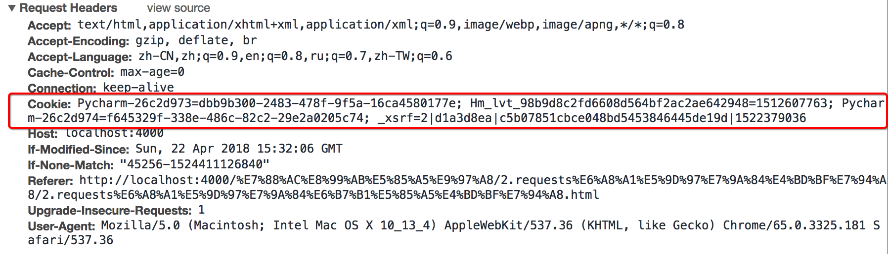
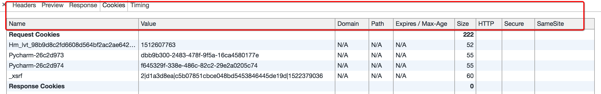
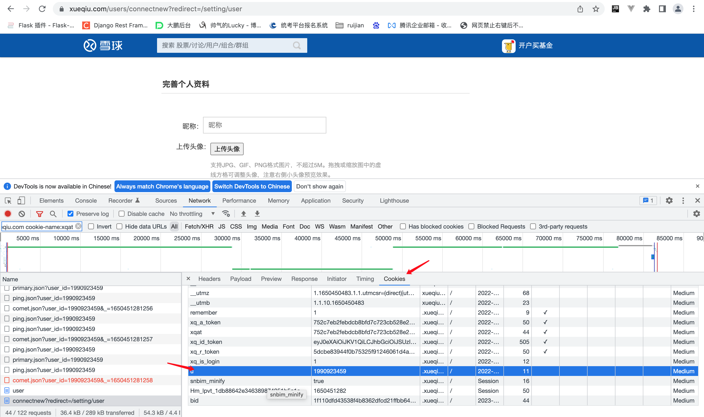
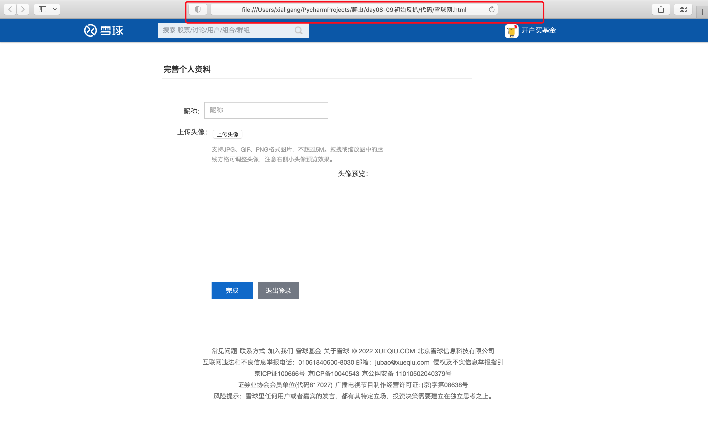

## 三、requests模块处理cookie相关的请求

**学习目标**

掌握requests处理cookie的三种方法

### 1 爬虫中使用cookie

> 为了能够通过爬虫获取到登录后的页面，或者是解决通过cookie的反扒，需要使用request来处理cookie相关的请求

##### 1.1 爬虫中使用cookie的利弊

+ 带上cookie的好处
  + 能够访问登录后的页面
  + 能够实现部分反反爬
+ 带上cookie的坏处
  + 一套cookie往往对应的是一个用户的信息，请求太频繁有更大的可能性被对方识别为爬虫
  + 那么上面的问题如何解决 ?使用多个账号

##### 1.2 requests处理cookie的方法

使用requests处理cookie有三种方法：
+ cookie字符串放在headers中
+ 把cookie字典放传给请求方法的cookies参数接收
+ 使用requests提供的session模块

### 2、cookie添加在heades中

##### 2.1 headers中cookie的位置



- headers中的cookie：
  - 使用分号(;)隔开
  - 分号两边的类似a=b形式的表示一条cookie
  - a=b中，a表示键（name），b表示值（value）
  - 在headers中仅仅使用了cookie的name和value

##### 2.2 cookie的具体组成的字段



由于headers中对cookie仅仅使用它的name和value，所以在代码中我们仅仅需要cookie的name和value即可

##### 2.3 在headers中使用cookie

复制浏览器中的cookie到代码中使用

```python
headers = {
"User-Agent":"Mozilla/5.0 (Macintosh; Intel Mac OS X 10_13_4) AppleWebKit/537.36 (KHTML, like Gecko) Chrome/65.0.3325.181 Safari/537.36",
"Cookie":" Pycharm-26c2d973=dbb9b300-2483-478f-9f5a-16ca4580177e; Hm_lvt_98b9d8c2fd6608d564bf2ac2ae642948=1512607763; Pycharm-26c2d974=f645329f-338e-486c-82c2-29e2a0205c74; _xsrf=2|d1a3d8ea|c5b07851cbce048bd5453846445de19d|1522379036"}

requests.get(url,headers=headers)
```

##### 注意：

cookie有过期时间 ，所以直接复制浏览器中的cookie可能意味着下一程序继续运行的时候需要替换代码中的cookie，对应的我们也可以通过一个程序专门来获取cookie供其他程序使用；当然也有很多网站的cookie过期时间很长，这种情况下，直接复制cookie来使用更加简单


### 3、使用cookies参数接收字典形式的cookie

- cookies的形式：字典

```json
cookies = {"cookie的name":"cookie的value"}
```

- 使用方法：

```python
requests.get(url,headers=headers,cookies=cookie_dict}
```

+ 实例（爬取雪球网）

  在网络中找到当前请求的网址 点击cookies 将当前的k,value复制到代码中

  

  ```python
  cookie_dict = {
      'u': '1990923459',
      'bid': '1f110dfd43538f4b8362dfcd21ffbb64_l27g4lfl',
      'xq_is_login': '1',
      'xq_r_token': '5dcbe83944f0b75325f91246061d4a2a01999367'
  }
  ```

  完整代码

  ```python
  import requests

  # 携带cookie登录雪球网  抓取完善个人资料页面
  headers = {
      'User-Agent': 'Mozilla/5.0 (Macintosh; Intel Mac OS X 10_15_7) AppleWebKit/537.36 (KHTML, like Gecko) Chrome/100.0.4896.127 Safari/537.36',
      'Referer': 'https://xueqiu.com/u/1990923459',
      'Host': 'xueqiu.com',
  }
  url = 'https://xueqiu.com/users/connectnew?redirect=/setting/user'

  cookie_dict = {
      'u': '1990923459',
      'bid': '1f110dfd43538f4b8362dfcd21ffbb64_l27g4lfl',
      'xq_is_login': '1',
      'xq_r_token': '5dcbe83944f0b75325f91246061d4a2a01999367'
  }
  res = requests.get(url, headers=headers, cookies=cookie_dict)
  with open('雪球网.html', 'w') as f:
      f.write(res.content.decode('UTF-8'))
      print(res.content.decode('UTF-8'))
  ```

  成果

  

### 4、使用requests.session处理cookie

> 前面使用手动的方式使用cookie，那么有没有更好的方法在requets中处理cookie呢？

requests 提供了一个叫做session类，来实现客户端和服务端的`会话保持`

会话保持有两个内涵：

- 保存cookie，下一次请求会带上前一次的cookie
- 实现和服务端的长连接，加快请求速度

##### 4.1 使用方法

```python
session = requests.session()
response = session.get(url,headers)
```

session实例在请求了一个网站后，对方服务器设置在本地的cookie会保存在session中，下一次再使用session请求对方服务器的时候，会带上前一次的cookie

##### 4.2 动手练习：模拟登陆

+ 17k小说网    https://passport.17k.com/

+ 古诗文：https://so.gushiwen.cn

+ 打码平台  

  图鉴   http://www.ttshitu.com/

##### 思路分析

1. 准备url地址和请求参数
2. 构造session发送post请求
3. 使用session请求个人主页，观察是否请求成功

### 5、小结

1. cookie字符串可以放在headers字典中，键为Cookie，值为cookie字符串
2. 可以把cookie字符串转化为字典，使用请求方法的cookies参数接收
3. 使用requests提供的session模块，能够自动实现cookie的处理，包括请求的时候携带cookie，获取响应的时候保存cookie


## 四、requests模块的其他方法

##### 学习目标

1. 掌握requests中cookirJar的处理方法
2. 掌握requests解决https证书错误的问题
3. 掌握requests中超时参数的使用
4. 掌握retrying模块的使用

### 1、requests中cookirJar的处理方法

> 使用request获取的resposne对象，具有cookies属性，能够获取对方服务器设置在本地的cookie，但是如何使用这些cookie呢？

##### 1.1 方法介绍

1. response.cookies是CookieJar类型
2. 使用requests.utils.dict_from_cookiejar，能够实现把cookiejar对象转化为字典

##### 1.2 方法展示

```python
import requests

url = "http://www.baidu.com"
#发送请求，获取resposne
response = requests.get(url)
print(type(response.cookies))

#使用方法从cookiejar中提取数据  等同于  dict(response.cookies)
cookies = requests.utils.dict_from_cookiejar(response.cookies)
print(cookies)
```

输出为:

```python
<class 'requests.cookies.RequestsCookieJar'>
{'BDORZ': '27315'}
```

##### 注意：

在前面的requests的session类中，我们不需要处理cookie的任何细节，如果有需要，我们可以使用上述方法来解决

### 2、requests处理证书错误

> 经常我们在网上冲浪时，经常能够看到下面的提示：


出现这个问题的原因是：ssl的证书不安全导致

##### 2.1 代码中发起请求的效果

那么如果在代码中请求会怎么样呢？

```python
import requests

url = "https://www.12306.cn/mormhweb/"
response = requests.get(url)
```

返回证书错误，如下：

```
ssl.CertificateError ...
```

##### 2.2 解决方案

为了在代码中能够正常的请求，我们修改添加一个参数

```python
import requests

url = "https://www.12306.cn/mormhweb/"
response = requests.get(url,verify=False)
```

### 3、超时参数的使用

> 在平时网上冲浪的过程中，我们经常会遇到网络波动，这个时候，一个请求等了很久可能任然没有结果
>
> 在爬虫中，一个请求很久没有结果，就会让整个项目的效率变得非常低，这个时候我们就需要对请求进行强制要求，让他必须在特定的时间内返回结果，否则就报错

##### 3.1 超时参数使用方法如下：

```python
response = requests.get(url,timeout=3)
```

通过添加timeout参数，能够保证在3秒钟内返回响应，否则会报错

##### 注意：

这个方法还能够拿来检测代理ip的质量，如果一个代理ip在很长时间没有响应，那么添加超时之后也会报错，对应的这个ip就可以从代理ip池中删除

### 4、retrying模块的使用

> 使用超时参数能够加快我们整体的请求速度，但是在正常的网页浏览过成功，如果发生速度很慢的情况，我们会做的选择是**刷新页面**，那么在代码中，我们是否也可以刷新请求呢？

对应的，retrying模块就可以帮助我们解决

##### 4.1 retrying模块的使用

retrying模块的地址：https://pypi.org/project/retrying/

pip install retrying

retrying 模块的使用

1. 使用retrying模块提供的retry模块
2. 通过装饰器的方式使用，让被装饰的函数反复执行
3. retry中可以传入参数`stop_max_attempt_number`,让函数报错后继续重新执行，达到最大执行次数的上限，如果每次都报错，整个函数报错，如果中间有一个成功，程序继续往后执行

##### 4.2 retrying和requests的简单封装

实现一个发送请求的函数，每次爬虫中直接调用该函数即可实现发送请求，在其中

- 使用timeout实现超时报错
- 使用retrying模块实现重试

代码参考:

```python
# parse.py
import requests
from retrying import retry

headers = {}

#最大重试3次，3次全部报错，才会报错
@retry(stop_max_attempt_number=3) 
def _parse_url(url):
    #超时的时候回报错并重试
    response = requests.get(url, headers=headers, timeout=3) 
    #状态码不是200，也会报错并重试
    assert response.status_code == 200
    return response


def parse_url(url)
    try: #进行异常捕获
        response = _parse_url(url)
    except Exception as e:
        print(e)
        #报错返回None
        response = None
    return response
```

### 5、扩展

##### 1、`**kwargs`:控制访问的参数，均为可选项

+ params: 字典或字节序列，作为参数增加到url中
+ data:字典，字节序列或文件对象,作为Request的内容
+ headers: 字典, HTTP定制头
+ timeout: 设定超时时间，秒为单位
+ proxies [ˈprɑksiz] : 字典类型，设定访问代理服务器，可以增加登录认证
+ verify[ˈverəti] : True/False默认Ture,认证ssl证书开关


