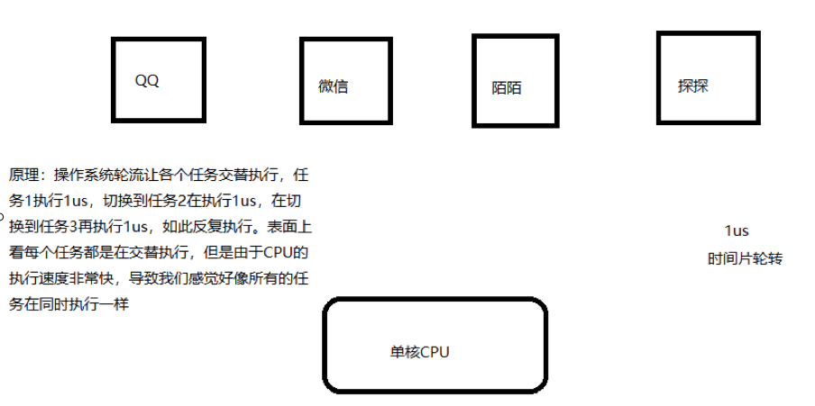
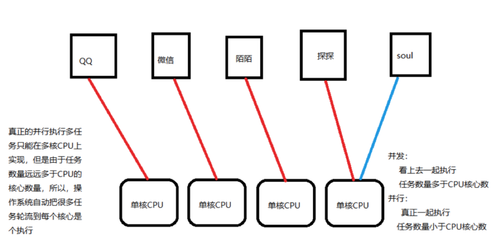

# 高效编程

## 一、多任务原理

- 概念

  现代操作系统比如Mac OS X，UNIX，Linux，Windows等，都是支持“多任务”的操作系统

- 什么叫多任务？

  就是操作系统可以同时运行多个任务

- 单核CPU实现多任务原理

  操作系统轮流让各个任务交替执行，QQ执行2us（微秒），切换到微信，在执行2us，再切换到陌陌，执行2us……。表面是看，每个任务反复执行下去，但是CPU调度执行速度太快了，导致我们感觉就像所有任务都在同时执行一样

  

- 多核CPU实现多任务原理

  ​	真正的秉性执行多任务只能在多核CPU上实现，但是由于任务数量远远多于CPU的核心数量，所以，操作系统也会自动把很多任务轮流调度到每个核心上执行

  

- 并发与并行

  + 并发

    CPU调度执行速度太快了,看上去一起执行，任务数多于CPU核心数

  + 并行

    真正一起执行，任务数小于等于CPU核心数

  + 并发是逻辑上的同时发生，并行更多是侧重于物理上的同时发生。

- 实现多任务的方式

  - 多进程模式

    启动多个进程，每个进程虽然只有一个线程，但是多个进程可以一起执行多个任务

  - 多线程模式

    启动一个进程，在一个进程的内部启动多个线程，这样多个线程也可以一起执行多个任务

  - 多进程+多线程

    启动多个进程，每个进程再启动多个线程

  - 协程

  - 多进程+协程

## 二、进程

### 1、概念

- 什么是进程？

  是计算机中的程序关于某数据集合上的一次运行活动，是系统进行资源分配和调度的基本单位，是操作系统结构的基础。

- 对于操作系统

  一个任务就是一个进程。比方说打开浏览器就是启动一个浏览器的进程，在打开一个记事本就启动一个记事本进程，如果打开两个记事本就启动两个记事本进程


### 2、使用进程

- 单进程现象

  需要等待代码执行完后再执行下一段代码

  ```python
  import time

  def run1():
      while 1:
          print("lucky is a good man")
          time.sleep(1)

  def run2():
      while 1:
          print("lucky is a nice man")
          time.sleep(1)

  if __name__ == "__main__":
      run1()
      # 不会执行run2()函数，只有上面的run1()结束才能执行run2()
      run2()
  ```

- 启动进程实现多任务

  - multiprocessing模块

    跨平台的多进程模块，提供了一个Process类用来示例化一个进程对象

  - Process类

    作用：创建进程(子进程)

  - _\_name\_\_

    这是 Windows 上多进程的实现问题。在 Windows 上，子进程会自动 import 启动它的这个文件，而在 import 的时候是会执行这些语句的。如果你这么写的话就会无限递归创建子进程报错。所以必须把创建子进程的部分用那个 if 判断保护起来，import 的时候 `__name__` 不是 `__main__` ，就不会递归运行了。

    | 参数     | 说明               |
    | ------ | ---------------- |
    | target | 指定进程执行的任务        |
    | args   | 给进程函数传递的参数，是一个元组 |

    注意：此时进程被创建，但是不会启动进程执行

  + **启动进程实现多任务**

    from multiprocessing import Process

    **创建子进程**

    P = Process(target=run,args=("nice",),name='当前进程名称')

    + target指定 子进程运行的函数

    + args 指定传递的参数 , 是元组类型

    + 启动进程：Process对象.start()

    **获取进程信息**

    + os.getpid()	 获取当前进程id号
    + os.getppid() 获取当前进程的父进程id号
    + multiprocessing.current_process().name   获取当前进程名称

    **父子进程的先后顺序**

    + 默认   父进程的结束不能影响子进程  让父进程等待子进程结束再执行父进程

    + p.join()  阻塞当前进程，直到调用join方法的那个进程执行完，再继续执行当前进程。

    + 全局变量在过个进程中不能共享

      **注意:** 在子线程中修改全局变量时对父进程中的全局变量没有影响

  - 示例代码

    ```python
    import time

    from multiprocessing import Process

    def run1(name):
        while 1:
            print("%s is a good man"%name)
            time.sleep(1)

    def run2():
        while 1:
            print("lucky is a nice man")
            time.sleep(1)

    if __name__ == "__main__":
        # 程序启动时的进程称为主进程(父进程)
        
        # 创建进程并启动
        p = Process(target=run1, args=("lucky",))
        p.start()

        # 主进程执行run2()函数
        run2()
    ```

- 主进程负责调度

  主进程主要做的是调度相关的工作，一般不负责具体业务逻辑

  ```python
  import time
  from multiprocessing import Process

  def run1():
      for i in range(7):
          print("lucky is a good man")
          time.sleep(1)

  def run2(name, word):
      for i in range(5):
          print("%s is a %s man"%(name, word))
          time.sleep(1)

  if __name__ == "__main__":
      t1 = time.time()

      # 创建两个进程分别执行run1、run2
      p1 = Process(target=run1)
      p2 = Process(target=run2, args=("lucky", "cool"))

      # 启动两个进程
      p1.start()
      p2.start()

      # 查看耗时
      t2 = time.time()
      print("耗时：%.2f"%(t2-t1))
  ```

- 父子进程的先后顺序

  主进程的结束不能影响子进程，所以可以等待子进程的结束再结束主进程，等待子进程结束，才能继续运行主进程

  p.join()  *阻塞当前进程，直到调用join方法的那个进程执行完，再继续执行当前进程。*

  ```python
  import time
  from multiprocessing import Process

  def run1():
      for i in range(7):
          print("lucky is a good man")
          time.sleep(1)

  def run2(name, word):
      for i in range(5):
          print("%s is a %s man"%(name, word))
          time.sleep(1)

  if __name__ == "__main__":
      t1 = time.time()

      p1 = Process(target=run1)
      p2 = Process(target=run2, args=("lucky", "cool"))

      p1.start()
      p2.start()

      # 主进程的结束不能影响子进程，所以可以等待子进程的结束再结束主进程
      # 等待子进程结束，才能继续运行主进程
      p1.join()
      p2.join()

      t2 = time.time()
      print("耗时：%.2f"%(t2-t1))
  ```

### 3、全局变量在多个子进程中不能共享

**原因:**

​	在创建子进程时对全局变量做了一个备份,父进程中num变量与子线程中的num不是一个变量

```python
from multiprocessing import Process
#全局变量在进程中 不能共享
num = 10
def run():
    print("我是子进程的开始")
    global num
    num+=1
    print(num)
    print("我是子进程的结束")
if __name__=="__main__":
    p = Process(target=run)
    p.start()
    p.join()

    print(num)
```

尝试列表是否能共享

```python
from multiprocessing import Process
#全局变量在进程中 不能共享
mylist = []
def run():
    print("我是子进程的开始")
    global mylist
    mylist.append(1)
    mylist.append(2)
    mylist.append(3)
    print("我是子进程的结束")

if __name__=="__main__":
    p = Process(target=run)
    p.start()
    p.join()

    print(mylist)
```

### 4、启动大量子进程

+ 获取CPU核心数

  print('CPU number:' + str(multiprocessing.cpu_count()))

+ 导入

  from multiprocesssing  import Pool

+ 开启并发数

  pp = Pool([参数])   #开启并发数  默认是你的核心数

+ 创建子进程,并放入进程池管理

  apply_async为非阻塞模式(并发执行)

  pp.apply_async(run,args=(i,))  #args参数 可以为元组 或者是列表[] 

+ 关闭进程池

  pp.close()关闭进程池

+ join()

  在调用join之前必须先调用close,调用close之后就不能再继续添加新的进程了

  pp.join()

  进程池对象调用join，会等待进程池中所有的子进程结束完毕再去执行父进程

+ 实例

  ```python
  # Pool类：进程池类
  from multiprocessing import Pool
  import time
  import random
  import multiprocessing

  def run(index):
      print('CPU number:' + str(multiprocessing.cpu_count()))
      print("子进程 %d 启动"%(index))
      t1 = time.time()
      time.sleep(random.random()* 5+2)
      t2 = time.time()
      print("子进程 %d 结束，耗时：%.2f" % (index, t2-t1))

  if __name__ == "__main__":
      print("启动主进程……")

      # 创建进程池对象
      # 由于pool的默认值为CPU的核心数，假设有4核心，至少需要5个子进程才能看到效果
      # Pool()中的值表示可以同时执行进程的数量
      pool = Pool(2)
      for i in range(1, 7):
          # 创建子进程，并将子进程放到进程池中统一管理
          pool.apply_async(run, args=(i,))

      # 等待子进程结束
      # 关闭进程池：在关闭后就不能再向进程池中添加进程了
      # 进程池对象在调用join之前必须先关闭进程池
      pool.close()
      #pool对象调用join，主进程会等待进程池中的所有子进程结束才会继续执行主进程
      pool.join()

      print("结束主进程……")
  ```

  get方法：获取进程的返回值

  ```python
  from multiprocessing import Lock, Pool
  import time

  def function(index):
      print('Start process: ', index)
      time.sleep(2)
      print('End process', index)
      return index


  if __name__ == '__main__':
      pool = Pool(processes=3)
      for i in range(4):
          result = pool.apply_async(function, (i,))
          print(result.get()) #获取每个 子进程的返回值
      print("Started processes")
      pool.close()
      pool.join()
      print("Subprocess done.")
  ```

  注意：这样来获取每个进程的返回值 那么就会变成单进程

### 5、map方法

+ 概述

  如果你现在有一堆数据要处理，每一项都需要经过一个方法来处理，那么map非常适合

  比如现在你有一个数组，包含了所有的URL，而现在已经有了一个方法用来抓取每个URL内容并解析，那么可以直接在map的第一个参数传入方法名，第二个参数传入URL数组。

+ 概述

  ```python
  from multiprocessing import Pool
  import requests
  from requests.exceptions import ConnectionError
   
  def scrape(url):
      try:
          print(requests.get(url))
      except ConnectionError:
          print('Error Occured ', url)
      finally:
          print('URL', url, ' Scraped')
   
   
  if __name__ == '__main__':
      pool = Pool(processes=3)
      urls = [
          'https://www.baidu.com',
          'http://www.meituan.com/',
          'http://blog.csdn.net/',
          'http://xxxyxxx.net'
      ]
      pool.map(scrape, urls)
  ```

  在这里初始化一个Pool，指定进程数为3，如果不指定，那么会自动根据CPU内核来分配进程数。

  然后有一个链接列表，map函数可以遍历每个URL，然后对其分别执行scrape方法。

### 6、单进程与多进程复制文件对比

- 单进程复制文件

  ```python
  import time

  def copy_file(path, toPath):
      with open(path, "rb") as fp1:
          with open(toPath, "wb") as fp2:
              while 1:
                  info = fp1.read(1024)
                  if not info:
                      break
                  else:
                      fp2.write(info)
                      fp2.flush()

  if __name__ == "__main__":
      t1 = time.time()

      for i in range(1, 5):
          path = r"/Users/lucky/Desktop/file/%d.mp4"%i
          toPath = r"/Users/lucky/Desktop/file2/%d.mp4"%i
          copy_file(path, toPath)

      t2 = time.time()
      print("单进程耗时：%.2f"%(t2-t1))
  ```

- 多进程复制文件

  ```python
  import time
  from multiprocessing import Pool
  import os

  def copy_file(path, toPath):
      with open(path, "rb") as fp1:
          with open(toPath, "wb") as fp2:
              while 1:
                  info = fp1.read(1024)
                  if not info:
                      break
                  else:
                      fp2.write(info)
                      fp2.flush()

  if __name__ == "__main__":
      t1 = time.time()
      path = r"/Users/xialigang/Desktop/视频"
      dstPath = r"/Users/xialigang/Desktop/1视频"
      fileList = os.listdir(path)
      pool = Pool()

      for i in fileList:
          newPath1 = os.path.join(path, i)
          newPath2 = os.path.join(dstPath, i)
          pool.apply_async(copy_file, args=(newPath1, newPath2))

      pool.close()
      pool.join()

      t2 = time.time()
      print("耗时：%.2f"%(t2-t1))
  ```

### 7、进程间通信

- 队列共享

  + 导入

    from multiprocessing import Queue

  + 使用

    que = Queue()  #创建队列

    que.put(数据)  #压入数据

    que.get()           #获取数据

  + 队列常用函数

    Queue.empty() 如果队列为空，返回True, 反之False

    Queue.full() 如果队列满了，返回True,反之False

    Queue.get([block[, timeout]]) 获取队列，timeout等待时间

    Queue.get_nowait() 相当Queue.get(False)

    Queue.put(item) 阻塞式写入队列，timeout等待时间

    Queue.put_nowait(item) 相当Queue.put(item, False)

  + 特点：先进先出

  + 注意：

    get方法有两个参数，blocked和timeout，意思为阻塞和超时时间。默认blocked是true，即阻塞式。

    当一个队列为空的时候如果再用get取则会阻塞，所以这时候就需要吧blocked设置为false，即非阻塞式，实际上它就会调用get_nowait()方法，此时还需要设置一个超时时间，在这么长的时间内还没有取到队列元素，那就抛出Queue.Empty异常。

    当一个队列为满的时候如果再用put放则会阻塞，所以这时候就需要吧blocked设置为false，即非阻塞式，实际上它就会调用put_nowait()方法，此时还需要设置一个超时时间，在这么长的时间内还没有放进去元素，那就抛出Queue.Full异常。

    另外队列中常用的方法

  + 队列的大小

    Queue.qsize() 返回队列的大小 ，不过在 Mac OS 上没法运行。

  实例

  ```python
  import multiprocessing
  queque = multiprocessing.Queue() #创建 队列
  #如果在子进程 和主进程 之间 都压入了数据 那么在主进程 和 子进程 获取的就是 对方的数据
  def fun(myque):
      # print(id(myque)) #获取当前的队列的存储地址  依然是拷贝了一份
      myque.put(['a','b','c']) #在子进程里面压入数据
      # print("子进程获取",myque.get())#获取队列里面的值

  if __name__=='__main__':
      # print(id(queque))
      queque.put([1,2,3,4,5]) #将列表压入队列  如果主进程也压入了数据 那么在主进程取的就是在主进程压入的数据 而不是子进程的
      p = multiprocessing.Process(target=fun,args=(queque,))
      p.start()
      p.join()
      print("主进程获取",queque.get())#在主进程进行获取
      print("主进程获取",queque.get())#在主进程进行获取
      # print("主进程获取",queque.get(block=True, timeout=1))#在主进程进行获取

  ```


- 字典共享

  + 导入

    import multiprocess

  + 概述

    Manager是一个进程间高级通信的方法  支持Python的字典和列表的数据类型

  + 创建字典

    myDict = multiprocess.Manager().dict()

  实例

  ```python
  import multiprocessing


  def fun(mydict):
      # print(mylist)
      mydict['x'] = 'x'
      mydict['y'] = 'y'
      mydict['z'] = 'z'

  if __name__=='__main__':
      # Manager是一种较为高级的多进程通信方式，它能支持Python支持的的任何数据结构。
      mydict = multiprocessing.Manager().dict()
      p = multiprocessing.Process(target=fun,args=(mydict,))
      p.start()
      p.join()
      print(mydict)
  ```

- 列表共享

  + 导入

    import multiprocess

  + 创建列表

    myDict = multiprocess.Manager().list()

  实例(字典与列表共享)

  ```python
  import multiprocessing


  def fun(List):
      # print(mylist)
      List.append('x')
      List.append('y')
      List.append('z')


  if __name__=='__main__':
      # Manager是一种较为高级的多进程通信方式，它能支持Python支持的的任何数据结构。
      List = multiprocessing.Manager().list()
      p = multiprocessing.Process(target=fun,args=(List,))
      p.start()
      p.join()
      print(List)
  ```

- 注意

  进程名.terminate() 强行终止子进程

+ deamon

  在这里介绍一个属性，叫做deamon。每个进程程都可以单独设置它的属性，如果设置为True，当父进程结束后，子进程会自动被终止。

  进程.daemon = True

  设置在start()方法之前

  ```python
  import multiprocessing
  import time
  def fun():
      time.sleep(100)
  if __name__=='__main__':
      p = multiprocessing.Process(target=fun)
      p.daemon = True
      p.start()
      print('over')
  ```

+ 进程名.terminate() 强行终止子进程

  ```Python
  import multiprocessing
  import time
  def fun():
      time.sleep(100)
  if __name__=='__main__':
      p = multiprocessing.Process(target=fun)
      p.start()
      p.terminate()
      p.join()
      print('over')
  ```


### 8、进程实现生产者消费者

**生产者消费者模型描述：**

生产者是指生产数据的任务，消费者是指消费数据的任务。

当生产者的生产能力远大于消费者的消费能力，生产者就需要等消费者消费完才能继续生产新的数据，同理，如果消费者的消费能力远大于生产者的生产能力，消费者就需要等生产者生产完数据才能继续消费，这种等待会造成效率的低下，为了解决这种问题就引入了生产者消费者模型。

生产者/消费者问题可以描述为：两个或者更多的进程（线程）共享同一个缓冲区，其中一个或多个进程（线程）作为“生产者”会不断地向缓冲区中添加数据，另一个或者多个进程（线程）作为“消费者”从缓冲区中取走数据。

+ 代码

  ```python
  from multiprocessing import Process
  from multiprocessing import Queue
  import time

  def product(q):
      print("启动生产子进程……")
      for data in ["good", "nice", "cool", "handsome"]:
          time.sleep(2)
          print("生产出：%s"%data)
          # 将生产的数据写入队列
          q.put(data)
      print("结束生产子进程……")

  def t(q):
      print("启动消费子进程……")
      while 1:
          print("等待生产者生产数据")
          # 获取生产者生产的数据，如果队列中没有数据会阻塞，等待队列中有数据再获取
          value = q.get()
          print("消费者消费了%s数据"%(value))
      print("结束消费子进程……")

  if __name__ == "__main__":
      q = Queue()

      p1 = Process(target=product, args=(q,))
      p2 = Process(target=customer, args=(q,))

      p1.start()
      p2.start()

      p1.join()
      # p2子进程里面是死循环，无法等待它的结束
      # p2.join()
      # 强制结束子进程
      p2.terminate()

      print("主进程结束")
  ```

### 9、案例（抓取斗图）

```python
from multiprocessing import Process,Queue
from concurrent.futures import ThreadPoolExecutor
from lxml import etree
import time
import requests

headers = {
    "User-Agent": "Mozilla/5.0 (Windows NT 10.0; Win64; x64) AppleWebKit/537.36 (KHTML, like Gecko) Chrome/99.0.4844.84 Safari/537.36"
}

def get_img_src(url, q):
    """
    进程1: 负责提取页面中所有的img的下载地址
    将图片的下载地址通过队列. 传输给另一个进程进行下载
    """

    resp = requests.get(url, headers=headers)
    tree = etree.HTML(resp.text)
    srcs = tree.xpath("//li[@class='list-group-item']//img[@referrerpolicy='no-referrer']/@data-original")
    for src in srcs:
        q.put(src.strip())
    resp.close()


def download_img(q):
    """
        进程2: 将图片的下载地址从队列中提取出来. 进行下载.
   """
    with ThreadPoolExecutor(20) as t:
        while 1:
            try:
                s = q.get(timeout=20)
                t.submit(donwload_one, s)
            except Exception as e:
                print(e)
                break

def donwload_one(s):
    # 单纯的下载功能
    resp = requests.get(s, headers=headers)
    file_name = s.split("/")[-1]
    # 请提前创建好img文件夹
    with open(f"img/{file_name}", mode="wb") as f:
        f.write(resp.content)
    print("一张图片下载完毕", file_name)
    resp.close()

if __name__ == '__main__':
    t1 = time.time()
    q = Queue()  # 两个进程必须使用同一个队列. 否则数据传输不了
    p_list = []
    for i in range(1, 11):
        url = f"https://www.pkdoutu.com/photo/list/?page={i}"
        p = Process(target=get_img_src, args=(url, q))
        p_list.append(p)
    for p in p_list:
        p.start()
    p2 = Process(target=download_img, args=(q,))
    p2.start()
    for p in p_list:
        p.join()
    p2.join()
    print((time.time()-t1)/60)
# 0.49572664896647134
```

