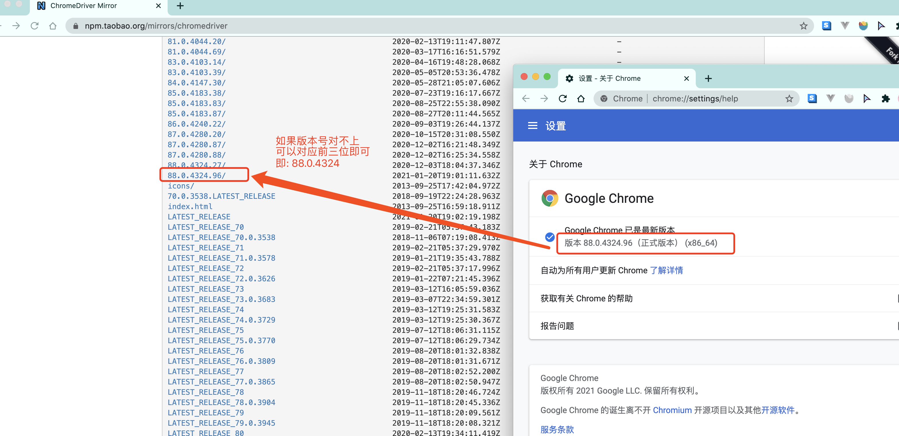
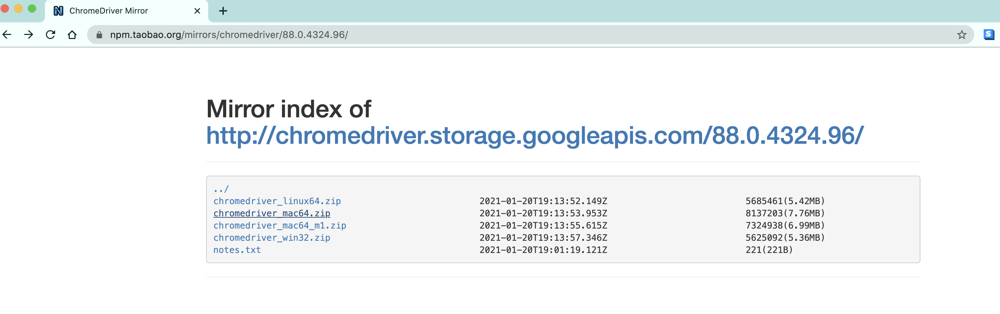
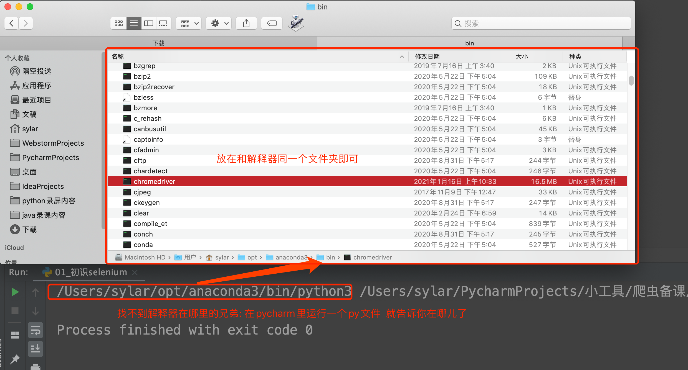
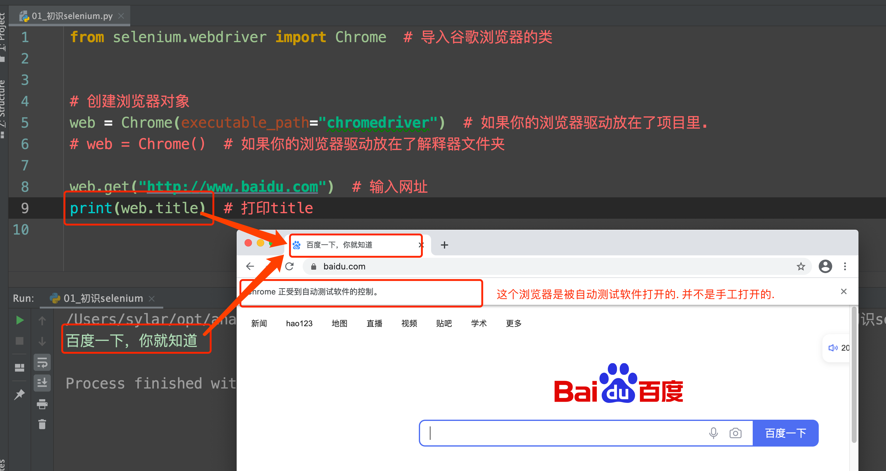

# selenium

## 一、前期准备

### 1、概述

selenium本身是一个自动化测试工具。它可以让python代码调用浏览器。并获取到浏览器中加载的各种资源。 我们可以利用selenium提供的各项功能。 帮助我们完成数据的抓取。

### 2、学习目标

1. 掌握 selenium发送请求，加载网页的方法
2. 掌握 selenium简单的元素定位的方法
3. 掌握 selenium的基础属性和方法
4. 掌握 selenium退出的方法

### 3、安装

安装：pip install selenium

它与其他库不同的地方是他要启动你电脑上的浏览器, 这就需要一个驱动程序来辅助. 

这里推荐用chrome浏览器

chrome驱动地址:http://chromedriver.storage.googleapis.com/index.html





根据你电脑的不同自行选择吧.  win64选win32即可.

然后关键的来了. 把你下载的浏览器驱动放在python解释器所在的文件夹

Windwos:  py -0p     查看Python路径

Mac: open + 路径

例如：open /usr/local/bin/



 前期准备工作完毕.  上代码看看 感受一下selenium

```python
from selenium.webdriver import Chrome  # 导入谷歌浏览器的类


# 创建浏览器对象
web = Chrome()  # 如果你的浏览器驱动放在了解释器文件夹

web.get("http://www.baidu.com")  # 输入网址
print(web.title)  # 打印title
```

运行一下你会发现神奇的事情发生了. 浏览器自动打开了. 并且输入了网址. 也能拿到网页上的title标题. 




## 二、selenium的基本使用

### 1、加载网页：

selenium通过控制浏览器，所以对应的获取的数据都是elements中的内容

```python
from selenium import webdriver
from selenium.webdriver.common.by import By

driver = webdriver.Chrome()
# 访问百度
driver.get("http://www.baidu.com/")
# 截图
driver.save_screenshot("baidu.png")
```

### 2、定位和操作：

```python
# 搜索关键字 杜卡迪
driver.find_element(By.ID, "kw").send_keys("杜卡迪")
# 点击id为su的搜索按钮
driver.find_element(By.ID, "su").click()
```

### 3、查看请求信息：

```python
driver.page_source   # 获取页面内容
driver.get_cookies()
driver.current_url
```

### 4、退出

```python
driver.close()  # 退出当前页面
driver.quit()   # 退出浏览器
```


### 小结

1. selenium的导包:`from selenium import webdriver`
2. selenium创建driver对象:`webdriver.Chrome()`
3. selenium请求数据:`driver.get("http://www.baidu.com/")`
4. selenium查看数据: `driver.page_source`
5. 关闭浏览器: `driver.quit()`
6. 根据id定位元素: `driver.find_element_by_id("kw")/driver.find_element(By.ID, "kw")`
7. 操作点击事件: `click()`
8. 给输入框赋值:`send_keys()`

## 三、元素定位的方法

### 学习目标

1. 掌握 selenium定位元素的方法
2. 掌握 selenium从元素中获取文本和属性的方法

> 通过selenium的基本使用可以简单定位元素和获取对应的数据,接下来我们再来学习下 定位元素的其他方法

### 1、selenium的定位操作

1. 元素定位的两种写法：

   - 直接调用型

     ```python
      el = driver.find_element_by_xxx(value)
      # xxx是定位方式，后面我们会讲，value为该方式对应的值
     ```

   - 使用By类型(需要导入By)  建议使用这种方式

     ```python
      # 直接掉用的方式会在底层翻译成这种方式
     from selenium.webdriver.common.by import By
     driver.find_element(By.xxx,value)
     ```

2. 元素定位的两种方式:

   - 精确定位一个元素,返回结果为一个element对象,定位不到则报错

     ```python
     driver.find_element(By.xx, value)  # 建议使用
     driver.find_element_by_xxx(value)
     ```

   - 定位一组元素,返回结果为element对象列表,定位不到返回空列表

     ```python
     driver.find_elements(By.xx, value)  # 建议使用
     driver.find_elements_by_xxx(value)
     ```

3. 元素定位的八种方法:

   以下方法在element之后添加s就变成能够获取一组元素的方法

   + By.ID  使用id值定位

     ```python
     el = driver.find_element(By.ID, '')
     el = driver.find_element_by_id()            
     ```

   + By.XPATH 使用xpath定位

     ```python
     el = driver.find_element(By.XPATH, '')
     el = driver.find_element_by_xpath()         
     ```

   + By.TAG_NAME. 使用标签名定位

     ```python
     el = driver.find_element(By.TAG_NAME, '')
     el = driver.find_element_by_tag_name()     
     ```

   + By.LINK_TEXT使用超链接文本定位

     ```python
     el = driver.find_element(By.LINK_TEXT, '')
     el = driver.find_element_by_link_text() 
     ```

   + By.PARTIAL_LINK_TEXT  使用部分超链接文本定位

     ```python
     el = driver.find_element(By.PARTIAL_LINK_TEXT  , '')
     el = driver.find_element_by_partial_link_text()
     ```

   + By.NAME   使用name属性值定位

     ```python
     el = driver.find_element(By.NAME, '')
     el = driver.find_element_by_name()
     ```

   + By.CLASS_NAME     使用class属性值定位

     ```python
     el = driver.find_element(By.CLASS_NAME, '')   
     el = driver.find_element_by_class_name()
     ```

   + By.CSS_SELECTOR   使用css选择器定位

     ```python
     el = driver.find_element(By.CSS_SELECTOR, '')  
     el = driver.find_element_by_css_selector()
     ```

**注意：**

+ 建议使用find_element/find_elements
+ `find_element`和`find_elements`的区别 

+ `by_link_text`和`by_partial_link_text`的区别：
  全部文本和包含某个文本

- 使用： 以豆瓣为例

  ```python
  import time
  from selenium import webdriver
  from selenium.webdriver.common.by import By

  driver = webdriver.Chrome()
  driver.implicitly_wait(10)  # 等待节点加载完成
  driver.get("https://www.douban.com/search?q=%E6%9D%B0%E6%A3%AE%E6%96%AF%E5%9D%A6%E6%A3%AE")
  time.sleep(2)
  # 使用id的方式获取右上角的搜索框
  # ret1 = driver.find_element(By.ID, 'inp-query')
  # ret1 = driver.find_element(By.ID, 'inp-query').send_keys("杰森斯坦森")
  # ret1 = driver.find_element_by_id("inp-query")
  # print(ret1)

  # 输出为：<selenium.webdriver.remote.webelement.WebElement (session="ea6f94544ac3a56585b2638d352e97f3", element="0.5335773935305805-1")>

  # 搜索输入框  使用find_elements进行获取
  # ret2 = driver.find_elements(By.ID, "inp-query")
  # ret2 = driver.find_elements_by_id("inp-query")
  # print(ret2)
  #输出为：[<selenium.webdriver.remote.webelement.WebElement (session="ea6f94544ac3a56585b2638d352e97f3", element="0.5335773935305805-1")>]

  # 搜索按钮  使用xpath进行获取
  # ret3 = driver.find_elements(By.XPATH, '//*[@id="inp-query"]')
  # ret3 = driver.find_elements_by_xpath("//*[@id="inp-query"]")
  # print(len(ret3))
  # print(ret3)

  # 匹配图片标签
  ret4 = driver.find_elements(By.TAG_NAME, 'img')
  for url in ret4:
      print(url.get_attribute('src'))

   #ret4 = driver.find_elements_by_tag_name("img")
  print(len(ret4))

  ret5 = driver.find_elements(By.LINK_TEXT, "浏览发现")
  # ret5 = driver.find_elements_by_link_text("浏览发现")
  print(len(ret5))
  print(ret5)

  ret6 = driver.find_elements(By.PARTIAL_LINK_TEXT, "浏览发现")
  # ret6 = driver.find_elements_by_partial_link_text("浏览发现")
  print(len(ret6))
  # 使用class名称查找
  ret7 = driver.find_elements(By.CLASS_NAME, 'nbg')
  print(ret7)
  driver.close()
  ```

**注意：**

find_element与find_elements区别

1. 只查找一个元素的时候:可以使用find_element(),find_elements()
     find_element()会返回一个WebElement节点对象,但是没找到会报错,而find_elements()不会,之后返回一个空列表
2. 查找多个元素的时候:只能用find_elements(),返回一个列表,列表里的元素全是WebElement节点对象
3. 找到都是节点(标签)
4. 如果想要获取相关内容(只对find_element()有效,列表对象没有这个属性)  使用  .text
5. 如果想要获取相关属性的值(如href对应的链接等,只对find_element()有效,列表对象没有这个属性):使用   .get_attribute("href")                                        

### 2、元素的操作

> find_element_by_xxx方法仅仅能够获取元素对象，接下来就可以对元素执行以下操作 从定位到的元素中提取数据的方法

1. 从定位到的元素中获取数据

```python
el.get_attribute(key)           # 获取key属性名对应的属性值
el.text                        	# 获取开闭标签之间的文本内容
```

1. 对定位到的元素的操作

```python
el.click()                      # 对元素执行点击操作

el.submit()                     # 对元素执行提交操作

el.clear()                      # 清空可输入元素中的数据

el.send_keys(data)              # 向可输入元素输入数据
```

使用示例：

```python
from selenium import webdriver
from selenium.webdriver.common.by import By

driver =webdriver.Chrome()

driver.get("https://www.douban.com/")
# 打印页面内容 （获取到以后可以进行后续的xpath,bs4 或者存储等）
print(driver.page_source)

ret4 = driver.find_elements(By.TAG_NAME, "h1")
print(ret4[0].text)
#输出：豆瓣

ret5 = driver.find_elements(By.LINK_TEXT, "下载豆瓣 App")
print(ret5[0].get_attribute("href"))
#输出：https://www.douban.com/doubanapp/app?channel=nimingye

driver.close()
```

### 小结

1. 根据xpath定位元素:`driver.find_elements(By.XPATH,"//*[@id='s']/h1/a")`
2. 根据class定位元素:`driver.find_elements(By.CLASS_NAME, "box")`
3. 根据link_text定位元素:`driver.find_elements(By.LINK_TEXT, "下载豆瓣 App")`
4. 根据tag_name定位元素:`driver.find_elements(By.TAG_NAME, "h1")`
5. 获取元素文本内容:`element.text`
6. 获取元素标签属性: `element.get_attribute("href")`
7. 向输入框输入数据: `element.send_keys(data)`


## 四、selenium的其他操作

### 学习目标

1. 掌握 selenium处理cookie等方法
2. 掌握 selenium中switch的使用
3. 掌握selenium中无头浏览器的设置

### 1、无头浏览器

我们已经基本了解了selenium的基本使用了. 但是呢, 不知各位有没有发现, 每次打开浏览器的时间都比较长. 这就比较耗时了. 我们写的是爬虫程序. 目的是数据. 并不是想看网页. 那能不能让浏览器在后台跑呢? 答案是可以的

```python
from selenium.webdriver import Chrome
from selenium.webdriver.chrome.options import Options

opt = Options()
opt.add_argument("--headless")
opt.add_argument('--disable-gpu')
opt.add_argument("--window-size=4000,1600")  # 设置窗口大小

web = Chrome(options=opt)
```


### 1、selenium 处理cookie

通过`driver.get_cookies()`能够获取所有的cookie

+ 获取cookie

  ```python
  dictCookies = driver.get_cookies()
  ```

+ 设置cookie

  ```python
  driver.add_cookie(dictCookies)
  ```

+ 删除cookue

  ```python
  #删除一条cookie
  driver.delete_cookie("CookieName")
  # 删除所有的cookie
  driver.delete_all_cookies()
  ```

### 2、页面等待

- 为什么需要等待
  如果网站采用了动态html技术，那么页面上的部分元素出现时间便不能确定，这个时候就可以设置一个等待时间，强制等待指定时间，等待结束之后进行元素定位，如果还是无法定位到则报错 

- 页面等待的三种方法

  - 强制等待

    ```python
    import time
    time.sleep(n)      # 阻塞等待设定的秒数之后再继续往下执行
    ```

  - 显式等待(自动化web测试使用，爬虫基本不用)

    ```python
    from selenium.webdriver.common.keys import Keys
    from selenium.webdriver.common.by import By
    from selenium.webdriver.support.ui import WebDriverWait
    from selenium.webdriver.support import expected_conditions as EC

    WebDriverWait(driver, 10,0.5).until( EC.presence_of_element_located((By.ID, "myDynamicElement"))
    # 显式等待指定某个条件，然后设置最长等待时间10，在10秒内每隔0.5秒使用指定条件去定位元素，如果定位到元素则直接结束等待，如果在10秒结束之后仍未定位到元素则报错
    ```

  - 隐式等待 隐式等待设置之后代码中的所有元素定位都会做隐式等待

    ```python
    driver.implicitly_wait(10)    # 在指定的n秒内每隔一段时间尝试定位元素，如果n秒结束还未被定位出来则报错
    ```

**注意：**

Selenium显示等待和隐式等待的区别
1、selenium的显示等待
原理：显示等待，就是明确要等到某个元素的出现或者是某个元素的可点击等条件，等不到，就一直等，除非在规定的时间之内都没找到，就会跳出异常Exception

(简而言之，就是直到元素出现才去操作，如果超时则报异常)

2、selenium的隐式等待

原理：隐式等待，就是在创建driver时，为浏览器对象创建一个等待时间，这个方法是得不到某个元素就等待一段时间，直到拿到某个元素位置。
注意：在使用隐式等待的时候，实际上浏览器会在你自己设定的时间内部断的刷新页面去寻找我们需要的元素

### 3、switch方法切换的操作

##### 3.1 一个浏览器肯定会有很多窗口，所以我们肯定要有方法来实现窗口的切换。切换窗口的方法如下：

```python
也可以使用 window_handles 方法来获取每个窗口的操作对象。例如：

# 1. 获取当前所有的窗口
current_windows = driver.window_handles

# 2. 根据窗口索引进行切换
driver.switch_to.window(current_windows[1])

driver.switch_to.window(web.window_handles[-1])  # 跳转到最后一个窗口
driver.switch_to.window(current_windows[0])  # 回到第一个窗口
```

##### 3.2 iframe是html中常用的一种技术，即一个页面中嵌套了另一个网页，selenium默认是访问不了frame中的内容的，对应的解决思路是

```python
driver.switch_to.frame(name/el/id)     传入的参数可以使iframe对应的id值，也可以是用元素定位之后的元素对象
```

动手：qq邮箱

在使用selenium登录qq邮箱的过程中，我们会发现，无法在邮箱的登录input标签中输入内容，通过观察源码可以发现，form表单在一个frame中，所以需要切换到frame中

##### 3.3 当你触发了某个事件之后，页面出现了弹窗提示，处理这个提示或者获取提示信息方法如下：

```python
alert = driver.switch_to_alert()
```

##### 4. 页面前进和后退

```python
driver.forward()     # 前进
driver.back()        # 后退
driver.refresh() 		 # 刷新
driver.close()       # 关闭当前窗口
```

##### 5、设置浏览器最大窗口

```
driver.maximize_window()  #最大化浏览器窗口
```


### 4、selenium的优缺点

- 优点
  - selenium能够执行页面上的js，对于js渲染的数据和模拟登陆处理起来非常容易
  - 使用难度简单
  - 爬取速度慢，爬取频率更像人的行为，天生能够应对一些反爬措施
- 缺点
  - 由于selenium操作浏览器，因此会将发送所有的请求，因此占用网络带宽
  - 由于操作浏览器，因此占用的内存非常大(相比较之前的爬虫)
  - 速度慢，对于效率要求高的话不建议使用

### 小结

1. 获取cookie: `get_cookies()`
2. 删除cookie: `delete_all_cookies()`
3. 切换窗口:`switch_to.window()`
4. 切换iframe: `switch_to.frame()`


### 5、selenium的配置

https://blog.csdn.net/qq_35999017/article/details/123922952

https://blog.csdn.net/qq_27109535/article/details/125468643