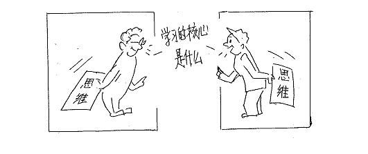
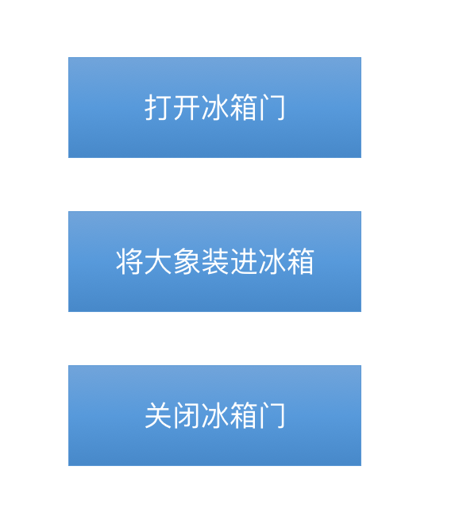
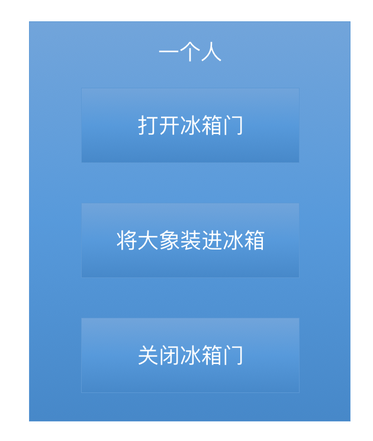
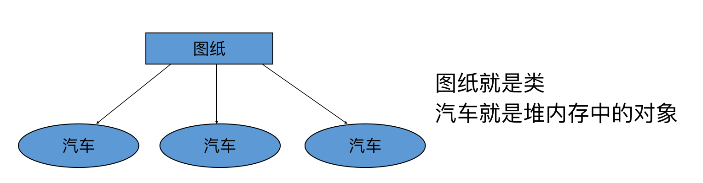
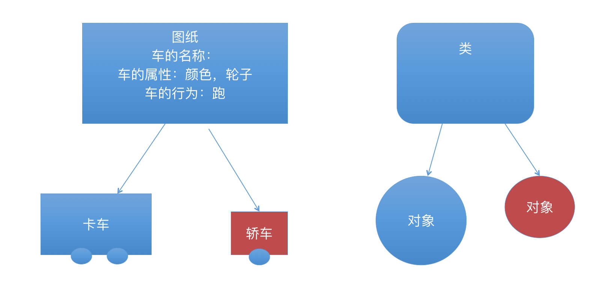
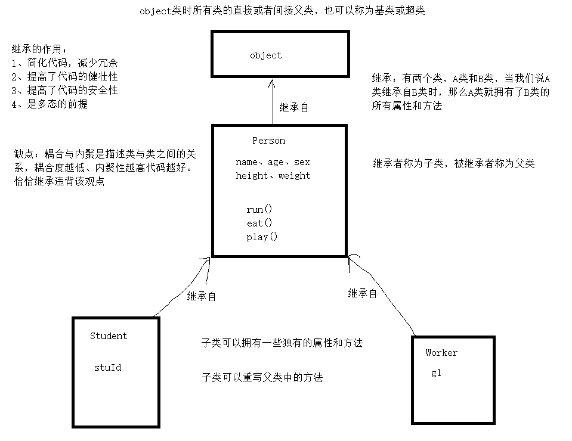

## 一、面向对象基础

### 1、面向对象思想简介

- 软件编程就是将我们的思维转变成计算机能够识别语言的一个过程

  

- 什么是面向过程？

  自上而下顺序执行，逐步求精

  其程序结构是按功能划分为若干个基本模块，这些模块形成一个树状结构；

  各模块之间的关系尽可能简单，在功能上相对独立

  每一模块内部均是由顺序、选择和循环三种基本结构组成

  其模块化实现的具体方法是使用子程序

  程序流程在写程序时就已决定

- 什么是面向对象？

  把数据及对数据的操作方法放在一起，作为一个相互依存的整体——对象

  对同类对象抽象出其共性，形成类

  类中的大多数数据，只能用本类的方法进行处理

  类通过一个简单的外部接口与外界发生关系，对象与对象之间通过消息进行通信

  程序流程由用户在使用中决定

- 理解面向对象

  - 面向对象是相对面向过程而言

  - 面向对象和面向过程都是一种思想

  - 面向过程

    强调的是功能行为
    关注的是解决问题需要哪些步骤

  - 面向对象

    将功能封装进对象，强调具备了功能的对象
    关注的是解决问题需要哪些对象

  - 面向对象是基于面向过程的

- 把🐘关冰箱

  面向过程

  


  面向对象：更加符合人民思考习惯的思想，从执行者变成了指挥者

  

- 面向对象的特点

  是一种符合人们思考习惯的思想

  可以将复杂的事情简单化

  将程序员从执行者转换成了指挥者

- 完成需求时

  a、先要去找具有所需的功能的对象来用

  b、如果该对象不存在，那么创建一个具有所需功能的对象

- 类与对象的关系

  使用计算机语言就是不断的在描述现实生活中的事物

  Python中描述事物通过类的形式体现，类是具体事物的抽象，概念上的定义

  对象即是该类事物实实在在存在的个体

  


  

  

### 2、第一个Python类

- 设计类只关心3样东西

  - 说明

    类名：首字母大写，遵守标识符规则
    属性：遵守标识符规则
    行为(功能、方法、函数)：遵守标识符规则

  - 设计类

    人类

    ```
    类名：Personl
    属性：name age sex height weight
    行为：搬砖、盖房子
    ```

    汽车类

    ```
    类名：Car
    属性：color kuanshi(款式) weight pailiang(排量)
    行为：跑、拉东西
    ```

- 创建类

  - 格式

    ```
    class 类名(父类名):
        属性&行为
    ```

  - 说明

    class：表明这是一个类

    类名：类的名字

    ()：父类集合的开始和结束

    父类名：父类的名字，定义的类继承自父类，可以不写，默认是object。object是所有类的直接或间接父类

  - 代码

    ```python
    class Person(object):
        pass
    class Person:
        pass
    ```

+ 创建存在属性与方法的类

  ```python
  """
  wife
  属性: sex age  height  weight  name faceValue
  行为：洗衣服  做饭    生小孩
  """
  """
  husband
  属性：sex age  height  weight  name faceValue
  行为：吃饭   帮忙生小孩   买菜  赚钱
  """
  class Wife:
      sex = "女" #类属性
      age = "20"
      height = 160
      name = "苍苍"
      faceValue = "很 高"
      #self 代表当前 的对象  不一定名字叫做self  标准来说 都叫self
      def washClothes(self):
          print("洗衣服")
      def cook(self):
          print("做饭")
      def papapa(self):
          print("生小孩")
  zhangSan = Wife() #类的实例化  称为 对象
  ```

### 3、使用类实例化对象

- 格式

  对象名 = 类名(参数列表)

- 说明

  参数列表：为了后面给属性进行赋值的

- 实例化代码

  ```python
  per1 = Person()
  print(per1)
  per2 = Person()
  print(per2)
  ```

### 4、self参数

+ 概述

  + 在类地内部，使用 def 关键字来定义一个方法，与一般函数定义不同，类方法必须包含参数 self，且为第一个参数，self 代表的是类的实例，而非类

  + self 的名字并不是规定死的，也可以使用 this，但是最好还是按照约定使用 self。
  + 这个self的参数 不需要传参的  它是代表 当前实例化后的对象

+ self 不是 python 关键字，我们把他换成arg也是可以正常执行

  ```python
  class Test:
      def prt(arg):
          print(arg)
          print(arg.__class__)
   
  t = Test()
  t.prt()
  ```

  下面代码可以验证

  ```python
  class A:
      name = "ss"
      def aa(self):
          print(self.__dict__)
          print(id(self)) #打印slef对象的存储地址
  a = A()
  a.name = 'a'
  print(a.__dict__)
  print(id(a)) #打印当前类实例的变量a的存储地址
  ```

+ 注意：
  1. self 就是当前类实例化的对象  哪个对象调用它  它就是哪个对象
  2. self不是必须的 但是作为标准规范 是必须叫self
  3. self 在类中创建对象  调用类中的属性与方法

### 5、属性和方法的使用

+ 格式

  ```
  对象.属性名
  对象.方法名(参数...)
  ```

+ 方法的返回值 return

  方法里 如果 没有返回值 打印方法的时候  返回 None

  如果有返回值得 方法  需要使用 print() 将其输出

  ```python
  class 类名：
  	def 方法名():
          return "值"
  ```

+ 注意：

  return 下方的代码不在执行  遇到return 就认为是结束了！

## 二、面向对象进阶

### 1、类属性

- 定义

  ```python
  class Person(object):
      # 定义类属性
      # 当多个类的对象的属性值需要相同时可以使用类属性
      name = "lilei"
      age = 18
      sex = "男"
  ```

- 调用

  可以通过类调用，也可以通过对象调用

- 给类绑定属性

  ​	类名.属性名 = 属性值

- 使用

  ```python
  # 实例化对象时，每一个对象的属性值都相同
  per1 = Person()
  per2 = Person()

  #通过对象方法类属性   对象名.类属性名
  print(per1.name, per1.age, per1.sex)
  print(per2.name, per2.age, per2.sex)

  # 修改对象属性值，如果对象属性不存在则变为增加对象属性
  per1.name = "liudh"
  per2.name = "daol"
  print(per1.name, per2.name, Person.name)

  print(hasattr(per1, 'name'))
  print(setattr(per1, 'name', 'lucky'))
  print(getattr(per1, 'name'))
  ```

- 问题

  使用类创建的所有对象的属性初始值都是一样的

### 2、对象属性

+ 概述：

  + 通过self以及实例化后对象所创建的属性为对象属性

+ 通过类中定义以及类名称创建的属性为对象属性 

  + 对象属性只存在于当前对象中

+ 对象属性只能由对象调用

+ 实例对象绑定属性

  + 通过类的self变量

  + 直接给实例对象赋值

  ```python
  class Student(object):
      def __init__(self, name):
          self.name = name
  s = Student('lucky')#方法一 通过类的self变量绑定属性
  s.score = 90#方法二 直接赋值
  ```

+ 实例

  ```python
  class Person(object):
       # 这里的属性实际上属于类属性(用类名来调用)
      name = "person"
      def __init__(self, name):
          pass
          #对象属性
          self.name = name


  print(Person.name)
  per = Person("lucky")
  #对象属性的优先级高于类属性
  print(per.name)
  #动态的给对象添加对象属性
  per.age = 18  # 只针对于当前对象生效，对于类创建的其他对象没有作用
  print(Person.name)
  per2 = Person("lilei")
  #print(per2.age)  #没有age属性


  #删除对象中的name属性，在调用会使用到同名的类属性
  del per.name
  print(per.name)

  #注意：以后千万不要将对象属性与类属性重名，因为对象属性会屏蔽掉类属性。但是当删除对象属性后，在使用又能使用类属性了。
  ```

+ 注意：
  + 使用对象创建的属性 只有当前对象存在该属性  称为对象属性
  + 使用类创建的属性 在每个对象里都会存在 称为类属性
  + 当在对象里去修改 类属性的值的时候 在当前的对象里面新创建了一个对象属性  当调用的时候 会优先调用 对象属性  而类属性本身的值 不会改变
  + 使用 类里面的方法创建的属性 也是对象属性  不能够使用类去调用
  + 当对象的属性删掉以后 还会调用 类属性
  + 不能再对象里去删除类的属性  #AttributeError: 属性名
  + 对象属性的优先级高于类属性


### 3、类属性与对象属性

+ 注意：
  + 通过self以及实例化后对象所创建的属性为对象属性
  + 通过类中定义以及类名称创建的属性为对象属性 
  + 类属性会存在每个实例化的对象中
  + 对象属性只存在于当前对象中
  + 类属性可以使用对象进行调用
  + 对象属性只能由对象调用


### 4、对象的初始化状态

- 需求

  类创建的多个对象的属性的初始值是不同的

- `_init__` 方法

  定义

  ```python
  class Person(object):
      # 类属性
      country = "中国"

      # 构造方法：在使用类创建实例对象时自动调用，目的是初始化对象的内容
      def __init__(self, name, age, sex):
          # 定义对象属性
          # 只能对象调用
          self.name = name
          self.age = age
          self.sex = sex
  ```

- 使用

  ```python
  # 创建对象时给每个对象的属性进行赋值
  per1 = Person("daol", 45, "男")
  per2 = Person("liudh", 55, "男")

  print(per1.name)
  print(per2.name)

  # print(Person.name) # 类中没有name属性，且类无法调用对象属性
  ```


## 三、继承

### 1、继承的概念



面向对象的编程带来的主要好处之一是代码的重用，实现这种重用的方法之一是通过继承机制。继承完全可以理解成类之间的类型和子类型关系。

在OOP程序设计中，当我们定义一个class的时候，可以从某个现有的class继承，新的class称为**子类**（Subclass），而被继承的class称为**基类、父类或超类（Base class、Super class）。**

### 2、单一继承

`class`后面紧接着是类名，即`Student`，类名通常是大写开头的单词，紧接着是`(object)`，表示该类是从哪个类继承下来的，继承的概念我们后面再讲，通常，**如果没有合适的继承类，就使用`object`类，这是所有类最终都会继承的类**

单继承的实现

- 格式：

  ```python
  class Student(object):
      pass
  ```

  Python 同样支持类的继承，如果一种语言不支持继承，类就没有什么意义。派生类的定义如下所示:

  ```python
  class DerivedClassName(BaseClassName1):
      <statement-1>
      .
      .
      .
      <statement-N>
  ```

  ##### 实例：

  ```python
  #类定义
  class people:
      #定义基本属性
      name = ''
      age = 0
      #定义私有属性,私有属性在类外部无法直接进行访问
      __weight = 0
      #定义构造方法
      def __init__(self,n,a,w):
          self.name = n
          self.age = a
          self.__weight = w
      def speak(self):
          print("%s 说: 我 %d 岁。" %(self.name,self.age))
    #单继承示例
  class student(people):
      grade = ''
      def __init__(self,n,a,w,g):
          #调用父类的构函
          people.__init__(self,n,a,w)
          self.grade = g
      #覆写父类的方法
      def speak(self):
          print("%s 说: 我 %d 岁了，我在读 %d 年级"%(self.name,self.age,self.grade))
  ```

  ​

### 3、父类方法的调用

+ 方式

  + 方式1

    super(Dog, self).saySomething()

  + 方式2 [推荐]

    super().saySomething()  

  + 方式3

    Animal.saySomething(self)

+ ##### 注意：

  1. 如果是单一继承  super() 会自动调用 父类的被覆盖的方法

  2. 使用super(类名,self) 会根据当前的类名 往右进行检索 父类相同的方法

     这样做有一些缺点，比如说如果修改了父类名称，那么在子类中会涉及多处修改，另外，Python是允许多继承的语言，如上所示的方法在多继承时就需要重复写多次，显得累赘。为了解决这些问题，Python引入了super()机制

+ 实例

  ```python
  #  方式1
  super(类名, self).saySomething()
  #  方式2 [推荐]
  super().saySomething()
  # 方式3
  Animal.saySomething(self)
  class Animal():
      def __init__(self, name):
          self.name = name
      def saySomething(self):
          print("I am " + self.name)

  class Dog(Animal):
      def __init__(self, name):
          super().__init__(name)

      def saySomething(self):
          print("I am " + self.name + ", and I can bark")

      def animal_say_1(self):
          # 子类调用父类的方法
          #  方式1
          super(Dog, self).saySomething()

      def animal_say_2(self):
          #  方式2 [推荐]
          super().saySomething()

      def animal_say_3(self):
          # 方式3
          Animal.saySomething(self)

  dog = Dog("Blake")
  dog.saySomething()
  dog.animal_say_1()
  dog.animal_say_2()
  dog.animal_say_3()
  ```

### 4、重写

+ 目的：如果你的父类方法的功能不能满足你的需求，你可以在子类重写你父类的方法

  ```python
  class Parent:        # 定义父类
     def myMethod(self):
        print ('调用父类方法')
   
  class Child(Parent): # 定义子类
     def myMethod(self):
        print ('调用子类方法')
   
  c = Child()          # 子类实例
  c.myMethod()         # 子类调用重写方法
  ```


