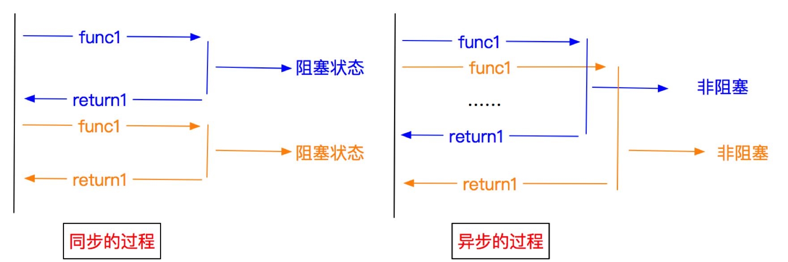
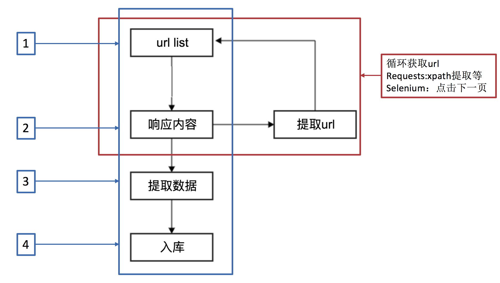
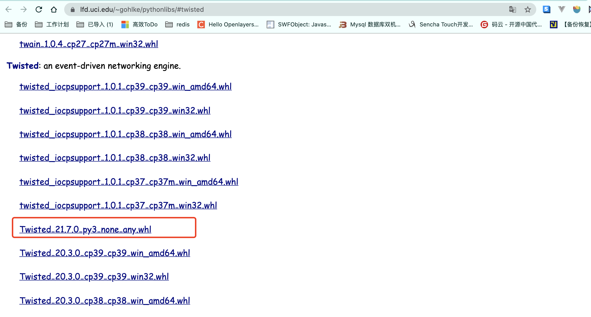
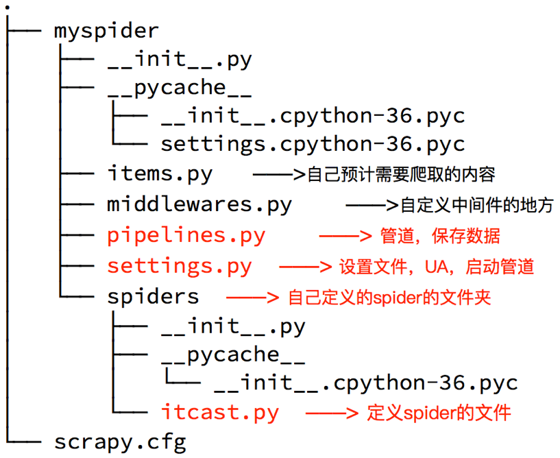

# Scrapy框架

## 一、前言

### 1、介绍

前面我们学习了基础的爬虫实现方法和selenium以及mongodb数据库，那么接下来会我们学习一个上场率非常高的爬虫框架：scrapy

### 2、内容

- scrapy的基础概念和工作流程
- scrapy入门使用

## 二、scrapy的概念和流程

##### 学习目标：

1. 了解 scrapy的概念
2. 掌握 scrapy框架的运行流程
3. 掌握 scrapy框架的作用

### 1、为什么学习scrapy？

1. 能够让开发过程方便、快速
2. scrapy框架能够让我们的爬虫效率更高

### 2、什么是scrapy？

文档地址：https://docs.scrapy.org/en/latest/

Scrapy 使用了Twisted['twɪstɪd]异步网络框架，可以加快我们的下载速度。

**Scrapy是一个为了爬取网站数据，提取结构性数据而编写的应用框架**，我们只需要实现少量的代码，就能够快速的抓取。

### 3、异步和非阻塞的区别

前面我们说Twisted是一个异步的网络框架，经常我们也听到一个词语叫做非阻塞，那么他们有什么区别呢？



**异步**：调用在发出之后，这个调用就直接返回，不管有无结果；异步是过程。 **非阻塞**：关注的是程序在等待调用结果（消息，返回值）时的状态，指在不能立刻得到结果之前，该调用不会阻塞当前线程。

### 4、scrapy的工作流程

##### 4.1 回顾之前的爬虫流程



##### 4.2 上面的流程可以改写为


##### 4.3 scrapy的流程


##### 其流程可以描述如下：

1. 调度器把requests-->引擎-->下载中间件--->下载器
2. 下载器发送请求，获取响应---->下载中间件---->引擎--->爬虫中间件--->爬虫
3. 爬虫提取url地址，组装成request对象---->爬虫中间件--->引擎--->调度器
4. 爬虫提取数据--->引擎--->管道
5. 管道进行数据的处理和保存

##### 注意：

- 图中绿色线条的表示数据的传递
- 注意图中中间件的位置，决定了其作用
- 注意其中引擎的位置，所有的模块之前相互独立，只和引擎进行交互

##### 4.4 scrapy中每个模块的具体作用


### 小结

1. scrapy的概念：Scrapy是一个为了爬取网站数据，提取结构性数据而编写的应用框架

2. scrapy框架的运行流程以及数据传递过程：
   1. 调度器把requests-->引擎-->下载中间件--->下载器
   2. 下载器发送请求，获取响应---->下载中间件---->引擎--->爬虫中间件--->爬虫
   3. 爬虫提取url地址，组装成request对象---->爬虫中间件--->引擎--->调度器
   4. 爬虫提取数据--->引擎--->管道
   5. 管道进行数据的处理和保存

3. scrapy框架的作用：通过少量代码实现快速抓取

4. 掌握scrapy中每个模块的作用： 

   引擎(engine)：负责数据和信号在不同模块间的传递 调度器(scheduler)：实现一个队列，存放引擎发过来的request请求对象 

   下载器(downloader)：发送引擎发过来的request请求，获取响应，并将响应交给引擎 

   爬虫(spider)：处理引擎发过来的response，提取数据，提取url，并交给引擎 

   管道(pipeline)：处理引擎传递过来的数据，比如存储 

   下载中间件(downloader middleware)：可以自定义的下载扩展，比如设置代理ip 

   爬虫中间件(spider middleware)：可以自定义request请求和进行response过滤

5. 理解异步和非阻塞的区别：异步是过程，非阻塞是状态


# 三、scrapy的入门使用

##### 学习目标：

1. 掌握 scrapy的安装
2. 应用 创建scrapy的项目
3. 应用 创建scrapy爬虫
4. 应用 运行scrapy爬虫
5. 应用 解析并获取scrapy爬虫中的数据

### 1、scrapy项目实现流程

1. 创建一个scrapy项目:scrapy startproject mySpider
2. 生成一个爬虫:scrapy genspider myspider [www.xxx.cn](www.xxx.cn)
3. 提取数据:完善spider，使用xpath等方法
4. 保存数据:pipeline中保存数据

### 2、安装

安装scrapy命令：

```
 pip install scrapy==2.5.1
 pip install -i https://pypi.tuna.tsinghua.edu.cn/simple scrapy==2.5.1 
 pip install scrapy-redis==0.7.2
```

如果安装失败. 请先升级一下pip.  然后重新安装scrapy即可. 

最新版本的pip升级完成后. 安装依然失败, 可以根据报错信息进行一点点的调整, 多试几次pip. 直至success. 

注意：

如果上述过程还是无法正常安装scrapy, 可以考虑用下面的方案来安装:

如果上述过程还是无法正常安装scrapy, 可以考虑用下面的方案来安装:

1. 安装wheel

   ```
   pip install wheel
   ```

2. 下载twisted安装包, https://www.lfd.uci.edu/~gohlke/pythonlibs/#twisted

   

3. 用wheel安装twisted. 

   ```
   pip install Twisted‑21.7.0‑py3‑none‑any.whl
   ```

4. 安装pywin32

   ```
   pip install pywin32
   ```

5. 安装scrapy

   ```
   pip install scrapy
   ```

总之, 最终你的控制台输入`scrapy version`能显示版本号. 就算成功了

### 3、创建scrapy项目

创建scrapy项目的命令：scrapy startproject +<项目名字>

示例：scrapy startproject myspider

#### 生成的目录和文件结果如下：


#### scrapy的核心组件

- **引擎(Scrapy)**
   用来处理整个系统的数据流处理, 触发事务(框架核心)
- **调度器(Scheduler)**
   用来接受引擎发过来的请求, 压入队列中, 并在引擎再次请求的时候返回. 可以想像成一个URL（抓取网页的网址或者说是链接）的优先队列, 由它来决定下一个要抓取的网址是什么, 同时去除重复的网址
- **下载器(Downloader)**
   用于下载网页内容, 并将网页内容返回给蜘蛛(Scrapy下载器是建立在twisted这个高效的异步模型上的)
- **爬虫(Spiders)**
   爬虫是主要干活的, 用于从特定的网页中提取自己需要的信息, 即所谓的实体(Item)。用户也可以从中提取出链接,让Scrapy继续抓取下一个页面
- **项目管道(Pipeline)**
   负责处理爬虫从网页中抽取的实体，主要的功能是持久化实体、验证实体的有效性、清除不需要的信息。当页面被爬虫解析后，将被发送到项目管道，并经过几个特定的次序处理数据。

### 4、创建爬虫

命令：**在项目路径下执行**:scrapy genspider +<爬虫名字> + <允许爬取的域名>

示例：

-  scrapy startproject duanzi01
-  cd duanzi01/
-  scrapy genspider duanzi duanzixing.com

生成的目录和文件结果如下：



### 5、完善spider

完善spider即通过方法进行数据的提取等操作

在/duanzi01/duanzi01/spiders/duanzi.py中修改内容如下:

```python
 import scrapy
 
 # 自定义spider类，继承scrapy.spider
 class DuanziSpider(scrapy.Spider):
     # 爬虫名字
     name = 'duanzi'
     # 允许爬取的范围，防止爬虫爬到别的网站
     allowed_domains = ['duanzixing.com']
     # 开始爬取的url地址
     start_urls = ['http://duanzixing.com/']
 
     # 数据提取的方法，接受下载中间件传过来的response 是重写父类中的parse方法
     def parse(self, response, **kwargs):
         # 打印抓取到的页面源码
         # print(response.text)
         # xpath匹配每条段子的article列表
         article_list = response.xpath('//article[@class="excerpt"]')
         # print(article_list)
         # 循环获取每一个article
         for article in article_list:
             # 匹配标题
             # title = article.xpath('./header/h2/a/text()')
             # [<Selector xpath='./header/h2/a/text()' data='一个不小心就把2000块钱的包包设置成了50包邮'>]
             # title = article.xpath('./header/h2/a/text()')[0].extract()
             # 等同于
             title = article.xpath('./header/h2/a/text()').extract_first()
 
             # 获取段子内容
             con = article.xpath('./p[@class="note"]/text()').extract_first()
             print('title', title)
             print('con', con)
```

**启动爬虫命令**： scrapy crawl  duanzi

**response响应对象的常用属性**

- response.url：当前响应的url地址
- response.request.url：当前响应对应的请求的url地址
- response.headers：响应头
- response.request.headers：当前响应的请求头
- response.body：响应体，也就是html代码，byte类型
- response.text  返回响应的内容 字符串
- response.status：响应状态码

##### 注意：

1. response.xpath方法的返回结果是一个类似list的类型，其中包含的是selector对象，操作和列表一样，但是有一些额外的方法

2. extract() 返回一个包含有字符串的列表  

   **如果使用列表调用extract()则表示，extract会将列表中每一个列表元素进行extract操作，返回列表**

3. extract_first() 返回列表中的第一个字符串，列表为空没有返回None

4. spider中的parse方法必须有

5. 需要抓取的url地址必须属于allowed_domains,但是start_urls中的url地址没有这个限制

6. 启动爬虫的时候注意启动的位置，是在项目路径下启动

### 6、配置settings文件

- ROBOTSTXT_OBEY = False

  robots是一种反爬协议。在协议中规定了哪些身份的爬虫无法爬取的资源有哪些。

  在配置文件中setting，取消robots的监测：

- 在配置文件中配置全局的UA：USER_AGENT='xxxx'

- 在配置文件中加入日志等级：LOG_LEVEL = 'ERROR'  只输出错误信息

  其它日志级别

  - CRITICAL  严重错误
  - ERROR  错误
  - WARNING  警告
  - INFO  消息
  - DEBUG   调试

代码实例

```python
 # Scrapy settings for mySpider project
 USER_AGENT = 'Mozilla/5.0 (Macintosh; Intel Mac OS X 10_15_7) AppleWebKit/537.36 (KHTML, like Gecko) Chrome/100.0.4896.127 Safari/537.36'
 
 ROBOTSTXT_OBEY = False
 
 LOG_LEVEL = 'ERROR'
```

### 7、数据存储

#### 7.1、使用终端命令行进行存储

- 代码配置

  /myspider/myspider/spiders/ITSpider.py

  ```python
   class ITSpider(scrapy.Spider):
       name = 'ITSpider'
       # allowed_domains = ['www.xxx.com']
       start_urls = ['https://duanzixing.com/page/2/']
   
       # 通过终端写入文件的方式
       def parse(self, response):
           article_list = response.xpath('/html/body/section/div/div/article')
           # 创建列表， 存储数据
           all_data = []
           for article in article_list:
               title = article.xpath('./header/h2/a/text()').extract_first()
               con = article.xpath('./p[2]/text()').extract_first()
               dic = {
                   'title': title,
                   'con': con
               }
               all_data.append(dic)
           return all_data
  ```

- 终端命令

  scrapy crawl ITSpider -o ITSpider.csv  

  将文件存储到ITSpider.csv  文件中

#### 7.2、利用管道pipeline来处理(保存)数据(写入文件中)

**先跟着配置 后面会单讲**

代码配置

- 打开items.py文件 添加如下代码

  myspider/myspider/items.py

  ```python
   import scrapy
   
   
   class MyspiderItem(scrapy.Item):
       # define the fields for your item here like:
       # name = scrapy.Field()
       title = scrapy.Field()
       con = scrapy.Field()
  ```

- /myspider/myspider/spiders/ITSpider.py

  ```python
   import scrapy
   from myspider.items import MyspiderItem
   
   class ITSpiderSpider(scrapy.Spider):
       name = 'ITSpider'
       # allowed_domains = ['www.xxx.com']
       start_urls = ['https://duanzixing.com/page/2/']
   
       # 写入管道 持久化存储
       def parse(self, response):
           article_list = response.xpath('/html/body/section/div/div/article')
           for article in article_list:
               title = article.xpath('./header/h2/a/text()').extract_first()
               con = article.xpath('./p[2]/text()').extract_first()
               item = DuanziproItem()
               item['title'] = title
               item['con'] = con
               yield item
  ```

  在爬虫文件ITSpider.py中parse()函数中最后添加

  ```python
   yield item
  ```

  思考：为什么要使用yield？

  1. 让整个函数变成一个生成器，有什么好处呢？
  2. 遍历这个函数的返回值的时候，挨个把数据读到内存，不会造成内存的瞬间占用过高
  3. python3中的range和python2中的xrange同理

  **注意：yield能够传递的对象只能是：BaseItem,Request,dict,None**

- 打开管道文件 pipelines.py  添加如下代码 

  myspider/myspider/pipelines.py

  ```python
   class ITSpiderPipeline:
       f = None
       def open_spider(self, spider):
           print('爬虫开始时被调用一次')
           self.f = open('./duanzi.text', 'w')
           
       # 爬虫文件中提取数据的方法每yield一次item，就会运行一次
       # 该方法为固定名称函数
       def process_item(self, item, spider):
           print(item)
           self.f.write(item['title']+item['con']+'\n')
           return item
   
       def close_spider(self, spider):
           print('爬虫结束时被调用')
           self.f.close()
  ```

  - open_spider方法

    重写父类中open_spider方法  只有爬虫开始十被调用一次

  - close_spider 方法

    重写父类中lose_spider方法  爬虫结束时被调用一次

- 在settings.py设置开启pipeline

  将默认被注释的管道打开

  ```python
   ITEM_PIPELINES = {
      'myspider.pipelines.MyspiderPipeline': 300,
   }
  ```

  其中数值代表优先级  数值越小优先级越高

### 8、运行scrapy

命令：在项目目录下执行scrapy crawl +<爬虫名字>

示例：scrapy crawl ITSpider

### 9、总结

1. srapy的安装：pip install scrapy
2. 创建scrapy的项目: scrapy startproject myspider
3. 创建scrapy爬虫：在项目目录下执行 scrapy genspider ITSpider [www.xxx.cn](www.xxx.cn)
4. 运行scrapy爬虫：在项目目录下执行 scrapy crawl ITSpider
5. 解析并获取scrapy爬虫中的数据：
   1. response.xpath方法的返回结果是一个类似list的类型，其中包含的是selector对象，操作和列表一样，但是有一些额外的方法
   2. extract() 返回一个包含有字符串的列表
   3. extract_first() 返回列表中的第一个字符串，列表为空没有返回None
6. scrapy管道的基本使用:
   1. 完善pipelines.py中的process_item函数
   2. 在settings.py中设置开启pipeline