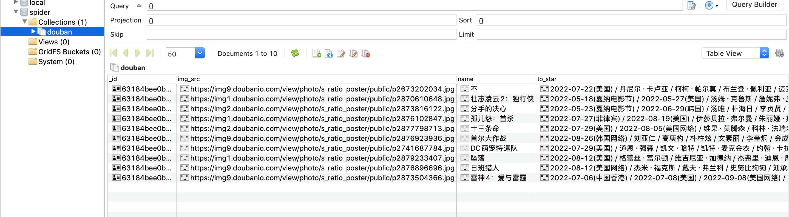

# Scrapy深入使用-存储

## scrapy的深入使用

##### 学习目标：

1. 了解 scrapy debug信息
2. 了解 scrapy shell的使用
3. 掌握 scrapy的settings.py设置
4. 掌握 scrapy管道(pipelines.py)的使用
5. 掌握scrapy下载图片

------

### 1、了解scrapy的debug信息


### 2、了解scrapyShell

scrapy shell是scrapy提供的一个终端工具，能够通过它查看scrapy中对象的属性和方法，以及测试xpath

使用方法：

```linux
scrapy shell http://www.baidu.com
```

在终端输入上述命令后，能够进入python的交互式终端，此时可以使用：

- response.xpath()：直接测试xpath规则是否正确
- response.url：当前响应的url地址
- response.request.url：当前响应对应的请求的url地址
- response.headers：响应头
- response.body：响应体，也就是html代码，默认是byte类型
- response.request.headers：当前响应的请求头

### 3、settings.py中的设置信息

##### 3.1 为什么项目中需要配置文件

在配置文件中存放一些公共变量，在后续的项目中方便修改，如：本地测试数据库和部署服务器的数据库不一致

##### 3.2 配置文件中的变量使用方法

1. 变量名一般全部大写
2. 导入即可使用

##### 3.3 settings.py中的重点字段和含义

- USER_AGENT 设置ua

- ROBOTSTXT_OBEY 是否遵守robots协议，默认是遵守

- CONCURRENT_REQUESTS 设置并发请求的数量，默认是16个

- DOWNLOAD_DELAY 下载延迟，默认无延迟 （下载器在从同一网站下载连续页面之前应等待的时间（以秒为单位）。这可以用来限制爬行速度，以避免对服务器造成太大影响）

- COOKIES_ENABLED 是否开启cookie，即每次请求带上前一次的cookie，默认是开启的

- DEFAULT_REQUEST_HEADERS 设置默认请求头，这里加入了USER_AGENT将不起作用

- SPIDER_MIDDLEWARES 爬虫中间件，设置过程和管道相同

- DOWNLOADER_MIDDLEWARES 下载中间件

- LOG_LEVEL 控制终端输出信息的log级别，终端默认显示的是debug级别的log信息
  - LOG_LEVEL = "WARNING"
    - CRITICAL  严重
    - ERROR  错误
    - WARNING  警告
    - INFO  消息
    - DEBUG   调试

- LOG_FILE 设置log日志文件的保存路径，如果设置该参数，终端将不再显示信息

  LOG_FILE = "./test.log"

- 其他设置参考：https://www.jianshu.com/p/df9c0d1e9087

### 4、pipeline管道的深入使用

> 之前我们在scrapy入门使用一节中学习了管道的基本使用，接下来我们深入的学习scrapy管道的使用

#### 4.1 使用终端命令行进行存储

+ 代码配置

  /myspider/myspider/spiders/ITSpider.py

  ```python
  class ITSpider(scrapy.Spider):
      name = 'ITSpider'
      # allowed_domains = ['www.xxx.com']
      start_urls = ['https://duanzixing.com/page/1/']

      # 通过终端写入文件的方式
      def parse(self, response):
          article_list = response.xpath('/html/body/section/div/div/article')
          # 创建列表， 存储数据
          all_data = []
          for article in article_list:
              title = article.xpath('./header/h2/a/text()').extract_first()
              con = article.xpath('./p[2]/text()').extract_first()
              dic = {
                  'title': title,
                  'con': con
              }
              all_data.append(dic)
          return all_data
  ```

+ 终端命令

  scrapy crawl 爬虫名称-o 文件名.csv  

  scrapy crawl ITSpider -o ITSpider.csv  

  将文件存储到ITSpider.csv  文件中

#### 4.2 使用管道存储到文件中

##### (1) 抓取网站：https://movie.douban.com/chart

##### (2) 创建工程

+ scrapy startproject doubanfile

+ cd doubanfile

+ scrapy genspider db movie.douban.com/chart

##### (3) 抓取需求与实现

**抓取：**

+ 封面
+ 电影名称
+ 主演

##### (4) 配置settings.py

```
LOG_LEVEL = 'ERROR'
ROBOTSTXT_OBEY = False
```

##### (5) db.py中实现

先抓取每一行数据的tr列表

```python
import scrapy


class DbSpider(scrapy.Spider):
    name = 'db'
    allowed_domains = ['https://movie.douban.com/chart']
    start_urls = ['https://movie.douban.com/chart']

    def parse(self, resp, **kwargs):
        print(resp.text)
        # 先获取到每一行数据的tr
        tr_list = resp.xpath('//div[@class="indent"]/div/table/tr[@class="item"]')
        print(tr_list)
```

此刻运行打印

srapy crawl db

发现无任何打印，将LOG_LEVEL = 'ERROR' 更改为 INFO  ，发现此刻请求没有权限


发现问题所在后修改settings.py

在默认请求头`DEFAULT_REQUEST_HEADERS`中添加`User-Agent`

```python
DEFAULT_REQUEST_HEADERS = {
  'Accept': 'text/html,application/xhtml+xml,application/xml;q=0.9,*/*;q=0.8',
  'Accept-Language': 'en',
  'User-Agent': 'Mozilla/5.0 (Macintosh; Intel Mac OS X 10_15_7) AppleWebKit/537.36 (KHTML, like Gecko) Chrome/104.0.0.0 Safari/537.36'
}
```

再次请求，成功

##### (6) db.py完整实现

```python
import scrapy
import re

class DbSpider(scrapy.Spider):
    name = 'db'
    allowed_domains = ['https://movie.douban.com/chart']
    start_urls = ['https://movie.douban.com/chart']

    def parse(self, resp, **kwargs):
        # print(resp.text)
        # 先获取到每一行数据的tr
        tr_list = resp.xpath('//div[@class="indent"]/div/table/tr[@class="item"]')
        for tr in tr_list:
            # 获取封面
            img_src = tr.xpath('./td[1]/a/img/@src').extract_first()
            # 电影名称
            name = tr.xpath('./td[2]/div[@class="pl2"]/a//text()').extract_first()
            # 去除空白字符使用replace替换
            # name = name.replace('\n', '').replace('\r', '').replace('/', '').replace(' ', '')
            # 去除空白字符使用正则替换
            name = re.sub('(/)|(\s)', '', name)
            # 主演
            to_star = tr.xpath('./td[2]/div[@class="pl2"]/p[@class="pl"]/text()').extract_first()
```

##### (7) 打开items.py文件

添加如下代码

属性名称和当前爬虫db.py中抓到要存储数据的变量一致 否则报错

```python
import scrapy


class DoubanfileItem(scrapy.Item):
    # define the fields for your item here like:
    # name = scrapy.Field()
    img_src = scrapy.Field()
    name = scrapy.Field()
    to_star = scrapy.Field()
```

##### (8) db.py 再次进行修改

```python
import scrapy
import re
from doubanfile.items import DoubanfileItem

class DbSpider(scrapy.Spider):
    name = 'db'
    allowed_domains = ['https://movie.douban.com/chart']
    start_urls = ['https://movie.douban.com/chart']

    def parse(self, resp, **kwargs):
        item = DoubanfileItem()  # 实例化item类
        # print(resp.text)
        # 先获取到每一行数据的tr
        tr_list = resp.xpath('//div[@class="indent"]/div/table/tr[@class="item"]')
        for tr in tr_list:
            # 获取封面
            item['img_src'] = tr.xpath('./td[1]/a/img/@src').extract_first()
            # 电影名称
            name = tr.xpath('./td[2]/div[@class="pl2"]/a//text()').extract_first()
            # 去除空白字符使用replace替换
            # name = name.replace('\n', '').replace('\r', '').replace('/', '').replace(' ', '')
            # 去除空白字符使用正则替换
            item['name'] = re.sub('(/)|(\s)', '', name)
            # 主演
            item['to_star'] = tr.xpath('./td[2]/div[@class="pl2"]/p[@class="pl"]/text()').extract_first()
            yield item
```

思考：为什么要使用yield？

1. 让整个函数变成一个生成器，有什么好处呢？
2. 遍历这个函数的返回值的时候，挨个把数据读到内存，不会造成内存的瞬间占用过高
3. python3中的range和python2中的xrange同理

**注意：yield能够传递的对象只能是：BaseItem,Request,dict,None**

##### (8) 开启管道

pipeline中常用的方法：

1. process_item(self,item,spider):实现对item数据的处理
2. open_spider(self, spider): 在爬虫开启的时候仅执行一次
3. close_spider(self, spider): 在爬虫关闭的时候仅执行一次

settings.py 打开当前注释

```python
ITEM_PIPELINES = {
   'doubanfile.pipelines.DoubanfilePipeline': 300,
}
```

##### (9) 在pipelines.py代码中完善（设置文件存储）

```python
class DoubanfilePipeline:
    f = None
    def open_spider(self, item):
        self.f = open('./db.text', 'w')
    def process_item(self, item, spider):
        print(item)
        self.f.write(item['img_src']+'\n')
        self.f.write(item['name']+'\n')
        self.f.write(item['to_star']+'\n')
        return item

    def close_spider(self, item):
        self.f.close()
```

**注意：**

当前process_item中的return item必须存在，如果当前爬虫存在于多个管道的时候，如果没有return item 则下一个管道不能获取到当前的item数据

#### 4.3 存储到MySQL数据库中

##### (1) 抓取网站：https://movie.douban.com/chart

##### (2) 创建工程

+ scrapy startproject doubanmysql

+ cd doubanmysql

+ scrapy genspider db movie.douban.com/chart

##### (3) 抓取需求与实现

**抓取：**

+ 封面
+ 电影名称
+ 主演

##### (4) 配置settings.py

```python
# 设置日志级别
LOG_LEVEL = 'ERROR'
ROBOTSTXT_OBEY = False
# 设置请求头
DEFAULT_REQUEST_HEADERS = {
  'Accept': 'text/html,application/xhtml+xml,application/xml;q=0.9,*/*;q=0.8',
  'Accept-Language': 'en',
  'User-Agent': 'Mozilla/5.0 (Macintosh; Intel Mac OS X 10_15_7) AppleWebKit/537.36 (KHTML, like Gecko) Chrome/104.0.0.0 Safari/537.36'
}
# 开启管道
ITEM_PIPELINES = {
   'doubanmysql.pipelines.DoubanmysqlPipeline': 300,
}
```

##### (5) 创建豆瓣数据库

```sql
create database douban character set utf8;
use douban
CREATE TABLE `douban` (
  `id` int(10) unsigned NOT NULL AUTO_INCREMENT,
  `img_src` varchar(200) NOT NULL COMMENT '封面地址',
  `name` varchar(50) NOT NULL COMMENT '电影名称',
  `to_star` varchar(250) NOT NULL COMMENT '主演',
  PRIMARY KEY (`id`)
) ENGINE=InnoDB DEFAULT CHARSET=utf8
```

**示例SQL语句**

```python
insert into info(img_src, name, to_star) values("https://img9.doubanio.com/view/photo/s_ratio_poster/public/p2673202034.webp", "尼罗河上的惨案 Death on the Nile", "肯尼思·布拉纳", "迈克尔·格林 / 阿加莎·克里斯蒂", "肯尼思·布拉纳艾玛·麦基/艾米·汉莫/珍妮弗·桑德斯/苏菲·奥康内多/安妮特·贝宁/妮基塔·查达哈/汤姆·巴特曼/亚当·加西亚/汉/爱德华·刘易斯·弗伦奇/拉普洛斯·卡伦福佐斯")
```

##### (6) items.py

```python
import scrapy


class DoubanmysqlItem(scrapy.Item):
    # define the fields for your item here like:
    # name = scrapy.Field()
    img_src = scrapy.Field()
    name = scrapy.Field()
    to_star = scrapy.Field()
```

##### (7) db.py

```python
import scrapy
from doubanmysql.items import DoubanmysqlItem
import re

class DbSpider(scrapy.Spider):
    name = 'db'
    allowed_domains = ['movie.douban.com/chart']
    start_urls = ['http://movie.douban.com/chart/']

    def parse(self, resp, **kwargs):
        item = DoubanmysqlItem()  # 实例化item类
        # print(resp.text)
        # 先获取到每一行数据的tr
        tr_list = resp.xpath('//div[@class="indent"]/div/table/tr[@class="item"]')
        for tr in tr_list:
            # 获取封面
            item['img_src'] = tr.xpath('./td[1]/a/img/@src').extract_first()
            # 电影名称
            name = tr.xpath('./td[2]/div[@class="pl2"]/a//text()').extract_first()
            # 去除空白字符使用replace替换
            # name = name.replace('\n', '').replace('\r', '').replace('/', '').replace(' ', '')
            # 去除空白字符使用正则替换
            item['name'] = re.sub('(/)|(\s)', '', name)
            # 主演
            item['to_star'] = tr.xpath('./td[2]/div[@class="pl2"]/p[@class="pl"]/text()').extract_first()
            yield item
```

##### (8) 管道代码

```python
from itemadapter import ItemAdapter
import pymysql

class DoubanmysqlPipeline:
    db = None
    cursor = None
    def open_spider(self, spider):
        # 判断当前运行的是否为db爬虫，不是db爬虫则下面代码不执行
        # 当前仅限于一个scrapy下有多个爬虫工程
        if spider.name == 'db':
            self.db = pymysql.connect(host='127.0.0.1', port=3306, db='douban', user='root', passwd='123456', charset='utf8')
            self.cursor = self.db.cursor()

    def process_item(self, item, spider):
        # 判断当前运行的是否为db爬虫
        if spider.name == 'db':
            try:
                sql = f'insert into douban(img_src, name, to_star) values("{item["img_src"]}", "{item["name"]}", "{item["to_star"]}")'
                self.cursor.execute(sql)
                self.db.commit()
            except Exception as e:
                print(e)
                print(sql)
                self.db.rollback()
				return item
    def close_spider(self, item):
        # 关闭数据库连接
        self.db.close()
```

##### (9) 运行爬虫

scrapy crawl db

查看终端数据是否有报错，如果没有报错查看数据库数据是否存储成功


#### 4.4 存储到MongoDB数据库中

##### (1) 抓取网站：https://movie.douban.com/chart

##### (2) 创建工程

+ scrapy startproject doubanmongodb

+ cd doubanmongodb

+ scrapy genspider db movie.douban.com/chart

##### (3) 抓取需求与实现

**抓取：**

+ 封面
+ 电影名称
+ 主演

##### (4) 配置settings.py

```python
# 设置日志级别
LOG_LEVEL = 'ERROR'
ROBOTSTXT_OBEY = False
# 设置请求头
DEFAULT_REQUEST_HEADERS = {
  'Accept': 'text/html,application/xhtml+xml,application/xml;q=0.9,*/*;q=0.8',
  'Accept-Language': 'en',
  'User-Agent': 'Mozilla/5.0 (Macintosh; Intel Mac OS X 10_15_7) AppleWebKit/537.36 (KHTML, like Gecko) Chrome/104.0.0.0 Safari/537.36'
}
# 开启管道
ITEM_PIPELINES = {
   'doubanmongodb.pipelines.DoubanmongodbPipeline': 300,
}
```

##### (5) items.py

```python
import scrapy


class DoubanmongodbItem(scrapy.Item):
    # define the fields for your item here like:
    # name = scrapy.Field()
    img_src = scrapy.Field()
    name = scrapy.Field()
    to_star = scrapy.Field()
```

##### (6) db.py

```python
import scrapy
from doubanmongodb.items import DoubanmongodbItem
import re


class DbSpider(scrapy.Spider):
    name = 'db'
    allowed_domains = ['movie.douban.com/chart']
    start_urls = ['http://movie.douban.com/chart/']

    def parse(self, resp, **kwargs):
        item = DoubanmongodbItem()  # 实例化item类
        # print(resp.text)
        # 先获取到每一行数据的tr
        tr_list = resp.xpath('//div[@class="indent"]/div/table/tr[@class="item"]')
        for tr in tr_list:
            # 获取封面
            item['img_src'] = tr.xpath('./td[1]/a/img/@src').extract_first()
            # 电影名称
            name = tr.xpath('./td[2]/div[@class="pl2"]/a//text()').extract_first()
            # 去除空白字符使用replace替换
            # name = name.replace('\n', '').replace('\r', '').replace('/', '').replace(' ', '')
            # 去除空白字符使用正则替换
            item['name'] = re.sub('(/)|(\s)', '', name)
            # 主演
            item['to_star'] = tr.xpath('./td[2]/div[@class="pl2"]/p[@class="pl"]/text()').extract_first()
            yield item
```

##### (7) 管道代码

```python
from itemadapter import ItemAdapter
from pymongo import MongoClient

class DoubanmongodbPipeline:
    con = None
    collection = None
    def open_spider(self, spider):  # 在爬虫开启的时候仅执行一次
        if spider.name == 'db':
            self.con = MongoClient(host='127.0.0.1', port=27017) # 实例化mongoclient
            self.collection = self.con.spider.douban  # 创建数据库名为spider,集合名为douban的集合操作对象

    def process_item(self, item, spider):
        if spider.name == 'db':
            # print(spider.name)
            self.collection.insert_one(dict(item)) # 此时item对象需要先转换为字典,再插入
        # 不return的情况下，另一个权重较低的pipeline将不会获得item
        return item

    def close_spider(self, item):
        # 关闭数据库连接
        self.con.close()
```

**注意：**

需要开启mongo服务

mongod.exe  --dbpath=C:/User/xxx/db

新开终端

mongo.exe

##### (8) 运行爬虫

scrapy crawl db

查看终端数据是否有报错，如果没有报错查看数据库数据是否存储成功




#### 4.5 数据同时存储到文件、MySQL、MongoDB中

##### (1) 抓取网站：https://movie.douban.com/chart

##### (2) 创建工程

+ scrapy startproject douban

+ cd douban

+ scrapy genspider db movie.douban.com/chart

##### (3) 抓取需求与实现

**抓取：**

+ 封面
+ 电影名称
+ 主演

##### (4) 配置settings.py

```python
# 设置日志级别
LOG_LEVEL = 'ERROR'
ROBOTSTXT_OBEY = False
# 设置请求头
DEFAULT_REQUEST_HEADERS = {
  'Accept': 'text/html,application/xhtml+xml,application/xml;q=0.9,*/*;q=0.8',
  'Accept-Language': 'en',
  'User-Agent': 'Mozilla/5.0 (Macintosh; Intel Mac OS X 10_15_7) AppleWebKit/537.36 (KHTML, like Gecko) Chrome/104.0.0.0 Safari/537.36'
}
# 开启管道
ITEM_PIPELINES = {
   'douban.pipelines.DoubanPipeline': 300,
}
```

##### (5) items.py

```python
import scrapy


class DoubanItem(scrapy.Item):
    # define the fields for your item here like:
    # name = scrapy.Field()
    img_src = scrapy.Field()
    name = scrapy.Field()
    to_star = scrapy.Field()
```

##### (6) db.py

```python
import scrapy
from douban.items import DoubanItem
import re


class DbSpider(scrapy.Spider):
    name = 'db'
    allowed_domains = ['movie.douban.com/chart']
    start_urls = ['http://movie.douban.com/chart/']

    def parse(self, resp, **kwargs):
        item = DoubanItem()  # 实例化item类
        # print(resp.text)
        # 先获取到每一行数据的tr
        tr_list = resp.xpath('//div[@class="indent"]/div/table/tr[@class="item"]')
        for tr in tr_list:
            # 获取封面
            item['img_src'] = tr.xpath('./td[1]/a/img/@src').extract_first()
            # 电影名称
            name = tr.xpath('./td[2]/div[@class="pl2"]/a//text()').extract_first()
            # 去除空白字符使用replace替换
            # name = name.replace('\n', '').replace('\r', '').replace('/', '').replace(' ', '')
            # 去除空白字符使用正则替换
            item['name'] = re.sub('(/)|(\s)', '', name)
            # 主演
            item['to_star'] = tr.xpath('./td[2]/div[@class="pl2"]/p[@class="pl"]/text()').extract_first()
            yield item
```

##### (7) 管道代码

```python
# Define your item pipelines here
#
# Don't forget to add your pipeline to the ITEM_PIPELINES setting
# See: https://docs.scrapy.org/en/latest/topics/item-pipeline.html


# useful for handling different item types with a single interface
from itemadapter import ItemAdapter
import pymysql
from pymongo import MongoClient


class DoubanFilePipeline:
    '''
    设置文件存储
    '''
    f = None
    def open_spider(self, item):
        self.f = open('./db.text', 'w')

    def process_item(self, item, spider):
        print(item)
        self.f.write(item['img_src'] + '\n')
        self.f.write(item['name'] + '\n')
        self.f.write(item['to_star'] + '\n')
        return item

    def close_spider(self, item):
        self.f.close()

class DoubanmysqlPipeline:
    '''
    存储到MySQL数据库中
    '''
    db = None
    cursor = None
    def open_spider(self, spider):
        # 判断当前运行的是否为db爬虫，不是db爬虫则下面代码不执行
        # 当前仅限于一个scrapy下有多个爬虫工程
        if spider.name == 'db':
            self.db = pymysql.connect(host='127.0.0.1', port=3306, db='douban', user='root', passwd='123456', charset='utf8')
            self.cursor = self.db.cursor()

    def process_item(self, item, spider):
        # 判断当前运行的是否为db爬虫
        if spider.name == 'db':
            try:
                sql = f'insert into douban(img_src, name, to_star) values("{item["img_src"]}", "{item["name"]}", "{item["to_star"]}")'
                self.cursor.execute(sql)
                self.db.commit()
            except Exception as e:
                print(e)
                print(sql)
                self.db.rollback()
        return item
    def close_spider(self, item):
        # 关闭数据库连接
        self.db.close()


class DoubanmongodbPipeline:
    '''
    存储到MongoDB数据库中
    '''
    con = None
    collection = None
    def open_spider(self, spider):  # 在爬虫开启的时候仅执行一次
        if spider.name == 'db':
            self.con = MongoClient(host='127.0.0.1', port=27017) # 实例化mongoclient
            self.collection = self.con.spider.douban  # 创建数据库名为spider,集合名为douban的集合操作对象

    def process_item(self, item, spider):
        if spider.name == 'db':
            # print(spider.name)
            self.collection.insert_one(dict(item)) # 此时item对象需要先转换为字典,再插入
        # 不return的情况下，另一个权重较低的pipeline将不会获得item
        return item

    def close_spider(self, item):
        # 关闭数据库连接
        self.con.close()
```

##### (8) 修改settings.py 添加管道

```python
ITEM_PIPELINES = {
   'douban.pipelines.DoubanFilePipeline': 300,  # 300表示权重
   'douban.pipelines.DoubanmysqlPipeline': 400,
   'douban.pipelines.DoubanmongodbPipeline': 500,
}
```

您在此设置中分配给类的整数值决定了它们运行的顺序：项目从低值到高值的类。通常将这些数字定义在 0-1000 范围内。

**思考：pipeline在settings中能够开启多个，为什么需要开启多个？**

1. 不同的pipeline可以处理不同爬虫的数据，通过spider.name属性来区分
2. 不同的pipeline能够对一个或多个爬虫进行不同的数据处理的操作，比如一个进行数据清洗，一个进行数据的保存
3. 同一个管道类也可以处理不同爬虫的数据，通过spider.name属性来区分

#### 4.6 pipeline使用注意点

1. 使用之前需要在settings中开启
2. pipeline在setting中键表示位置(即pipeline在项目中的位置可以自定义)，值表示距离引擎的远近，越近数据会越先经过
3. 有多个pipeline的时候，process_item的方法必须return item,否则后一个pipeline取到的数据为None值
4. pipeline中process_item的方法必须有，否则item没有办法接受和处理
5. process_item方法接受item和spider，其中spider表示当前传递item过来的spider
6. open_spider(spider) :能够在爬虫开启的时候执行一次
7. close_spider(spider) :能够在爬虫关闭的时候执行一次
8. 上述俩个方法经常用于爬虫和数据库的交互，在爬虫开启的时候建立和数据库的连接，在爬虫关闭的时候断开和数据库的连接

#### 4.7 总结

1. debug能够展示当前程序的运行状态 
2. scrapy shell能够实现xpath的测试和对象属性和方法的尝试
3. scrapy的settings.py能够实现各种自定义的配置，比如下载延迟和请求头等
4. 管道能够实现数据的清洗和保存，能够定义多个管道实现不同的功能，其中有个三个方法
   - process_item(self,item,spider):实现对item数据的处理
   - open_spider(self, spider): 在爬虫开启的时候仅执行一次
   - close_spider(self, spider): 在爬虫关闭的时候仅执行一次

### 5、抓取详情页

##### (1) 概述

在之前的抓取中我们都是抓取当前再生成spider时候的网址中的数据，那如果我们想要访问当前数据中的子页面的数据，那又该如何操作呢，回忆下我们在前面requests课程中是如何抓取子页面数据的

**思路：**

+ 先对第一层url进行请求
+ 请求返回数据进行解析循环  找到每一条子页面的url
+ 找到子页面的url以后进行再次请求
+ 请求解析子页面请求返回的数据
+ 结束

那么在我们scrapy中的思路也是一样的，通过抓取当前第一层页面中解析出来的子页面的数据，在通过scrapy.Rquests进行子页面的请求，那我们了解了当前抓取的思路，就开始我们scrapy子页面的请求与抓取吧

##### (2) 抓取网站：https://movie.douban.com/chart

##### (3) 创建工程

+ scrapy startproject doubandetail

+ cd doubandetail

+ scrapy genspider db movie.douban.com/chart

##### (4) 抓取需求与实现

**抓取：**

+ 电影名称
+ 导演
+ 编剧
+ 主演
+ 类型

通过第一层匹配到的子页面的url进行请求详情页的url数据


##### 

##### (5) 配置settings.py

```python
# 设置日志级别
LOG_LEVEL = 'ERROR'
ROBOTSTXT_OBEY = False
COOKIES_ENABLED = False  # cookies的中间件将不起作用，下面的cookie起作用

# 设置请求头
DEFAULT_REQUEST_HEADERS = {
  'Accept': 'text/html,application/xhtml+xml,application/xml;q=0.9,*/*;q=0.8',
  'Accept-Language': 'en',
  'User-Agent': 'Mozilla/5.0 (Macintosh; Intel Mac OS X 10_15_7) AppleWebKit/537.36 (KHTML, like Gecko) Chrome/104.0.0.0 Safari/537.36',
  'Cookie': '设定cookie 防止反扒'
}
# 开启管道
ITEM_PIPELINES = {
   'doubandetail.pipelines.DoubandetailPipeline': 300,
}
```

##### (6) db.py

+ 概述

  ​因为当前需要对详情页面再次请求以获取详情页数据，请求思路和之前requests一样，只是在这里我们使用	`yield scrapy.Request()` 进行请求 默认请求方式为get

+ yield scrapy.Request(url, callback=self.parse_deatil)

  + url：为再次请求的URL地址

  + callback：请求后进行处理的回调方法

  + method: 请求方式

  + callback: 回调函数

  + errback: 报错回调

  + dont_filter: 默认False, 表示"不过滤", 该请求会重新进行发送

  + headers: 请求头

  + cookies: cookie信息

+ 代码实现

  ```python
  import scrapy
  from doubandetail.items import DoubandetailItem
  import re

  class DbSpider(scrapy.Spider):
      name = 'db'
      # 需要注释掉
      # allowed_domains = ['movie.douban.com/chart']
      start_urls = ['http://movie.douban.com/chart/']

      def parse(self, resp, **kwargs):
          print(resp.text)
          # 先获取到每一行数据的tr
          tr_list = resp.xpath('//div[@class="indent"]/div/table/tr[@class="item"]')
          for tr in tr_list:
              # 获取每个详情页的url
              detail_url = tr.xpath('./td[1]/a/@href').extract_first()
              # 请求子页面
              print(detail_url)
              yield scrapy.Request(detail_url, callback=self.parse_deatil)

      # 解析子页面数据
      def parse_deatil(self, response):
          # 默认携带我们settings.py中所配置的请求头进行请求
          # print(response.request.headers)
          item = DoubandetailItem()
          item['name'] = response.xpath('//*[@id="content"]/h1/span[1]/text()').extract_first()  # 电影名称
          item['director'] = response.xpath('//*[@id="info"]/span[1]/span[2]/a/text()').extract_first()  # 导演
          item['screenwriter'] = ''.join(response.xpath('//*[@id="info"]/span[2]/span[2]//text()').extract())  # 编剧
          item['to_star'] = ''.join(response.xpath('//*[@id="info"]/span[3]/span[2]//text()').extract())  # 主演
          item['type'] = '/'.join(response.xpath('//span[@property="v:genre"]//text()').extract())  # 类型
          item['link_report'] = re.sub('(/)|(\s)|(\u3000)|(\'\n\')', '', link_report)
          print(item)
          return item
  ```

+ **注意：**

  ​需要将allowed_domains注释掉，否则详情页url不符合当前允许，所以会出现不请求的问题

##### (7) items.py 

```python
import scrapy


class DoubandetailItem(scrapy.Item):
    # define the fields for your item here like:
    # name = scrapy.Field()
    name = scrapy.Field()  # 电影名称
    director = scrapy.Field()  # 导演
    screenwriter = scrapy.Field()  # 编剧
    to_star = scrapy.Field()  # 主演
    type = scrapy.Field()  # 类型
```

##### (8) 管道代码

```python
# Define your item pipelines here
#
# Don't forget to add your pipeline to the ITEM_PIPELINES setting
# See: https://docs.scrapy.org/en/latest/topics/item-pipeline.html


# useful for handling different item types with a single interface
from itemadapter import ItemAdapter
from pymongo import MongoClient

class DoubandetailPipeline:
    con = None
    collection = None
    def open_spider(self, spider):  # 在爬虫开启的时候仅执行一次
        self.con = MongoClient(host='127.0.0.1', port=27017)  # 实例化mongoclient
        self.collection = self.con.spider.douban  # 创建数据库名为spider,集合名为douban的集合操作对象

    def process_item(self, item, spider):
        print(item)
        self.collection.insert_one(dict(item))  # 此时item对象需要先转换为字典,再插入
        return item

    def close_spider(self, item):
        # 关闭数据库连接
        self.con.close()
```

**注意：**

如果访问频率过高被禁止访问，可以携带登录后的cooki进行访问

### 6、下载图片

##### (1) 安装模块

```
pip3 install pillow
```

##### (2) 抓取网址

https://desk.zol.com.cn/dongman/

##### (3) 创建工程

+ scrapy startproject desk

+ cd desk

+ scrapy genspider img desk.zol.com.cn/dongman

##### (4) 配置settings.py

```python
# 设置日志级别
LOG_LEVEL = 'ERROR'
ROBOTSTXT_OBEY = False
# 设置请求头
DEFAULT_REQUEST_HEADERS = {
  'Accept': 'text/html,application/xhtml+xml,application/xml;q=0.9,*/*;q=0.8',
  'Accept-Language': 'en',
  'User-Agent': 'Mozilla/5.0 (Macintosh; Intel Mac OS X 10_15_7) AppleWebKit/537.36 (KHTML, like Gecko) Chrome/104.0.0.0 Safari/537.36'
}
```

##### (5) img.py 爬虫代码书写

思路：

抓取到详情页中图片的url地址，交给图片管道进行下载

```python
import scrapy
from urllib.parse import urljoin


class ImgSpider(scrapy.Spider):
    name = 'img'
    # allowed_domains = ['desk.zol.com.cn/dongman']
    start_urls = ['http://desk.zol.com.cn/dongman/']

    def parse(self, resp, **kwargs):
        # 先抓取到每个图片详情的url
        url_list = resp.xpath('//ul[@class="pic-list2  clearfix"]/li/a/@href').extract()
        # 获取到url列表后 进行循环进行每一个url详情页的请求
        for url in url_list:
            # 因为抓取到的url并不完整，需要进行手动拼接
            # urljoin('https://desk.zol.com.cn/dongman/', '/bizhi/8301_103027_2.html')
            url = urljoin('https://desk.zol.com.cn/dongman/', url)
            # 拼凑完发现当前url中有下载exe的url，将其去除
            if url.find('exe') != -1:
                continue
            yield scrapy.Request(url, callback=self.parse_detail)

    # 对详情页进行解析
    def parse_detail(self, resp):
        # 获取当前详情页中最大尺寸图片的url
        max_img_url = resp.xpath('//dd[@id="tagfbl"]/a/@href').extract()
        # 判断当前最大图片的url地址，为倒数第二个，如果当前图片列表url长度小于2 则当前证明不是图片的url
        if len(max_img_url) > 2:
            max_img_url = urljoin('https://desk.zol.com.cn/', max_img_url[0])
            # 对url页面进行请求 获取最终大图的页面
            yield scrapy.Request(max_img_url, callback=self.parse_img_detail)

    def parse_img_detail(self, resp):
        # 解析出大图的url
        img_src = resp.xpath("//img[1]/@src").extract_first()
        return {'img_src': img_src}
```

**注意：**

如果抓取过程中遇到如下报错，可能是cryptography 版本问题

```
twisted.web._newclient.ResponseNeverReceived: [<twisted.python.failure.Failure OpenSSL.SSL.Error: [('SSL routines', '', 'unsafe legacy renegotiation disabled')]>]
```

解决：

pip uninstall cryptography
pip install cryptography==36.0.2

##### (6) 配置图片管道

打开Pipelines文件夹

因为我们不能再像之前存储文本一样，使用之前的管道类（Pipeline），我们需要用到新的存储图片的管道类ImagesPipeline，因此我们需要先导入该类

pipelines.py

+ 导入

  ```python
  from scrapy.pipelines.images import ImagesPipeline
  ```

+ 定义一个Images类

  ```python
  from itemadapter import ItemAdapter
  from scrapy.pipelines.images import ImagesPipeline
  import scrapy

  class Imgspipline(ImagesPipeline):
      # 1. 发送请求(下载图片, 文件, 视频,xxx)
      def get_media_requests(self, item, info):
        	# 获取到图片的url
          url = item['img_src']
          # 进行请求
          yield scrapy.Request(url=url, meta={"url": url})  # 直接返回一个请求对象即可

      # 2. 图片存储路径
      def file_path(self, request, response=None, info=None, *, item=None):
          # 当前获取请求的url的方式有2种
          # 获取到当前的url 用于处理下载图片的名称
          file_name = item['img_src'].split("/")[-1]  # 用item拿到url
          # file_name = request.meta['url'].split("/")[-1]  # 用meta传参获取
          return file_name

      # 3. 可能需要对item进行更新
      def item_completed(self, results, item, info):
          # print('results', results)
          for r in results:
              # 获取每个图片的路径
              print(r[1]['path'])
          return item  # 一定要return item 把数据传递给下一个管道
  ```

##### (7) 保存数据

接着我们再定义一个保存数据的函数，并设置好存储的文件名，然后存储的路径需要在设置中（setting）文件中，添加IMAGE_STORE设置好存储的路径

开启图片管道

**settings.py**

```python
ITEM_PIPELINES = {
   'desk.pipelines.DeskPipeline': 300,
   'desk.pipelines.Imgspipline': 400,  # 开启图片管道
}
# 配置存储图片的路径
IMG_STORE = './imgs'
```

