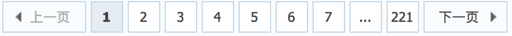

# scrapy模拟登陆&分页

## 一、模拟登陆

##### 学习目标：

1. 应用 scrapy直接携带cookie模拟登陆的方法
2. 应用 scrapy.FormRequest()发送post请求进行登陆
3. 应用 scrapy.FormRequest.from_response()发送表单请求

------

### 1、回顾之前的模拟登陆的方法

##### 1.1 requests模块是如何实现模拟登陆的？

1. 直接携带cookies请求页面
2. 找url地址，发送post请求存储cookie

##### 1.2 selenium是如何模拟登陆的？

1. 找到对应的input标签，输入文本点击登陆

##### 1.3 scrapy有三种方法模拟登陆

1. 直接携带cookies
2. 找url地址，发送post请求存储cookie
3. 找到对应的form表单，自动解析input标签，自动解析post请求的url地址，自动带上数据，自动发送请求

### 2、scrapy携带cookies直接获取需要登陆后的页面

**17k小说网**

```
https://user.17k.com/
```

##### 2.1 应用场景

1. cookie过期时间很长，常见于一些不规范的网站
2. 能在cookie过期之前把搜有的数据拿到
3. 配合其他程序使用，比如其使用selenium把登陆之后的cookie获取到保存到本地，scrapy发送请求之前先读取本地cookie

##### 2.2 通过修改settings中DEFAULT_REQUEST_HEADERS携带cookie

settings.py

```python
DEFAULT_REQUEST_HEADERS = {
  'Accept': 'text/html,application/xhtml+xml,application/xml;q=0.9,*/*;q=0.8',
  'Accept-Language': 'en',
  'User-Agent': 'Mozilla/5.0 (Macintosh; Intel Mac OS X 10_15_7) AppleWebKit/537.36 (KHTML, like Gecko) Chrome/104.0.0.0 Safari/537.36',
  'Cookie': 'ASP.NET_SessionId=n4lwamv5eohaqcorfi3dvzcv; xiaohua_visitfunny=103174; xiaohua_web_userid=120326; xiaohua_web_userkey=r2sYazfFMt/rxUn8LJDmUYetwR2qsFCHIaNt7+Zpsscpp1p6zicW4w=='
}
```

注意：需要打开COOKIES_ENABLED，否则上面设定的cookie将不起作用

```python
# Disable cookies (enabled by default)
COOKIES_ENABLED = False
```

**xiaoshuo.py**

```python
import scrapy


class DengluSpider(scrapy.Spider):
    name = 'denglu'
    allowed_domains = ['17k.com']
    start_urls = ['https://user.17k.com/ck/user/mine/readList?page=1&appKey=2406394919']

    def parse(self, res):
        print(res.text)
```

**局限性：**

当前设定方式虽然可以实现携带cookie保持登录，但是无法获取到新cookie，也就是当前cookie一直是固定的

如果cookie是经常性变化，那么当前不适用

##### 2.3 实现：重构scrapy的starte_rquests方法

scrapy中start_url是通过start_requests来进行处理的，其实现代码如下

```python
def start_requests(self):
    cls = self.__class__
    if method_is_overridden(cls, Spider, 'make_requests_from_url'):
        warnings.warn(
            "Spider.make_requests_from_url method is deprecated; it "
            "won't be called in future Scrapy releases. Please "
            "override Spider.start_requests method instead (see %s.%s)." % (
                cls.__module__, cls.__name__
            ),
        )
        for url in self.start_urls:
            yield self.make_requests_from_url(url)
    else:
        for url in self.start_urls:
            yield Request(url, dont_filter=True)
```

所以对应的，如果start_url地址中的url是需要登录后才能访问的url地址，则需要重写start_request方法并在其中手动添加上cookie

settings.py

```python
import scrapy


class DengluSpider(scrapy.Spider):
    name = 'denglu'
    # allowed_domains = ['https://user.17k.com/ck/user/mine/readList?page=1']
    start_urls = ['https://user.17k.com/ck/user/mine/readList?page=1&appKey=2406394919']

    def start_requests(self):
        cookies = 'GUID=796e4a09-ba11-4ecb-9cf6-aad19169267d; Hm_lvt_9793f42b498361373512340937deb2a0=1660545196; c_channel=0; c_csc=web; accessToken=avatarUrl%3Dhttps%253A%252F%252Fcdn.static.17k.com%252Fuser%252Favatar%252F18%252F98%252F90%252F96139098.jpg-88x88%253Fv%253D1650527904000%26id%3D96139098%26nickname%3D%25E4%25B9%25A6%25E5%258F%258BqYx51ZhI1%26e%3D1677033668%26s%3D8e116a403df502ab; sensorsdata2015jssdkcross=%7B%22distinct_id%22%3A%2296139098%22%2C%22%24device_id%22%3A%22181d13acb2c3bd-011f19b55b75a8-1c525635-1296000-181d13acb2d5fb%22%2C%22props%22%3A%7B%22%24latest_traffic_source_type%22%3A%22%E7%9B%B4%E6%8E%A5%E6%B5%81%E9%87%8F%22%2C%22%24latest_referrer%22%3A%22%22%2C%22%24latest_referrer_host%22%3A%22%22%2C%22%24latest_search_keyword%22%3A%22%E6%9C%AA%E5%8F%96%E5%88%B0%E5%80%BC_%E7%9B%B4%E6%8E%A5%E6%89%93%E5%BC%80%22%7D%2C%22first_id%22%3A%22796e4a09-ba11-4ecb-9cf6-aad19169267d%22%7D; Hm_lpvt_9793f42b498361373512340937deb2a0=1661483362'
        cookie_dic = {}
        for i in cookies.split(';'):
            v = i.split('=')
            cookie_dic[v[0]] = v[1]
        # {i.split('=')[0]:i.split('=')[1] for i in cookies_str.split('; ')}   # 简写
        for url in self.start_urls:
            yield scrapy.Request(url, cookies=cookie_dic)


    def parse(self, response):
        print(response.text)
```

##### 注意：

1. scrapy中cookie不能够放在headers中，在构造请求的时候有专门的cookies参数，能够接受字典形式的coookie
2. 在setting中设置ROBOTS协议、USER_AGENT

### 3、scrapy.FormRequest发送post请求

> 我们知道可以通过scrapy.Request()指定method、body参数来发送post请求；那么也可以使用scrapy.FormRequest()来发送post请求

##### 3.1 scrapy.FormRequest()的使用

通过scrapy.FormRequest能够发送post请求，同时需要添加fromdata参数作为请求体，以及callback

```python
login_url = 'https://passport.17k.com/ck/user/login'      
yield scrapy.FormRequest(
            url=login_url, 
            formdata={'loginName': '17346570232', 'password': 'xlg17346570232'}, 
            callback=self.do_login
)
```

#### 3.2 使用scrapy.FormRequest()登陆

##### 3.2.1 思路分析

1. 找到post的url地址：点击登录按钮进行抓包，然后定位url地址为https://www.xiaohua.com/Handler/Login.ashx
2. 找到请求体的规律：分析post请求的请求体，其中包含的参数均在前一次的响应中
3. 否登录成功：通过请求个人主页，观察是否包含用户名

##### 3.2.2 代码实现如下：

```python
import scrapy


class DengluSpider(scrapy.Spider):
    name = 'denglu'
    # allowed_domains = ['17k.com']
    start_urls = ['https://user.17k.com/ck/user/mine/readList?page=1&appKey=2406394919']

    def start_requests(self):
        '''
        请求登陆的账号和密码
        '''
        login_url = 'https://passport.17k.com/ck/user/login'
        # 使用request进行请求
        # yield scrapy.Request(url=login_url, body='loginName=17346570232&password=xlg17346570232', callback=self.do_login, method='POST')
        # 使用Request子类FormRequest进行请求  自动为post请求
        yield scrapy.FormRequest(
            url=login_url,
            formdata={'loginName': '17346570232', 'password': 'xlg17346570232'},
            callback=self.do_login
        )

    def do_login(self, response):
        '''
        登陆成功后调用parse进行处理
        cookie中间件会帮我们自动处理携带cookie
        '''
        for url in self.start_urls:
            yield scrapy.Request(url=url, callback=self.parse)

    def parse(self, response, **kwargs):
        print(response.text)
```

### 4、小技巧

在settings.py中通过设置COOKIES_DEBUG=TRUE 能够在终端看到cookie的传递传递过程

注意关闭LOG_LEVEL 


### 总结

1. start_urls中的url地址是交给start_request处理的，如有必要，可以重写start_request函数
2. 直接携带cookie登陆：cookie只能传递给cookies参数接收
3. scrapy.FormRequest()发送post请求

### 练习：

笑话网：https://www.xiaohua.com/


## 二、scrapy发送翻页请求

##### 学习目标：

1. 应用 完善并使用Item数据类
2. 应用 构造Request对象，并发送请求
3. 应用 利用meta参数在不同的解析函数中传递数据

------

### 1、翻页请求的思路

对于要提取如下图中所有页面上的数据该怎么办？



回顾requests模块是如何实现翻页请求的：

1. 找到下一页的URL地址
2. 调用requests.get(url)

scrapy实现翻页的思路：

1. 找到下一页的url地址
2. 构造url地址的请求，传递给引擎

### 2、scrapy实现翻页请求

#### 2.1 实现方法

1. 确定url地址
2. 构造请求，scrapy.Request(url,callback)
   - callback：指定解析函数名称，表示该请求返回的响应使用哪一个函数进行解析
3. 把请求交给引擎：yield scrapy.Request(url,callback)

#### 2.2 段子/豆瓣电影爬虫

> 通过爬取段子页面的信息,学习如何实现翻页请求
>
> 地址：https://duanzixing.com/

##### 思路分析：

1. 获取首页的数据
2. 寻找下一页的地址，进行翻页，获取数据

##### 注意：

1. 可以在settings中设置ROBOTS协议

   ```python
   # False表示忽略网站的robots.txt协议，默认为True
   ROBOTSTXT_OBEY = False
   ```

2. 可以在settings中设置User-Agent：

   ```python
   # scrapy发送的每一个请求的默认UA都是设置的这个User-Agent
   USER_AGENT = 'Mozilla/5.0 (Macintosh; Intel Mac OS X 10_12_5) AppleWebKit/537.36 (KHTML, like Gecko) Chrome/59.0.3071.115 Safari/537.36'
   ```

#### 2.3 代码实现

+ 段子实现多页抓取

  ```python
  url = 'https://duanzixing.com/page/%d/'
      num = 1
      def parse(self, response):
          article_list = response.xpath('/html/body/section/div/div/article')
          for article in article_list:
              title = article.xpath('./header/h2/a/text()').extract_first()
              con = article.xpath('./p[2]/text()').extract_first()
              # print(title)
              item = PageproItem()
              item['title'] = title
              item['con'] = con
              yield item
              
          if self.num < 11:
            	# 构造url
              new_url = format(self.url%self.num)
              self.num += 1
              print(new_url)
              # 构造scrapy.Request对象，并yield给引擎
          		# 利用callback参数指定该Request对象之后获取的响应用哪个函数进行解析
          		# 利用meta参数将本函数中提取的数据传递给callback指定的函数
          		# 注意这里是yield
              yield scrapy.Request(new_url, callback=self.parse)
  ```

+ 豆瓣电影抓取子页面数据(手动调用请求练习)

  新建豆瓣项目

  scrapy startproject douban

  cd douban

  scrapy genspider db

  scrapy crawl db

  ```python
  import scrapy


  class DbSpider(scrapy.Spider):
      name = 'db'
      # allowed_domains = ['www.xxx.com']
      start_urls = ['https://movie.douban.com/chart']

      def parse(self, response):
          table_list = response.xpath('//*[@id="content"]/div/div[1]/div/div/table')
          for table in table_list:
              # 抓取子页面url地址
              href = table.xpath('./tr/td[2]/div/a/@href').extract_first()
              print(href)
              # 手动请求子页面
              yield scrapy.Request(href, callback=self.parse_deatil)

      # 解析子页面数据
      def parse_deatil(self, response):
          # 获取所有的电影信息
          print(response.xpath('//*[@id="info"]//text()').extract())
  ```

#### 2.4 scrapy.Request的更多参数

```python
scrapy.Request(url[,callback,method="GET",headers,body,cookies, 
meta,dont_filter=False])
```

##### 参数解释

1. 中括号中的参数为可选参数
2. callback：表示当前的url的响应交给哪个函数去处理
3. meta：实现数据在不同的解析函数中传递，meta默认带有部分数据，比如下载延迟，请求深度等
4. dont_filter:默认为False，会过滤请求的url地址，即请求过的url地址不会继续被请求，对需要重复请求的url地址可以把它设置为Ture，比如贴吧的翻页请求，页面的数据总是在变化;start_urls中的地址会被反复请求，否则程序不会启动
5. method：指定POST或GET请求
6. headers：接收一个字典，其中不包括cookies
7. cookies：接收一个字典，专门放置cookies
8. body：接收一个字典，为POST的数据

### 3、meta参数的使用

##### meta的形式:字典

##### meta的作用：meta可以实现数据在不同的解析函数中的传递

在爬虫文件的parse方法中，提取详情页增加之前callback指定的parse_detail函数：

```python
def parse(self,response):
    ...
    yield scrapy.Request(detail_url, callback=self.parse_detail,meta={"item":item})
...

def parse_detail(self,response):
    #获取之前传入的item
    item = resposne.meta["item"]
```

##### 特别注意

1. meta参数是一个字典
2. meta字典中有一个固定的键`proxy`，表示代理ip，关于代理ip的使用我们将在scrapy的下载中间件的学习中进行介绍

### 4、items.py的使用

#### 4.1 Item能够做什么

+ 定义item即提前规划好哪些字段需要抓取，scrapy.Field()仅仅是提前占坑，通过item.py能够让别人清楚自己的爬虫是在抓取什么，同时定义好哪些字段是需要抓取的，没有定义的字段不能使用，防止手误

+ 在python大多数框架中，大多数框架都会自定义自己的数据类型(在python自带的数据结构基础上进行封装)，目的是增加功能，增加自定义异常

#### 4.2 定义Item

在items.py文件中定义要提取的字段：

```python
import scrapy

class DoubanItem(scrapy.Item):
    # define the fields for your item here like:
    # name = scrapy.Field()
    name = scrapy.Field()     # 电影名称
    director = scrapy.Field()     # 导演
    screenwriter = scrapy.Field()    # 编剧
    to_star = scrapy.Field()    # 主演
```

#### 4.3 使用Item

Item使用之前需要先导入并且实例化，之后的使用方法和使用字典相同

修改爬虫文件db.py：

```python
import scrapy
from douban.items import DoubanItem

class DbSpider(scrapy.Spider):
    name = 'db'
    # allowed_domains = ['www.xxx.com']
    start_urls = ['https://movie.douban.com/chart']
 
    def parse(self, response):
        table_list = response.xpath('//*[@id="content"]/div/div[1]/div/div/table')
        for table in table_list:
            # 抓取子页面url地址
            href = table.xpath('./tr/td[2]/div/a/@href').extract_first()
            print(href)
            # 手动请求子页面
            yield scrapy.Request(href, callback=self.parse_deatil)

    # 解析子页面数据
    def parse_deatil(self, response):
        # 提取电影详情
        item = DoubanItem()
        item['name'] = response.xpath('//*[@id="content"]/h1/span[1]/text()').extract_first()  # 电影名称
        item['director'] = response.xpath('//*[@id="info"]/span[1]/span[2]/a/text()').extract_first()  # 导演
        item['screenwriter'] = ''.join(response.xpath('//*[@id="info"]/span[2]/span[2]//text()').extract())  # 编剧
        item['to_star'] = ''.join(response.xpath('//*[@id="info"]/span[3]/span[2]//text()').extract())  # 主演
        print(item)
        return item
```

##### 注意：

1. from myspider.items import ITSpiderItem这一行代码中 注意item的正确导入路径，忽略pycharm标记的错误
2. python中的导入路径要诀：从哪里开始运行，就从哪里开始导入
3. 在parse_deatil中item[key] 必须要和items.py中的key对应，否则抛出异常

### 总结

1. 完善并使用Item数据类：
   1. 在items.py中完善要爬取的字段
   2. 在爬虫文件中先导入Item
   3. 实力化Item对象后，像字典一样直接使用
2. 构造Request对象，并发送请求：
   1. 导入scrapy.Request类
   2. 在解析函数中提取url
   3. yield scrapy.Request(url, callback=self.parse_detail, meta={})
3. 利用meta参数在不同的解析函数中传递数据:
   1. 通过前一个解析函数 yield scrapy.Request(url, callback=self.xxx, meta={}) 来传递meta
   2. 在self.xxx函数中 response.meta.get('key', '') 或 response.meta['key'] 的方式取出传递的数据


