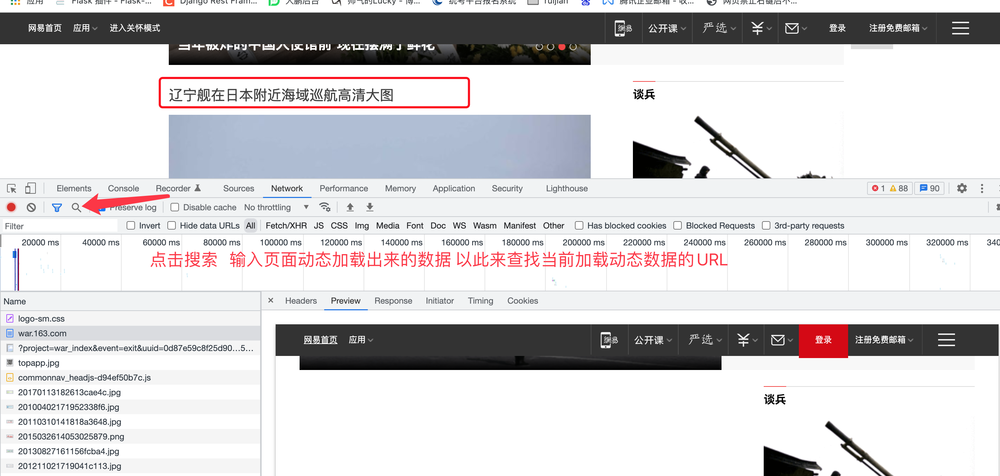

# Scrapy中间件

##### 学习目标：

1. 应用 scrapy中使用中间件使用随机UA的方法
2. 了解 scrapy中使用代理ip的的方法

------

### 1、scrapy中间件的分类和作用

##### 1.1 scrapy中间件的分类

根据scrapy运行流程中所在位置不同分为：

1. 下载中间件
2. 爬虫中间件

##### 1.2 scrapy中间的作用

1. 主要功能是在爬虫运行过程中进行一些处理，如对非200响应的重试（重新构造Request对象yield给引擎）
2. 也可以对header以及cookie进行更换和处理
3. 其他根据业务需求实现响应的功能

但在scrapy默认的情况下 两种中间件都在middlewares.py一个文件中

爬虫中间件使用方法和下载中间件相同，常用下载中间件

### 2、下载中间件的使用方法：

> 接下来我们对爬虫进行修改完善，通过下载中间件来学习如何使用中间件 编写一个Downloader Middlewares和我们编写一个pipeline一样，定义一个类，然后在setting中开启

Downloader Middlewares默认的方法：在中间件类中，有时需要重写处理请求或者响应的方法】

- process_request(self, request, spider)：【此方法是用的最多的】
  - 当每个request通过下载中间件时，该方法被调用。
  - 返回None值：继续请求  没有return也是返回None，该request对象传递给下载器，或通过引擎传递给其他权重低的process_request方法 【如果所有的下载器中间件都返回为None，则请求最终被交给下载器处理】
  - 返回Response对象：不再请求，把response返回给引擎【如果返回为请求，则将请求交给调度器】
  - 返回Request对象：把request对象交给调度器进行后续的请求  

- process_response(self, request, response, spider)：
  - 当下载器完成http请求，传递响应给引擎的时候调用
  - 返回Resposne：通过引擎交给爬虫处理或交给权重更低的其他下载中间件的process_response方法 【如果返回为请求，则将请求交给调度器】
  - 返回Request对象：交给调取器继续请求，此时将不通过其他权重低的process_request方法  【将响应对象交给spider进行解析】

- process_exception(self, request, exception, spider):

  + 请求出现异常的时候进行调用

  + 比如当前请求被识别为爬虫 可以使用代理

    ```python
    def process_exception(self, request, exception, spider):
    	request.meta['proxy'] = 'http://ip地址'
      	request.dont_filter = True  # 因为默认请求是去除重复的，因为当前已经请求过，所以需要设置当前为不去重
    	return request  # 将修正后的对象重新进行请求
    ```

- 在settings.py中配置开启中间件，权重值越小越优先执行  【同管道的注册使用】

- spider参数：为爬虫中类的实例化可以在这里进行调用爬虫中的属性

  如：spider.name


#### 2.1 当前中间件的简单使用

spiders.py（爬虫代码）news.163.com/domestic/

```python
class WySpider(scrapy.Spider):
    name = 'wy'
    start_urls = ['http://www.baidu123.com/']  # 给一个正确的网址
    # start_urls = ['http://www.baidu123.com/']  # 给一个错误的网址
    def parse(self, response, **kwargs):
        pass
```

settings.py(开启中间件)

```python
DOWNLOADER_MIDDLEWARES = {
   'wangyi.middlewares.WangyiDownloaderMiddleware': 543,
}
```

middlewares.py

```python
class WangyiDownloaderMiddleware:
    # Not all methods need to be defined. If a method is not defined,
    # scrapy acts as if the downloader middleware does not modify the
    # passed objects.

    @classmethod
    def from_crawler(cls, crawler):
        # This method is used by Scrapy to create your spiders.
        s = cls()
        crawler.signals.connect(s.spider_opened, signal=signals.spider_opened)
        return s

    def process_request(self, request, spider):
        print('process_request')
        return None

    def process_response(self, request, response, spider):
        print('process_response')
        return response

    def process_exception(self, request, exception, spider):
        print('process_exception')
        return request
```

运行查看


修改spiders.py  给一个错误的网址在进行查看，会发现当前会循环执行


### 3、定义实现随机User-Agent的下载中间件

##### 3.1 在settings中添加UA的列表

```python
USER_AGENTS_LIST = [ 
"Mozilla/5.0 (compatible; MSIE 9.0; Windows NT 6.1; Win64; x64; Trident/5.0; .NET CLR 3.5.30729; .NET CLR 3.0.30729; .NET CLR 2.0.50727; Media Center PC 6.0)", \
"Mozilla/5.0 (compatible; MSIE 8.0; Windows NT 6.0; Trident/4.0; WOW64; Trident/4.0; SLCC2; .NET CLR 2.0.50727; .NET CLR 3.5.30729; .NET CLR 3.0.30729; .NET CLR 1.0.3705; .NET CLR 1.1.4322)", \
"Mozilla/4.0 (compatible; MSIE 7.0b; Windows NT 5.2; .NET CLR 1.1.4322; .NET CLR 2.0.50727; InfoPath.2; .NET CLR 3.0.04506.30)", \
"Mozilla/5.0 (Windows; U; Windows NT 5.1; zh-CN) AppleWebKit/523.15 (KHTML, like Gecko, Safari/419.3) Arora/0.3 (Change: 287 c9dfb30)", \
"Mozilla/5.0 (X11; U; Linux; en-US) AppleWebKit/527+ (KHTML, like Gecko, Safari/419.3) Arora/0.6", \
"Mozilla/5.0 (Windows; U; Windows NT 5.1; en-US; rv:1.8.1.2pre) Gecko/20070215 K-Ninja/2.1.1", \
"Mozilla/5.0 (Windows; U; Windows NT 5.1; zh-CN; rv:1.9) Gecko/20080705 Firefox/3.0 Kapiko/3.0", \
"Mozilla/5.0 (X11; Linux i686; U;) Gecko/20070322 Kazehakase/0.4.5" ]
```

##### 3.2 在middlewares.py中完善代码

```python
import random
from Tencent.settings import USER_AGENTS_LIST # 注意导入路径,请忽视pycharm的错误提示

class UserAgentMiddleware(object):
    def process_request(self, request, spider):
        user_agent = random.choice(USER_AGENTS_LIST)
        request.headers['User-Agent'] = user_agent
```

##### 3.3 在爬虫文件tencent.py的每个解析函数中添加

```python
class CheckUA:
    def process_response(self,request,response,spider):
        print(request.headers['User-Agent'])
```

##### 3.4 在settings中设置开启自定义的下载中间件，设置方法同管道

```python
DOWNLOADER_MIDDLEWARES = {
   'Tencent.middlewares.UserAgentMiddleware': 543,
}
```

##### 3.5 运行爬虫观察现象

### 4、代理ip的使用

##### 4.1 思路分析

1. 代理添加的位置：request.meta中增加`proxy`字段

2. 获取一个代理ip，赋值给

   ```python
   request.meta['proxy']
   ```

   - 代理池中随机选择代理ip
   - 代理ip的webapi发送请求获取一个代理ip

##### 4.2 具体实现

```python
class ProxyMiddleware(object):
    def process_request(self,request,spider):
        proxy = random.choice(proxies) # proxies可以在settings.py中，也可以来源于代理ip的webapi
        # proxy = 'http://192.168.1.1:8118'
        request.meta['proxy'] = proxy
        return None # 可以不写return
```

##### 4.3 检测代理ip是否可用

在使用了代理ip的情况下可以在下载中间件的process_response()方法中处理代理ip的使用情况，如果该代理ip不能使用可以替换其他代理ip

```python
class ProxyMiddleware(object):
    def process_response(self, request, response, spider):
        if response.status != '200' and response.status != '302':
            #此时对代理ip进行操作，比如删除
            return request
```

### 总结

中间件的使用：

1. 完善中间件代码：
   - process_request(self, request, spider)：
     - 当每个request通过下载中间件时，该方法被调用。
     - 返回None值：继续请求
     - 返回Response对象：不再请求，把response返回给引擎
     - 返回Request对象：把request对象交给调度器进行后续的请求
   - process_response(self, request, response, spider)：
     - 当下载器完成http请求，传递响应给引擎的时候调用
     - 返回Resposne：交给process_response来处理
     - 返回Request对象：交给调取器继续请求
2. 需要在settings.py中开启中间件 DOWNLOADER_MIDDLEWARES = { 'myspider.middlewares.UserAgentMiddleware': 543, }

### 5、爬取网易新闻

url：https://news.163.com/

#### 5.1 爬取前准备

+ scrapy startproject wangyi
+ cd wangyi
+ scrapy genspider wy  https://news.163.com/

#### 5.2 爬取前分析

抓取 国内 国际 军事 航空

+ 分析 

  国内等数据是由动态加载的 并不是跟着当前的请求一起返回的 

  

  解决方式2种

  1. 通过selenium配合爬虫抓取页面进行数据

  2. 找到加载动态数据的url地址  通过爬虫进行抓取

     

     

  

  将找到的URL放到浏览器中进行请求  效果如下

  


#### 5.3 代码配置

+ 配置文件处理settings.py

  ```python
  # Scrapy settings for wangyi project
  BOT_NAME = 'wangyi'

  SPIDER_MODULES = ['wangyi.spiders']
  NEWSPIDER_MODULE = 'wangyi.spiders'

  # 默认请求头
  USER_AGENT = 'Mozilla/5.0 (Macintosh; Intel Mac OS X 10_15_7) AppleWebKit/537.36 (KHTML, like Gecko) Chrome/100.0.4896.127 Safari/537.36'

  # 用于更换随机请求头
  USER_AGENTS_LIST = [
  "Mozilla/5.0 (compatible; MSIE 9.0; Windows NT 6.1; Win64; x64; Trident/5.0; .NET CLR 3.5.30729; .NET CLR 3.0.30729; .NET CLR 2.0.50727; Media Center PC 6.0)",
  "Mozilla/5.0 (compatible; MSIE 8.0; Windows NT 6.0; Trident/4.0; WOW64; Trident/4.0; SLCC2; .NET CLR 2.0.50727; .NET CLR 3.5.30729; .NET CLR 3.0.30729; .NET CLR 1.0.3705; .NET CLR 1.1.4322)",
  "Mozilla/4.0 (compatible; MSIE 7.0b; Windows NT 5.2; .NET CLR 1.1.4322; .NET CLR 2.0.50727; InfoPath.2; .NET CLR 3.0.04506.30)",
  "Mozilla/5.0 (Windows; U; Windows NT 5.1; zh-CN) AppleWebKit/523.15 (KHTML, like Gecko, Safari/419.3) Arora/0.3 (Change: 287 c9dfb30)",
  "Mozilla/5.0 (X11; U; Linux; en-US) AppleWebKit/527+ (KHTML, like Gecko, Safari/419.3) Arora/0.6",
  "Mozilla/5.0 (Windows; U; Windows NT 5.1; en-US; rv:1.8.1.2pre) Gecko/20070215 K-Ninja/2.1.1",
  "Mozilla/5.0 (Windows; U; Windows NT 5.1; zh-CN; rv:1.9) Gecko/20080705 Firefox/3.0 Kapiko/3.0",
  "Mozilla/5.0 (X11; Linux i686; U;) Gecko/20070322 Kazehakase/0.4.5" ]

  LOG_LEVEL = 'ERROR'
  ROBOTSTXT_OBEY = False

  DOWNLOADER_MIDDLEWARES = {
     'wangyi.middlewares.WangyiDownloaderMiddleware': 543,
  }
  ITEM_PIPELINES = {
     'wangyi.pipelines.WangyiPipeline': 300,
  }
  ```

+ 爬虫代码wy.py

  ```python
  import scrapy
  from selenium import webdriver
  from selenium.webdriver import ChromeOptions
  from selenium.webdriver.chrome.options import Options
  from wangyi.items import WangyiItem


  class WySpider(scrapy.Spider):
      name = 'wy'
      # allowed_domains = ['news.163.com']
      start_urls = ['https://news.163.com/domestic/']
      # li_index = [1, 2, 4, 5]  # 当前要爬取菜单的索引位置
      li_index = [1, 2]  # 当前要爬取菜单的索引位置
      page_url = []
      # 隐藏浏览器界面
      chrome_option = Options()
      chrome_option.add_argument('--headless')
      chrome_option.add_argument('--disable-gpu')
      # 防止检测
      option = ChromeOptions()
      option.add_experimental_option('excludeSwitches', ['enable-automation'])
      # 导入配置
      driver = webdriver.Chrome(chrome_options=chrome_option, options=option)
      def parse(self, response, **kwargs):
          # 抓取 国内 国际 军事 航空
          menu = response.xpath('/html/body/div/div[3]/div[2]/div[2]/div/ul/li/a/@href').extract()
          # 循环获取当前我们要抓取栏目的url
          for i in range(len(menu)):
              if i in self.li_index:
                  url = menu[i]
                  self.page_url.append(url)
                  # 向详情页发起请求
                  yield scrapy.Request(url, callback=self.parse_detail)
      # 对栏目页进行请求
      def parse_detail(self, response):
          # 获取每个新闻的url
          detail_href_list = response.xpath('/html/body/div/div[3]/div[3]/div[1]/div[1]/div/ul/li/div/div/a/@href').extract()
          # print(detail_href_list)
          for url in detail_href_list:
              print(url)
              yield scrapy.Request(url, callback=self.parse_detail_con)

      # 对于新闻详情页进行解析
      def parse_detail_con(self, response):
          # 实例化item
          item = WangyiItem()
          # 匹配标题
          title = response.xpath('//*[@id="container"]/div[1]/h1/text()').extract_first()
          # 匹配内容
          con = ''.join(response.xpath('//*[@id="content"]/div[2]//text()').extract())
          item['title'] = title
          item['con'] = con
          print(item)
          yield item
  ```

+ Items.py

  ```python
  import scrapy
  class WangyiItem(scrapy.Item):
      # define the fields for your item here like:
      # name = scrapy.Field()
      title = scrapy.Field()
      content = scrapy.Field()
  ```

+ Middlewares.py

  ```python
  from wangyi.settings import USER_AGENTS_LIST
  import random
  from scrapy.http import HtmlResponse

  class WangyiDownloaderMiddleware:

      @classmethod
      def from_crawler(cls, crawler):
          # This method is used by Scrapy to create your spiders.
          s = cls()
          crawler.signals.connect(s.spider_opened, signal=signals.spider_opened)
          return s

      def process_request(self, request, spider):
          request.headers['User-Agent'] = random.choice(USER_AGENTS_LIST)
          # print(request.headers)
          return None

      def process_response(self, request, response, spider):
          # Called with the response returned from the downloader.
          driver = spider.driver  # 获取到selenium
          if request.url in spider.page_url:
              driver.get(request.url)
              # 滚动条滚动到最下方
              driver.execute_script('window.scrollTo(0, document.body.scrollHeight)')
              time.sleep(1)
              # 拖动两次
              driver.execute_script('window.scrollTo(0, document.body.scrollHeight)')
              time.sleep(1)
              text = driver.page_source
              # 篡改响应对象并返回
              return HtmlResponse(url=request.url, body=text, encoding='UTF-8', request=request)
          return response

      def process_exception(self, request, exception, spider):
          # Called when a download handler or a process_request()
          pass
      def spider_opened(self, spider):
          spider.logger.info('Spider opened: %s' % spider.name)
  ```


## 