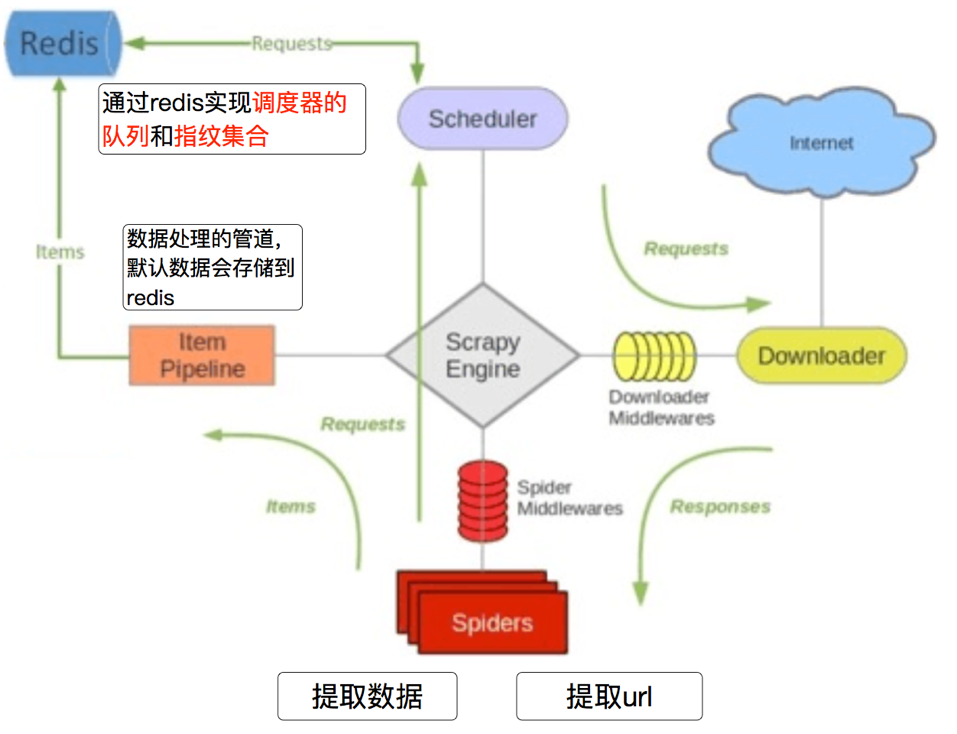

# scrapy_redis

## 一、scrapy_redis分布式原理

##### 学习目标

1. 了解 scarpy_redis的概念和功能
2. 了解 scrapy_redis的原理
3. 了解 redis数据库操作命令

------

> 在前面scrapy框架中我们已经能够使用框架实现爬虫爬取网站数据,如果当前网站的数据比较庞大, 我们就需要使用分布式来更快的爬取数据

### 1 scrapy_redis

#### 安装

pip install scrapy_redis == 0.7.2

### 2 为什么要学习scrapy_redis

Scrapy_redis在scrapy的基础上实现了更多，更强大的功能，具体体现在：

- 请求对象的持久化
- 去重的持久化
- 和实现分布式

### 3 scrapy_redis的原理分析

##### 3.1 回顾scrapy的流程


那么，在这个基础上，如果需要实现分布式，即多台服务器同时完成一个爬虫，需要怎么做呢？

##### 3.2 scrapy_redis的流程

- 在scrapy_redis中，所有的带抓取的对象和去重的指纹都存在所有的服务器公用的redis中
- 所有的服务器公用一个redis中的request对象
- 所有的request对象存入redis前，都会在同一个redis中进行判断，之前是否已经存入过
- 在默认情况下所有的数据会保存在redis中

具体流程如下：



### 4 对于redis的复习

> 由于时间关系,大家对redis的命令遗忘的差不多了, 但是在scrapy_redis中需要使用redis的操作命令,所有需要回顾下redis的命令操作

##### 4.1 redis是什么

redis是一个开源的内存型数据库，支持多种数据类型和结构，比如列表、集合、有序集合等,同时可以使用redis-manger-desktop等客户端软件查看redis中的数据，关于redis-manger-desktop的使用可以参考扩展阅读

##### 4.2 redis服务端和客户端的启动

- `redis-server.exe redis-windwos.conf` 启动服务端
- `redis-cli` 客户端启动

##### 4.3 redis中的常见命令

1. `select 1` 切换db
2. `keys *` 查看所有的键
3. `type 键` 查看键的类型
4. `flushdb` 清空db
5. `flushall` 清空数据库

##### 4.4 redis命令的复习

redis的命令很多，这里我们简单复习后续会使用的命令


### 小结

scarpy_redis的分布式工作原理
- 在scrapy_redis中，所有的带抓取的对象和去重的指纹都存在所有的服务器公用的redis中
- 所有的服务器公用一个redis中的request对象
- 所有的request对象存入redis前，都会在同一个redis中进行判断，之前是否已经存入过


## 二、配置分布式爬虫

##### 学习目标

配置完成使用分布式爬虫

### 1、概述

分布式爬虫

- 使用多台机器搭建一个分布式的机器，然后让他们联合且分布的对同一组资源进行数据爬取
- 原生的scrapy框架是无法实现分布式爬虫？
  - 原因：调度器，管道无法被分布式机群共享
- 如何实现分布式
  - 借助：scrapy-redis组件
  - 作用：提供了可以被共享的管道和调度器
  - 只可以将爬取到的数据存储到redis中

### 2、创建分布式crawlspider爬虫

+ scrapy  startproject fbsPro
+ cd fbsPro
+ scrapy genspider -t crawl fbs www.xxx.com

### 3、redis-settings需要的配置

1. (必须). 使用了scrapy_redis的去重组件，在redis数据库里做去重

   ```python
   DUPEFILTER_CLASS = "scrapy_redis.dupefilter.RFPDupeFilter"
   ```

2. (必须). 使用了scrapy_redis的调度器，在redis里分配请求

   ```python
   SCHEDULER = "scrapy_redis.scheduler.Scheduler"
   ```

3. (可选). 在redis中保持scrapy-redis用到的各个队列，从而允许暂停和暂停后恢复，也就是不清理redis queues

   ```python
   SCHEDULER_PERSIST = True
   ```

4. (必须). 通过配置RedisPipeline将item写入key为 spider.name : items 的redis的list中，供后面的分布式处理item 这个已经由 scrapy-redis 实现，不需要我们写代码，直接使用即可

   ```python
   ITEM_PIPELINES = {
   　　 'scrapy_redis.pipelines.RedisPipeline': 100 ,
   }
   ```

5. (必须). 指定redis数据库的连接参数

   ```python
   REDIS_HOST = '127.0.0.1' 
   REDIS_PORT = 6379
   REDIS_DB = 0  # (不指定默认为0)
   #  设置密码
   REDIS_PARAMS = {'password': '123456'}
   ```

### 4、settings.py

settings.py

这几行表示`scrapy_redis`中重新实现的了去重的类，以及调度器，并且使用的`RedisPipeline`

需要添加redis的地址，程序才能够使用redis

在settings.py文件修改pipelines，增加scrapy_redis。

```python
# 配置分布式
DUPEFILTER_CLASS = "scrapy_redis.dupefilter.RFPDupeFilter"
SCHEDULER = "scrapy_redis.scheduler.Scheduler"
SCHEDULER_PERSIST = True

ITEM_PIPELINES = {
    'scrapy_redis.pipelines.RedisPipeline': 400,
}


# 或者使用下面的方式
REDIS_HOST = "127.0.0.1"
REDIS_PORT = 6379
REDIS_PARAMS = {'password': '123456'}
```

**注意：scrapy_redis的优先级要调高**

### 6、爬虫文件代码中 fbs.py

```python
from scrapy_redis.spiders import RedisCrawlSpider

# 注意  一定要继承RedisCrawlSpider
class FbsSpider(RedisCrawlSpider):
    name = 'fbs'
    # allowed_domains = ['www.xxx.com']
    # start_urls = ['http://www.xxx.com/']
    redis_key = 'fbsQueue'  # 使用管道名称（课根据实际功能起名称）
```

### 7、scrapy-redis键名介绍

scrapy-redis中都是用key-value形式存储数据，其中有几个常见的key-value形式：

1、 “项目名:items”  -->list 类型，保存爬虫获取到的数据item 内容是 json 字符串

2、 “项目名:dupefilter”   -->set类型，用于爬虫访问的URL去重 内容是 40个字符的 url 的hash字符串

3、 “项目名:requests”   -->zset类型，用于scheduler调度处理 requests 内容是 request 对象的序列化 字符串

### 8、完整代码配置

+ 网址

  阳光问政为例

  https://wz.sun0769.com/political/index/politicsNewest

+ settings.py

  ```python
  BOT_NAME = 'fbsPro'

  SPIDER_MODULES = ['fbsPro.spiders']
  NEWSPIDER_MODULE = 'fbsPro.spiders'

  USER_AGENT = 'Mozilla/5.0 (Macintosh; Intel Mac OS X 10_15_7) AppleWebKit/537.36 (KHTML, like Gecko) Chrome/100.0.4896.127 Safari/537.36'

  # Obey robots.txt rules
  ROBOTSTXT_OBEY = False

  # 配置分布式
  DUPEFILTER_CLASS = "scrapy_redis.dupefilter.RFPDupeFilter"
  SCHEDULER = "scrapy_redis.scheduler.Scheduler"
  SCHEDULER_PERSIST = True

  ITEM_PIPELINES = {
      'scrapy_redis.pipelines.RedisPipeline': 400,
  }

  # 或者使用下面的方式
  REDIS_HOST = "127.0.0.1"
  REDIS_PORT = 6379
  REDIS_PARAMS = {'password': '123456'}
  ```

+ fbs.py

  实现方式就是之前的`crawlspider`类型的爬虫

  ```python
  import scrapy
  from scrapy.linkextractors import LinkExtractor
  from scrapy.spiders import CrawlSpider, Rule
  from scrapy_redis.spiders import RedisCrawlSpider

  # 注意  一定要继承RedisCrawlSpider
  class FbsSpider(RedisCrawlSpider):
      name = 'fbs'
      # allowed_domains = ['www.xxx.com']
      # start_urls = ['http://www.xxx.com/']
      redis_key = 'fbsQueue'  # 使用管道名称
      link = LinkExtractor(allow=r'/political/politics/index?id=\d+')
      rules = (
          Rule(link, callback='parse_item', follow=True),
      )

      def parse_item(self, response):
          item = {}
          yield item
  ```

+ redis中

  + redis-windwos.conf  （如果当前配置文件中的已经被注释或者不存在，则不用处理）

    + 56行添加注释 取消绑定127.0.0.1  # bind 127.0.0.1
    + 75行  修改保护模式为no  protected-mode no

  + 启动redis

  + 队列中添加url地址

    添加：lpush fbsQueue https://wz.sun0769.com/political/index/politicsNewest

    查看：lrange fbsQueue 0 -1 

+ 运行

  scrapy crawl fbs

+ 去redis中查看存储的数据
