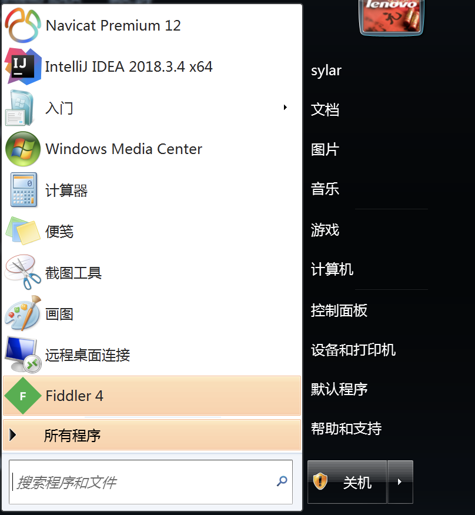

# 抓包工具和PyExeJs模块


我们在处理一些网站的时候, 会遇到一些屏蔽F12, 以及只要按出浏览器的开发者工具就会关闭甚至死机的现象. 在遇到这类网站的时候. 我们可以使用抓包工具把页面上屏蔽开发者工具的代码给干掉. 


## 一. Fiddler和Charles

这两款工具是非常优秀的抓包工具. 他们可以监听到我们计算机上所有的http网络请求. 利用这种特性. 可以获取到页面加载过程中的所有内容. 

### 1.1  软件安装.


Win7:




win10:


### 1.2 fiddler简单配置(HTTPS)

接下来.我们打开www.vmgirls.com. 尝试抓包看看. 发现https的请求默认是不可用的. 需要配置一下证书. 


### 1.3 fiddler简单使用

清理一下信息, 然后重新刷新浏览器. 就看到被响应的html内容了. 


vmgirl之所以不可以打开开发者工具. 是因为在其html中导入了一个disable-devtools.js. 我们需要想办法把这个东西给干掉.  只要干掉了它. 我们就又可以打开F12的开发者工具了. 那么如何干掉它呢?  这就需要我们了解一下fiddler和charles的工作原理了. 

fiddler和charles本质其实就是一个安装在这台计算机上的一个代理. 就像这样:


本质上和代理没啥区别. 但是, 由于fiddler是我们自己本地的软件. 那么我们可以在fiddler里对请求过来的内容进行截取和替换.

我们做这样一个事情. 把vmgirls的页面源代码捕获. 单独写入一个html文建. 然后把其中的disable-devtools.js部分注释掉. 


现在这个页面源代码在我本地了.  我就可以进行替换了....


接下来. 重新刷新页面(ctrl+shift+r) , 发现右键有效果了. 


### 1.4 charles安装和使用.

charles官网: https://www.charlesproxy.com/download/

charles激活: https://www.zzzmode.com/mytools/charles/


==注意, 在windows环境下如果出现证书不可用的情况.需要手工去windows的证书管理器中, 把Charles的证书拖拽到可信任证书那一栏. 然后重启浏览器和charles就可以用了==

==如果证书默认就可用. 就不要胡乱拖拽==

window证书管理器: win+r: 输入certlm.msc


回到Mac


搞定. 如果想要实现和fiddler一样的功能. 我也想要进行请求拦截.怎么办?  很简单


搞定. 


## 二. PyExecJS模块

pyexecjs是一个可以帮助我们运行js代码的一个第三方模块.  其使用是非常容易上手的. 

但是它的运行是要依赖能运行js的第三方环境的. 这里我们选择用node作为我们运行js的位置. 

### 2.1 安装Nodejs


切记. 重启pycharm或者重启电脑. 

### 2.2 安装pyexecjs

```
pip install pyexecjs
```

测试一下:

````python
import execjs

print(execjs.get().name)  # 需要重启pycharm或者重启电脑 Node.js (V8)
````

### 2.3 简单使用

```python
import execjs

print(execjs.get().name)

# execjs.eval 可以直接运行js代码并得到结果
js = """
    "鲁班_王昭君_猴子_亚瑟_蔡文姬".split("_")
"""
res = execjs.eval(js)
print(res)

# execjs.compile(),  call()
# execjs.compile() 事先加载好一段js代码,
jj = execjs.compile("""
    function an(a, b){
        return a + b    
    }
""")
# call() 运行代码中的xxx函数. 后续的参数是xxx的参数
ret = jj.call("an", 10, 20)
print(ret)
```

windows中如果出现编码错误. 在引入execjs之前. 插入以下代码即可.

```python
import subprocess
from functools import partial
subprocess.Popen = partial(subprocess.Popen, encoding='utf-8')

import execjs
```

完事儿.  你没有看错. execjs就这几个功能就够咱用的了. 


### 2.4 实战案例(调试工具)（详情见视频案例）

