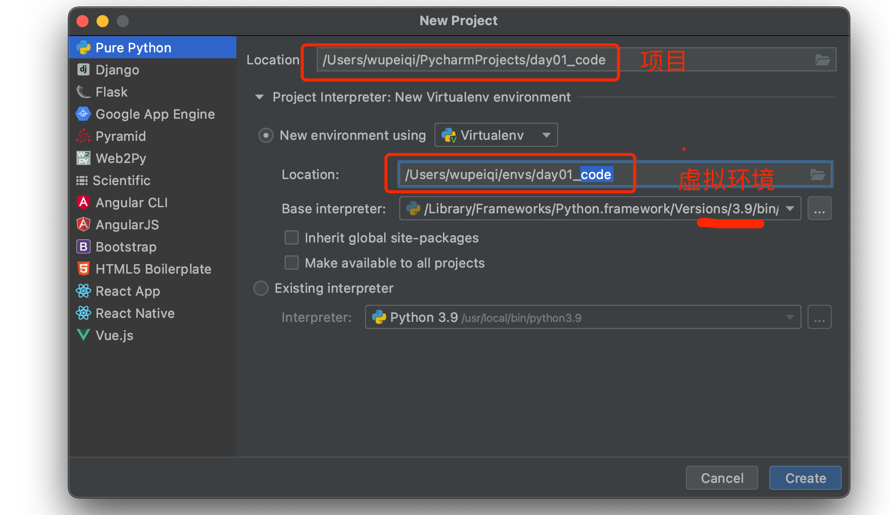
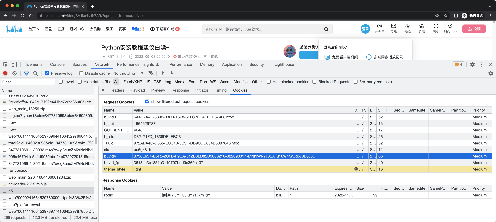

# day01 开班和B站

今日概要：

- 虚拟环境
- 用代码刷B站播放量


## 1.虚拟环境

为什么要存在虚拟环境？

- 帮我写一个项目 枯叶，要求你用：requests==1.8

  ```
  pip install requests==1.8
  ```

  ```python
  import requests
  
  ...
  ```

  

- 需求又来了

  ```
  pip install request==2.1
  ```

  ```python
  import requests
  
  ...
  ```


关于系统解释器（系统环境）：

- 安装Python（安装Python解释器） `C:\python39`

  ```
  C:\python39
  	- python.exe
  	- Scripts
  		- pip.exe
  		- pip3.exe
  	- Lib
  		- xxx.py
  		- re.py
  		- random.py
  		- site-packages（pip安装第三方模块）
  			- requests==1.8
  ```

  ```
  C:\python39\python.exe  code.py
  
  pip install requests
  C:\python39\Scripts\pip.exe install requests
  ```

  ```python
  import requests    # sys.path
  ```

  

所以，在Python中就出现了虚拟环境。

```
根据你电脑上的系统解释器虚拟出来N个python解释器。
```

```
# 系统解释器
C:\python39
	- python.exe
	- Lib
		...
		- requests1==1.8
	- Scripts
```

```
# 虚拟环境（虚拟解释器）
F:\xx\oo\crm
	- python.exe
	- Lib
		...
		- requests==1.9
	- Scripts
```

```
# 虚拟环境（虚拟解释器）
F:\xx\oo\luffy
	- python.exe
	- Lib
		...
		- requests==2.0
	- Scripts
```


潜规则：一般情况下，我们每次创建项目，都会为项目创建一个虚拟环境。

- 先创建虚拟环境：crm
- 再创建项目
- 项目 + 环境 关联起来，以后就可以利用这个环境专门去运行项目。


### 1.1 安装virtualenv

安装在系统解释器。

```
pip install virtualenv
```

```
# 系统解释器
C:\python39
	- python.exe
	- Lib
		...
		- requests1==1.8
	- Scripts
		- virtualenv.exe
```


### 1.2 利用virtualenv创建

在自己的终端（命令行）。

```
>>> F:
>>> cd /envs
>>> virtualenv crm --python=python3.9
```


### 1.3 写一段代码

```
/Users/wupeiqi/code.py
```

```python
print("alex是个傻狗")
```


如果想要运行代码：

- 直接根据环境的地址，找到python解释器去运行

  ```
  /Users/wupeiqi/s2/crm/bin/python3.9  /Users/wupeiqi/code.py
  ```

- 激活虚拟环境，再运行

  - mac

    ```
    wupeiqi@192 ~ % source /Users/wupeiqi/s2/crm/bin/activate
    (crm) wupeiqi@192 ~ %
    (crm) wupeiqi@192 ~ % python code.py
    ```

  - win

    ```
    >>>F:
    >>>cd envs/crm/Scripts
    >>>activate
    ```

  

### 1.4 Pycharm+虚拟环境



- 虚拟环境的目录：`/Users/wupeiqi/envs/day01_spider`
- 项目目录：`/Users/wupeiqi/PycharmProjects/day01_spider`


### 1.5 切记

- 虚拟环境的路径，不能包含中文
- win系统+Pycharm终端会自动激活虚拟环境，请替换切换 `powershell`至`cmd`


## 2.B站刷播放


###  2.1 抓包和定位

期初，在抓包时可以禁止自动播放，这样容易定位点击播放时都发送了哪些请求。


### 2.2 请求体


**aid** 和 **cid** 是啥呢？由于在此请求中携带了这俩值，那么这两个值来源就可能：

- 固定值
- 前期请求返回的数据
  - cookie
  - header
  - body
- js内部算法计算出来的


```python
import requests
import json
import re

res = requests.get("https://www.bilibili.com/video/BV1ne4y1H7Zk")
# ["",]
data_list = re.findall(r'__INITIAL_STATE__=(.+);\(function', res.text)
data_dict = json.loads(data_list[0])

aid = data_dict['aid']
cid = data_dict['videoData']['cid']

print(aid)
print(cid)
```


### 2.3 cookie


cookie的来源：

- 固定值
- 其他请求返回
  - cookie
  - body
  - header
- js算法生成


#### 2.3.1 buvid3


```python
import requests

session = requests.Session()
session.headers.update({
    "User-Agent": "Mozilla/5.0 (Macintosh; Intel Mac OS X 10_15_7) AppleWebKit/537.36 (KHTML, like Gecko) Chrome/97.0.4692.71 Safari/537.36"
})

video_url = "https://www.bilibili.com/video/BV1ne4y1H7Zk/"
res = session.get(video_url)

print(res.cookies.get_dict())
# {'b_nut': '1664528708', 'buvid3': 'E4C54B76-FFC4-CF38-190E-0A9A184C02C908456infoc'}
```


#### 2.3.2 b_lsid和_uuid


在spi请求之前，未发现有返回 b_lsid和_uuid的位置，那么就可能是js算法生成。


##### b_lsid


```
var e = this.splitDate();
t = Object(f.b)(e.millisecond)
t = "".concat(Object(f.c)(8), "_").concat(t);
```


清除cookie，断点调试：


所以，e就是时间戳。

```
e = new Date(Date.now()).getTime()
```

```python
import time

e = int(time.time()*1000)
```


所以，t的就是对时间戳转换16进制再变大写。

```
Math.ceil 方法用于对数值向上取整，即得到大于或等于该数值的最小整数
```

```
import time

e = int(time.time()*1000)
t = hex(e)[2:].upper()
print(t)
```


```javascript
e = 8

, a = function(e) {
    for (var t = "", n = 0; n < e; n++)
        t += o(16 * Math.random());  // 生成 16*随机小数 -> 十六进制
    // t
    return s(t, e)
}
	// 长度小于8，则在前面补0
    , s = function(e, t) {
    var n = "";
    if (e.length < t)
        for (var r = 0; r < t - e.length; r++)
            n += "0";
    return n + e
}
    , o = function(e) {
    return Math.ceil(e).toString(16).toUpperCase()
}
```

```python
import math
import random

data = ""
for i in range(8):
    v1 = math.ceil(16 * random.uniform(0, 1))
    v2 = hex(v1)[2:].upper()
    data += v2
result = data.rjust(8, "0")
print(result)
```


还原最后，再讲两个字符串拼接起来，就是 b_lsid了

```python
import time
import math
import random

data = ""
for i in range(8):
    v1 = math.ceil(16 * random.uniform(0, 1))
    v2 = hex(v1)[2:].upper()
    data += v2
result = data.rjust(8, "0")


e = int(time.time()*1000)
t = hex(e)[2:].upper()

b_lsid = "{}_{}".format(result,t)
print(b_lsid)
```


##### _uuid

再在当前页面继续搜索 `_uuid`


```python
import time
import uuid


def gen_uuid():
    uuid_sec = str(uuid.uuid4())
    time_sec = str(int(time.time() * 1000 % 1e5))
    time_sec = time_sec.rjust(5, "0")
    return "{}{}infoc".format(uuid_sec, time_sec)


_uuid = gen_uuid()
print(_uuid)
```


#### 2.3.3 buvid4




```python
import math
import random
import time
import uuid
import requests
import re
import json


def gen_uuid():
    uuid_sec = str(uuid.uuid4())
    time_sec = str(int(time.time() * 1000 % 1e5))
    time_sec = time_sec.rjust(5, "0")

    return "{}{}infoc".format(uuid_sec, time_sec)


def gen_b_lsid():
    data = ""
    for i in range(8):
        v1 = math.ceil(16 * random.uniform(0, 1))
        v2 = hex(v1)[2:].upper()
        data += v2
    result = data.rjust(8, "0")

    e = int(time.time() * 1000)
    t = hex(e)[2:].upper()

    b_lsid = "{}_{}".format(result, t)
    return b_lsid


session = requests.Session()
session.headers.update({
    "User-Agent": "Mozilla/5.0 (Macintosh; Intel Mac OS X 10_15_7) AppleWebKit/537.36 (KHTML, like Gecko) Chrome/97.0.4692.71 Safari/537.36"
})

video_url = "https://www.bilibili.com/video/BV1Pi4y1D7uJ"
res = session.get(video_url)

_uuid = gen_uuid()
session.cookies.set('_uuid', _uuid)

b_lsid = gen_b_lsid()
session.cookies.set('b_lsid', b_lsid)

session.cookies.set("CURRENT_FNVAL", "4048")

res = session.get("https://api.bilibili.com/x/frontend/finger/spi")

buvid4 = res.json()['data']['b_4']
print(buvid4)
```


#### 2.3.4 sid


```python
import math
import random
import time
import uuid
import requests
import re
import json


def gen_uuid():
    uuid_sec = str(uuid.uuid4())
    time_sec = str(int(time.time() * 1000 % 1e5))
    time_sec = time_sec.rjust(5, "0")

    return "{}{}infoc".format(uuid_sec, time_sec)


def gen_b_lsid():
    data = ""
    for i in range(8):
        v1 = math.ceil(16 * random.uniform(0, 1))
        v2 = hex(v1)[2:].upper()
        data += v2
    result = data.rjust(8, "0")

    e = int(time.time() * 1000)
    t = hex(e)[2:].upper()

    b_lsid = "{}_{}".format(result, t)
    return b_lsid


video_url = "https://www.bilibili.com/video/BV1Pi4y1D7uJ"
bvid = video_url.rsplit("/")[-1]
session = requests.Session()
session.headers.update({
    "User-Agent": "Mozilla/5.0 (Macintosh; Intel Mac OS X 10_15_7) AppleWebKit/537.36 (KHTML, like Gecko) Chrome/97.0.4692.71 Safari/537.36"
})

res = session.get(video_url)
data_list = re.findall(r'__INITIAL_STATE__=(.+);\(function', res.text)
data_dict = json.loads(data_list[0])
aid = data_dict['aid']
cid = data_dict['videoData']['cid']

_uuid = gen_uuid()
session.cookies.set('_uuid', _uuid)

b_lsid = gen_b_lsid()
session.cookies.set('b_lsid', b_lsid)

session.cookies.set("CURRENT_FNVAL", "4048")

res = session.get("https://api.bilibili.com/x/frontend/finger/spi")
buvid4 = res.json()['data']['b_4']

session.cookies.set("CURRENT_BLACKGAP", "0")
session.cookies.set("blackside_state", "0")

res = session.get(
    url='https://api.bilibili.com/x/player/v2',
    params={
        "cid": cid,
        "aid": aid,
        "bvid": bvid,
    }
)

print(res.cookies.get_dict())
```


### 2.4.实现刷播放

#### 2.4.1 隧道代理

```
   推荐：享95折
注册连接：https://www.qg.net/?sale=viltf
```


#### 2.4.2 代码示例

```python
import time
import math
import random
import time
import uuid
import requests
import re
import json


def get_tunnel_proxies():
    proxy_host = "tunnel2.qg.net:17955"
    proxy_username = "xxxxxxx"
    proxy_pwd = "xxxxxxxxxxx"

    return {
        "http": "http://{}:{}@{}".format(proxy_username, proxy_pwd, proxy_host),
        "https": "http://{}:{}@{}".format(proxy_username, proxy_pwd, proxy_host),
    }


def gen_uuid():
    uuid_sec = str(uuid.uuid4())
    time_sec = str(int(time.time() * 1000 % 1e5))
    time_sec = time_sec.rjust(5, "0")

    return "{}{}infoc".format(uuid_sec, time_sec)


def gen_b_lsid():
    data = ""
    for i in range(8):
        v1 = math.ceil(16 * random.uniform(0, 1))
        v2 = hex(v1)[2:].upper()
        data += v2
    result = data.rjust(8, "0")

    e = int(time.time() * 1000)
    t = hex(e)[2:].upper()

    b_lsid = "{}_{}".format(result, t)
    return b_lsid


def play(video_url, proxies):
    bvid = video_url.rsplit("/")[-1]
    session = requests.Session()
    session.proxies = proxies
    session.headers.update({
        "User-Agent": "Mozilla/5.0 (Macintosh; Intel Mac OS X 10_15_7) AppleWebKit/537.36 (KHTML, like Gecko) Chrome/97.0.4692.71 Safari/537.36"
    })

    res = session.get(video_url)
    data_list = re.findall(r'__INITIAL_STATE__=(.+);\(function', res.text)
    data_dict = json.loads(data_list[0])
    aid = data_dict['aid']
    cid = data_dict['videoData']['cid']

    _uuid = gen_uuid()
    session.cookies.set('_uuid', _uuid)

    b_lsid = gen_b_lsid()
    session.cookies.set('b_lsid', b_lsid)

    session.cookies.set("CURRENT_FNVAL", "4048")

    res = session.get("https://api.bilibili.com/x/frontend/finger/spi")
    buvid4 = res.json()['data']['b_4']
    session.cookies.set("buvid4", buvid4)
    session.cookies.set("CURRENT_BLACKGAP", "0")
    session.cookies.set("blackside_state", "0")

    res = session.get(
        url='https://api.bilibili.com/x/player/v2',
        params={
            "cid": cid,
            "aid": aid,
            "bvid": bvid,
        }
    )

    ctime = int(time.time())
    res = session.post(
        url="https://api.bilibili.com/x/click-interface/click/web/h5",
        data={
            "aid": aid,
            "cid": cid,
            "bvid": bvid,
            "part": "1",
            "mid": "0",
            "lv": "0",
            "ftime": ctime - random.randint(100, 500),  # 浏览器首次打开时间
            "stime": ctime,
            "jsonp": "jsonp",
            "type": "3",
            "sub_type": "0",
            "from_spmid": "",
            "auto_continued_play": "0",
            "refer_url": "",
            "bsource": "",
            "spmid": ""
        }
    )

    # print(res.text)


def get_video_id_info(video_url, proxies):
    session = requests.Session()
    bvid = video_url.rsplit('/')[-1]
    res = session.get(
        url="https://api.bilibili.com/x/player/pagelist?bvid={}&jsonp=jsonp".format(bvid),
        proxies=proxies
    )

    cid = res.json()['data'][0]['cid']

    res = session.get(
        url="https://api.bilibili.com/x/web-interface/view?cid={}&bvid={}".format(cid, bvid),
        proxies=proxies
    )
    res_json = res.json()
    aid = res_json['data']['aid']
    view_count = res_json['data']['stat']['view']
    duration = res_json['data']['duration']
    print("\n视频 {}，平台播放量为：{}".format(bvid, view_count))
    session.close()
    return aid, bvid, cid, duration, int(view_count)


def run():
    proxies = get_tunnel_proxies()
    video_url = "https://www.bilibili.com/video/BV1N94y1R7K5"
    aid, bvid, cid, duration, view_count = get_video_id_info(video_url, proxies)
    while True:
        try:
            get_video_id_info(video_url, proxies)
            play(video_url, proxies)
            view_count += 1
            print("理论刷的播放量：", view_count)
        except Exception as e:
            pass


if __name__ == '__main__':
    run()

```


