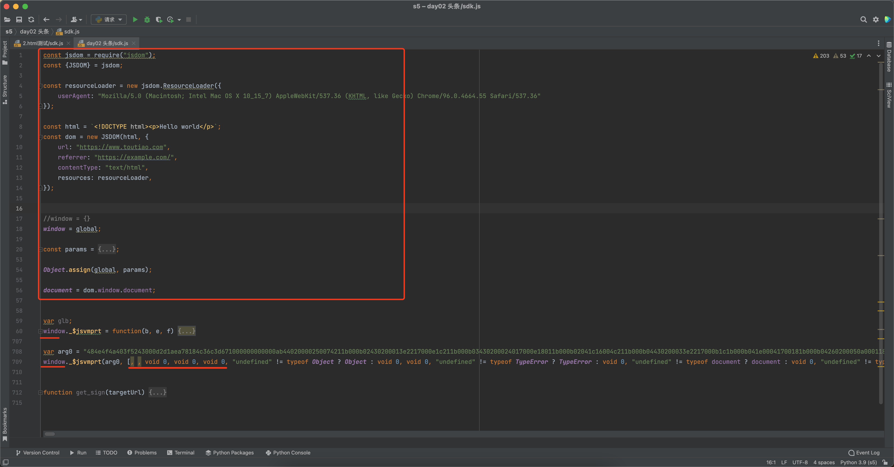

# day02 头条

今日目标：获取头条新闻资讯


## 1.前端必备

### 1.1 基础

- 三元运算

  ```javascript
  v1 = 条件 ? 值A : 值B;
  
  res = 1 === 1 ? 99 : 88;
  console.log(res);  // 99
  ```

- 赋值和比较

  ```
  v1 = 11 === (n=123)
  
  console.log(n);  // 123
  console.log(v1); // false
  ```

- 逻辑运算

  ```
  v1 = true || true
  ```

  ```javascript
  v2 = 9 || 14             # v2=9
  v3 = 0 || 15             # v3=15
  v4 = 0 || 15 || "武沛齐"  # v4=15
  
  最终结果取决那个值？结果就是那个值。
  ```


**来一波案例**

```javascript
var res = (null === (n = window.byted_acrawler) || void 0 === n || null === (a = n.sign) || void 0 === a ? void 0 : a.call(n, o)) || ""
```

```javascript
o = {"url":"...."}
n = window.byted_acrawler             -> 确定不为空
a = window.byted_acrawler.sign        -> 确定不为空
window.byted_acrawler.sign.call(n, i) -> 确定不为空

var res = window.byted_acrawler.sign.call(n, o)
```


### 1.2 函数

- 执行函数

  ```javascript
  function sign(v1){
      // this
      console.log(v1);
  }
  // 执行，函数内部 this=window
  sign(123)
  
  // 执行，函数内部 this=123
  sign.call(123,456)
  ```

  ```javascript
  // n就会传递给call函数中this
  // i当做参数传递
  var o = window.byted_acrawler.sign.call(n,i)
  var o = window.byted_acrawler.sign(i)
  ```

- 函数的参数

  ```javascript
  function sign(){
      console.log(arguments)
  }
  
  sign()
  sign(11,22,33)
  sign(11,22,44,55)
  ```


### 1.3 其他

```javascript
v1 = { k1: 123 }
v2 = { k2:99, k3:888}

Object.assign(v1, v2)

console.log(v1) # {k1: 123, k2:99, k3:888 }
```

属性从一个或多个源对象复制到目标对象，返回修改后的对象。。


## 2.编译js代码


### 2.1 node.js编译代码

环境准备：node.js

- v1.js

  ```javascript
  function func(arg) {
      return arg + 'i666';
  }
  let data = func("老铁");
  console.log(data)
  ```

- node编译执行 ``
  

- python执行执行本地命令：`node v1.js`

  ```python
  import os
  import subprocess
  
  # 根据自己的操作系统去修改（相当于python的sys.path，加载安装的模块）
  # 这不是你的node安装路径，是第三方包安装路径，输入：npm root -g
  os.environ["NODE_PATH"] = "/usr/local/lib/node_modules/"  
  
  signature = subprocess.getoutput('node v1.js')
  ```

  


### 2.2 pyexecjs编译代码

本质还是调用node.js去编译代码。

准备环境：

- node.js

- pyexecjs模块

  ```
  pip install pyexecjs
  ```

例如：

- v2.js

  ```javascript
  function func(arg) {
      return arg + '666';
  }
  ```

- 执行js代码

  ```python
  import execjs
  import os
  
  os.environ["NODE_PATH"] = "/usr/local/lib/node_modules/"
  with open('v2.js', mode='r', encoding='utf-8') as f:
      js = f.read()
  
  JS = execjs.compile(js)
  
  sign = JS.call("func", "微信")
  print(sign) # 微信666
  ```


本质上都是依赖node.js

- 电脑上安装上node.js之后（编译器，相当于装CPython解释器）
- 自动安装npm（第三方包管理器，相当于pip）


### 2.3 浏览器环境

环境准备：

- node.js

- jsdom（通过后端node+js代码实现伪造浏览器环境）

  ```
  npm install node-gyp@latest sudo npm explore -g npm -- npm i node-gyp@latest
  ```

  ```
  npm install jsdom -g
  ```

  注意：上述安装成功后已可以模拟浏览器环境，由于今天的头条他的内容。

  ```
  npm install canvas -g
  ```

如果执行出现错误，请去官方网站下载并安装最新的稳定版的node即可。


#### 2.3.1 方式1

```javascript
const jsdom = require("jsdom");
const {JSDOM} = jsdom;

const resourceLoader = new jsdom.ResourceLoader({
    userAgent: "Mozilla/5.0 (Macintosh; Intel Mac OS X 10_15_7) AppleWebKit/537.36 (KHTML, like Gecko) Chrome/96.0.4664.55 Safari/537.36",
});

const html = `<!DOCTYPE html><p>Hello world</p>`;


const dom = new JSDOM(html, {
    url: "https://www.toutiao.com",
    referrer: "https://example.com/",
    contentType: "text/html",
    resources: resourceLoader,
});

console.log(dom.window.location)
console.log(dom.window.navigator.userAgent)
console.log(dom.window.document.referrer)
```


```python
import os
import subprocess

# 根据自己的操作系统去修改（相当于python的sys.path，加载安装的模块）
os.environ["NODE_PATH"] = "/usr/local/lib/node_modules/"  

res = subprocess.getoutput('node v10.js')
```


#### 2.3.2 方式2

```javascript
const jsdom = require("jsdom");
const {JSDOM} = jsdom;

const resourceLoader = new jsdom.ResourceLoader({
    userAgent: "Mozilla/5.0 (Macintosh; Intel Mac OS X 10_15_7) AppleWebKit/537.36 (KHTML, like Gecko) Chrome/96.0.4664.55 Safari/537.36"
});

const html = `<!DOCTYPE html><p>Hello world</p>`;
const dom = new JSDOM(html, {
    url: "https://www.toutiao.com",
    referrer: "https://example.com/",
    contentType: "text/html",
    resources: resourceLoader,
});


//window = {}
window = global;

const params = {
    location: {
        hash: "",
        host: "www.toutiao.com",
        hostname: "www.toutiao.com",
        href: "https://www.toutiao.com",
        origin: "https://www.toutiao.com",
        pathname: "/",
        port: "",
        protocol: "https:",
        search: "",
    },
    navigator: {
        appCodeName: "Mozilla",
        appName: "Netscape",
        appVersion: "5.0 (Macintosh; Intel Mac OS X 10_15_7) AppleWebKit/537.36 (KHTML, like Gecko) Chrome/93.0.4577.82 Safari/537.36",
        cookieEnabled: true,
        deviceMemory: 8,
        doNotTrack: null,
        hardwareConcurrency: 4,
        language: "zh-CN",
        languages: ["zh-CN", "zh"],
        maxTouchPoints: 0,
        onLine: true,
        platform: "MacIntel",
        product: "Gecko",
        productSub: "20030107",
        userAgent: "Mozilla/5.0 (Macintosh; Intel Mac OS X 10_15_7) AppleWebKit/537.36 (KHTML, like Gecko) Chrome/93.0.4577.82 Safari/537.36",
        vendor: "Google Inc.",
        vendorSub: "",
        webdriver: false
    }
};

Object.assign(global,params);


//在下面如果你使用
location.href
navigator.appCodeName
window.location.href
window.appCodeName
```


注意：在nodejs中默认代码中会有一个global的关键字（全局变量）。

```javascript
v1 = 123;
console.log(global);
```

```
global.v1 = 123
global.v2 = 123
global.navigator = {
	...
}
console.log(v1,v2);

navigator.userAgent
```


## 3.头条

### 3.1 分析请求


直接发送获取到结果：

```python
import requests

res = requests.get(
    url="https://www.toutiao.com/api/pc/list/feed?channel_id=3189398972&max_behot_time=1665400339&category=pc_profile_channel&client_extra_params=%7B%22short_video_item%22:%22filter%22%7D&aid=24&app_name=toutiao_web&_signature=_02B4Z6wo00901LMh3wwAAIDBTW2jPNzAFVCzBduAAE-R9dWiH5xo8Vte2P5kSfKL9SfFXPMr8fy7VLwosSD0nMdO8oA09Ff5YXpsHW7ud8qXZ1rMi.dLFE96OVn.7.VRpZxQVIsr1JfoxSyj69",
    headers={
        "user-agent": "Mozilla/5.0 (Macintosh; Intel Mac OS X 10_15_7) AppleWebKit/537.36 (KHTML, like Gecko) Chrome/93.0.4577.82 Safari/537.36"
    }
)

print(res.text)
```


### 3.2 _signature


```
a=undefined;
o = {url:"https://www.toutiao.com/api/pc/list/feed?channel_id=3189398999&max_behot_time=1665377792&category=pc_profile_channel&client_extra_params=%7B%22short_video_item%22:%22filter%22%7D&aid=24&app_name=toutiao_web"}
return window.byted_acrawler.sign.call(a,o);
```

```javascript
o = {url:"https://www.toutiao.com/api/pc/list/feed?channel_id=3189398957&max_behot_time=1642685645&category=pc_profile_channel&aid=24&app_name=toutiao_web"}
var 结果 = window.byted_acrawler.sign(o);
```


接下来如果继续搞：

- 找到sign算法，看看他是内部实现（走不通）。
- 应该有一个js，给全局变量中赋值，整体调用试试。
  

### 3.3 html页面


```python
import requests

res = requests.get(
    url="https://www.toutiao.com/api/pc/list/feed?offset=0&channel_id=94349549395&max_behot_time=0&category=pc_profile_channel&disable_raw_data=true&aid=24&app_name=toutiao_web&_signature=_02B4Z6wo00f01xmaO5QAAIDC59ZHpg3lCqsZsj8AAKUv2b",
    headers={
        "user-agent": "Mozilla/5.0 (Macintosh; Intel Mac OS X 10_15_7) AppleWebKit/537.36 (KHTML, like Gecko) Chrome/93.0.4577.82 Safari/537.36"
    }
)

print(res.text)
```


### 3.4 补环境




#### 3.4.1 示例1


```python
import os
import execjs
import requests

os.environ["NODE_PATH"] = "/usr/local/lib/node_modules/"
with open('sdk.js', mode='r', encoding='utf-8') as f:
    js = f.read()
JS = execjs.compile(js)
min_behot_time = 1664884732
url = "https://www.toutiao.com/api/pc/list/feed?channel_id=3189398999&max_behot_time={}&category=pc_profile_channel&client_extra_params=%7B%22short_video_item%22:%22filter%22%7D&aid=24&app_name=toutiao_web".format(
    min_behot_time)

signature = JS.call("get_sign", url)
final_url = f"{url}&_signature={signature}"

res = requests.get(
    url=final_url,
    headers={
        "user-agent": "Mozilla/5.0 (Macintosh; Intel Mac OS X 10_15_7) AppleWebKit/537.36 (KHTML, like Gecko) Chrome/93.0.4577.82 Safari/537.36",
        # "referer": "https://www.toutiao.com/?wid=1664893444672"
    }
)
print(res.text)
```


#### 3.4.2 示例2


```python
import time

import requests
import execjs
import os

os.environ["NODE_PATH"] = "/usr/local/lib/node_modules/"
with open('sdk.js', mode='r', encoding='utf-8') as f:
    js = f.read()
JS = execjs.compile(js)

min_behot_time = 1664884732
cookie_dict = {}
while True:
    print(min_behot_time)
    url = "https://www.toutiao.com/api/pc/list/feed?channel_id=3189398999&max_behot_time={}&category=pc_profile_channel&client_extra_params=%7B%22short_video_item%22:%22filter%22%7D&aid=24&app_name=toutiao_web".format(
        min_behot_time)

    signature = JS.call("get_sign", url)
    final_url = f"{url}&_signature={signature}"

    res = requests.get(
        url=final_url,
        headers={
            "user-agent": "Mozilla/5.0 (Macintosh; Intel Mac OS X 10_15_7) AppleWebKit/537.36 (KHTML, like Gecko) Chrome/93.0.4577.82 Safari/537.36",
            # "referer": "https://www.toutiao.com/?wid=1664893444672"
        },
        cookies=cookie_dict
    )

    # print(res.text)
    cookie_dict.update(res.cookies.get_dict())
    data_dict = res.json()
    print(data_dict['has_more'])
    for item in data_dict['data']:
        print(item['behot_time'], item['title'][0:10])
        min_behot_time = item['behot_time']
    res.close()

    time.sleep(5)
```


