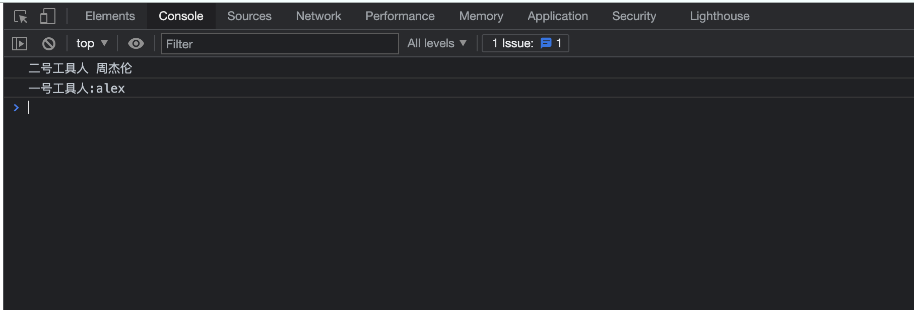

# Javascript进阶


## 一. 变量提升(不正常现象)

看以下代码, 或多或少会有些问题的.

```js
function fn(){
    console.log(name);
    var name = '大马猴';
}
fn()
```

发现问题了么. 这么写代码, 在其他语言里. 绝对是不允许的. 但是在js里. 不但允许, 还能执行. 为什么呢?  因为在js执行的时候. 它会首先检测你的代码.  发现在代码中会有name使用. OK. 运行时就会变成这样的逻辑:

```js
function fn(){
    var name;
    console.log(name);
    name = '大马猴';
}
fn()
console.log(a);
```

看到了么. 实际运行的时候和我们写代码的顺序可能会不一样....这种把变量提前到代码块第一部分运行的逻辑被称为变量提升. 这在其他语言里是绝对没有的. 并且也不是什么好事情. 正常的逻辑不应该是这样的. 那么怎么办?  在新的ES6中. 就明确了, 这样使用变量是不完善的. es6提出. 用let来声明变量. 就不会出现该问题了. 

```js
function fn(){
    console.log(name);  // 直接报错, let变量不可以变量提升.
    let name = '大马猴'; 
}
fn()
```

==结论一, 用let声明变量是新版本javascript提倡的一种声明变量的方案.== 

let还有哪些作用呢?  

```js
function fn(){
    // console.log(name);  // 直接报错, let变量不可以变量提升.
    // let name = '大马猴';
    var name = "周杰伦";
    var name = "王力宏";
    console.log(name);
}
fn()
```

显然一个变量被声明了两次. 这样也是不合理的. var本意是声明变量. 同一个东西. 被声明两次. 所以ES6规定. let声明的变量. 在同一个作用域内. 只能声明一次. 

```js
function fn(){
    // console.log(name);  // 直接报错, let变量不可以变量提升.
    // let name = '大马猴';
    let name = "周杰伦";
    console.log(name);
    let name = "王力宏";
    console.log(name);
}
fn()
```

注意, 报错是发生在代码检查阶段. 所以. 上述代码根本就执行不了. 

==结论二, 在同一个作用域内. let声明的变量只能声明一次. 其他使用上和var没有差别==


## 二. 闭包函数

我们先看一段代码. 

```js
let name = "周杰伦";
function chi(){
    name = "吃掉";
}
chi();
console.log(name);
```

发现没有, 在函数内部想要修改外部的变量是十分容易的一件事. 尤其是全局变量. 这是非常危险的.  试想, 我写了一个函数. 要用到name, 结果被别人写的某个函数给修改掉了. 多难受. 

接下来. 我们来看一个案例:  

我准备两个工具人. 来编写代码. 分别是js01和js02. 

```js
// 1号工具人.
var name = "alex"

setTimeout(function(){
    console.log("一号工具人:"+name) // 一号工具人还以为是alex呢, 但是该变量是不安全的.
}, 5000);

```

```js
// 2号工具人
var name = "周杰伦"
console.log("二号工具人", name);
```

html:

```html
<script src="js01.js"></script>
<script src="js02.js"></script>
```

此时运行的结果:


很明显,  虽然各自js在编写时是分开的. 但是在运行时, 是在同一个空间内执行的. 他们拥有相同的作用域. 此时的变量势必是非常非常不安全的. 那么如何来解决呢?  注意, 在js里. 变量是有作用域的. 也就是说一个变量的声明和使用是有范围的. 不是无限的. 这一点, 很容易验证.

```js
function fn(){
    let love = "爱呀"
}
fn()
console.log(love)
```

直接就报错了.  也就是说. 在js里是有全局和局部的概念的. 

直接声明在最外层的变量就是全局变量. 所有函数, 所有代码块都可以共享的. 但是反过来就不是了. 在函数内和代码块内声明的变量. 尤其是函数内. 声明出来的变量它是一个局部变量. 外界是无法进行访问的. 我们就可以利用这一点来给每个工具人创建一个局部空间. 就像这样:

```js
// 1号工具人.
(function(){
    var name = "alex";
    setTimeout(function(){
        console.log("一号工具人:"+name) // 一号工具人还以为是alex呢, 但是该变量是不安全的.
    }, 5000);
})()
```

```js
// 二号工具人
(function(){
    var name = "周杰伦"
    console.log("二号工具人", name);
})()
```

运行结果



这样虽然解决了变量的冲突问题. 但是...我们想想. 如果在外面需要函数内部的一些东西来帮我进行相关操作怎么办...比如, 一号工具人要提供一个功能(加密). 外界要调用. 怎么办?  

```js
// 1号工具人.
let jiami = (function(){

    let key = "10086" // 假装我是秘钥
    // 我是一个加密函数
    let mi = function(data){  // 数据
        console.log("接下来, 我要加密了,rsa哦. 很厉害的")
        console.log("秘钥:"+key);
        console.log("数据:"+data);
        // 返回密文
        return "我要返回密文";
    }
    // 外面需要用到这个功能啊. 你得把这个东东返回啊. 返回加密函数
    return mi;
})();

```

好像有点儿复杂了哈. 别着急. 注意了. 我们如果封装一个加密js包的时候. 好像还得准备出解密的功能. 并且, 不可能一个js包就一个功能吧..那也太痛苦了(起名字). 那怎么办?  我们可以返回一个对象. 对象里面可以存放好多个功能. 而一些不希望外界触碰的功能. 就可以很好的保护起来. 

```js
// 1号工具人.
let jiami = (function(){

    let key = "10086" // 加装我是秘钥
    // 我是一个加密函数
    let rsa_jiami = function(data){  // 数据
        console.log("接下来, 我要加密了,rsa哦. 很厉害的")
        console.log("秘钥:"+key);
        console.log("数据:"+data);
        // 返回密文
        return "我要返回密文";
    }
	// 该函数只属于该模块内部. 外界无法访问.
    let n = {
        abc:function(){
            console.log("我是abc. 你叫我干什么?")
        }
    }

    // 外面需要用到的功能.进行返回.
    return {
        rsa_jiami: function(data){
            console.log("接下来, 我要加密了,rsa哦. 很厉害的")
            console.log("秘钥:"+this.get_rsa_key() + key);
            n.abc();
            console.log("数据:"+data);
            return "我要返回密文";
        },
        aes_jiami: function(data){
            console.log("接下来, 我要加密了,aes哦. 很厉害的")
            console.log("秘钥:"+this.get_aes_key());
            n.abc();
            console.log("秘钥:"+key);
            console.log("数据:"+data);
            return "我要返回密文";
        },
        get_rsa_key: function() {
            return this.rsa_key = "rsa的key", this.rsa_key
        },
        get_aes_key: function() {
            return this.rsa_key = "aes的key", this.rsa_key
        }
    }
})();

```

html里面使用时:

```html
<script>
    miwen = jiami.rsa_jiami("吃你的糖葫芦吧");
    console.log(miwen);
</script>
```

OK. 至此. 何为闭包? 上面这个就是闭包. 相信你百度一下就会知道. 什么内层函数使用外层函数变量. 什么让一个变量常驻内存.等等. 其实你细看. 它之所以称之为闭包~. 它是一个封闭的环境. 在内部. 自己和自己玩儿. 避免了对该模块内部的冲击和改动. 避免的变量之间的冲突问题. 

闭包的特点:

1. 内层函数对外层函数变量的使用. 
2. 会让变量常驻与内存. 

这俩玩意就不解释了. 和python的闭包是一个意思. 不懂没关系. 能看懂他的执行过程就好. 


## 三. JS中的各种操作(非交互)

### 3.1 定时器

在JS中, 有两种设置定时器的方案

```js
// 语法规则
t = setTimeout(函数, 时间)
// 经过xxx时间后, 执行xxx函数

// 5秒后打印我爱你
t = setTimeout(function(){
    console.log("我爱你")
}, 5);

window.clearTimeout(t)  // 停止一个定时器
```

```js
//语法规则
t = setInterval(函数, 时间)
// 每隔 xxx时间, 执行一次xxx函数

// 每隔5秒钟, 打印`我爱你`
t = setInterval(function(){
    console.log("我爱你")
}, 5000)

window.clearInterval(t)  // 停止一个定时器

for(let i = 0; i <= 9999; i++)window.clearInterval(i); // 清理掉所有定时器
```


### 3.2 关于时间

http://www.baidu.com/s?word=jfdsaf&\_t=1640090719637

```js
var d = new Date(); // 获取系统时间
var d = new Date("2018-12-01 15:32:48"); // 得到一个具体时间

// 时间格式化
year = d.getFullYear();  // 拿到年份
month = d.getMonth() + 1; // 拿到月份. 注意月份从0开始
date = d.getDate();   // 拿到日期
hour = d.getHours();   // 拿到小时
minute = d.getMinutes();  // 分钟
seconds = d.getSeconds();  //秒

format_date = year + "-" + month + "-" + date + " " + hour + ":" + minute + ":" + seconds;
```

```js
d.getTime()  // 时间戳. 表示从1970-1-1 00:00:00 到现在一共经过了多少毫秒
```


### 3.3 eval函数(必须会. 隔壁村老太太都会.)

eval本身在js里面正常情况下使用的并不多. 但是很多网站会利用eval的特性来完成反爬操作. 我们来看看eval是个什么鬼?  

从功能上讲, eval非常简单. 它和python里面的eval是一样的. 它可以动态的把字符串当成js代码进行运行. 

```js
s = "console.log('我爱你')";
eval(s);
```

也就是说. eval里面传递的应该是即将要执行的代码(字符串). 那么在页面中如果看到了eval加密该如何是好?  其实只要记住了一个事儿. 它里面不论多复杂. 一定是个字符串. 

比如, 

```js
eval(function(p,a,c,k,e,d){e=function(c){return(c<a?'':e(parseInt(c/a)))+((c=c%a)>35?String.fromCharCode(c+29):c.toString(36))};if(!''.replace(/^/,String)){while(c--)d[e(c)]=k[c]||e(c);k=[function(e){return d[e]}];e=function(){return'\\w+'};c=1};while(c--)if(k[c])p=p.replace(new RegExp('\\b'+e(c)+'\\b','g'),k[c]);return p}('0.1(\'我爱你\')',62,2,'console|log'.split('|'),0,{}))
```

这一坨看起来, 肯定很不爽. 怎么变成我们看着很舒服的样子呢?  记住. eval()里面是字符串. 记住~!!

那我想看看这个字符串长什么样?  就把eval()里面的东西拷贝出来. 执行一下. 最终一定会得到一个字符串. 要不然eval()执行不了的. 对不...于是就有了下面的操作.


http://tools.jb51.net/password/evalencode, 在赠送你一个在线JS处理eval的网站. 大多数的eval加密. 都可以搞定了. 


### 3.4 prototype是个什么鬼 

prototype是js里面给类增加功能扩展的一种模式. 

写个面向对象来看看. 

```js
function People(name, age){
    this.name = name;
    this.age = age;
    this.run = function(){
        console.log(this.name+"在跑")
    }
}

p1 = new People("张三", 18);
p2 = new People("李四", 19);

p1.run();
p2.run();
```

我现在代码写完了. 突然之间, 我感觉好像少了个功能. 人不应该就一个功能. 光会吃是不够的. 还得能够ooxx. 怎么办?  直接改代码?  可以. 但不够好. 如果这个类不是我写的呢? 随便改别人代码是很不礼貌的. 也很容易出错. 怎么办?  我们可以在我们自己代码中对某个类型动态增加功能. 此时就用到了prototype. 

```js

function People(name, age){
    this.name = name;
    this.age = age;
    this.run = function(){
        console.log(this.name+"在跑")
    }
}

// 通过prototype可以给People增加功能
People.prototype.xxoo = function(){
    console.log(this.name+"还可以xxoo");
}

p1 = new People("张三", 18);
p2 = new People("李四", 19);

p1.run();
p2.run();

p1.xxoo();
p2.xxoo();
```


能看到一些效果了是吧. 也就是说. 可以通过prototype给我们的对象增加一些功能. 

接下来. 聊几个重要的概念. 

1. 构造器

   构造一个对象的函数. 叫构造器. 

   ```js
   function People(){  //这个东西就是构造器 constractor
       
   }
   
   var p = new People(); // 调用构造器
   p.constractor == People; // true
   ```

   

2. 原型对象

   每一个js对象中. 都有一个隐藏属性`__proto__`指向该对象的`原型对象`. 在执行该对象的方法或者查找属性时. 首先, 对象自己是否存在该属性或者方法. 如果存在, 就执行自己的. 如果自己不存在. 就去找`原型对象`. 

   ```js
   function Friend(){
       this.chi = function(){
           console.log("我的朋友在吃");
       }
   }
   Friend.prototype.chi = function(){
       console.log("我的原型在吃")
   }
   
   f = new Friend();
   f.chi(); // 此时. 该对象中. 有chi这个方法.  同时, 它的原型对象上, 也有chi这个方法.
   // 运行结果:
   // 我的朋友在吃
   ```

3. `prototype`和`__proto__`有什么关系?

   在js中. 构造器的prototype属性和对象的`__proto__`是一个东西.  都是指向这个`原型对象`. 

   ```js
   f.__proto__ === Friend.prototype   // true
   ```

4. 原型链

   这个比较绕了. 我们从前面的学习中, 了解到. 每个对象身体里. 都隐藏着`__proto__`也就是它的`原型对象`. 那么我们看哈, `原型对象`也是`对象`啊, 那么也就是说. `原型对象`也有`__proto__`属性. 

   类似于.....这样:

   ```js
   f.__proto__.__proto__
   ```

   打印出来的效果是这样的:

   

   此时. 又出现一堆看不懂的玩意. 这些玩意是什么?  这些其实是Object的原型. 

   ```js
   f.__proto__.__proto__ === Object.prototype
   ```

   所以, 我们在执行`f.toString()`的时候不会报错. 反而可以正常运行. 原因就在这里. 

   执行过程:  先找`f对象`中是否有`toString`. 没有, 找它的`原型对象`.`原型对象`中没有, 继续找`原型对象的原型对象`. 直至你找到Object的原型为止. 如果还是没有. 就报错了. 

   ```js
   f.hahahahahahah()  // 报错. 
   ```

   综上, `原型链是js 方法查找的路径指示标`.  

5. 我们用原型链能做什么?(每日一恶心)

   我们来看一段神奇的代码. 

   ```js
   (function(){debugger})();
   ```

   这样一段代码可以看到. 浏览器进入了debugger断点. 

   那么这段代码的背后是什么呢?  注意. 在js代码执行时. 每一个function的对象都是通过Function()来创建的. 也就是说. 函数是Function()的对象. 

   ```js
   function fn(){}
   console.log(fn.__proto__.constructor); // ƒ Function() { [native code] }
   ```

   函数就是Function的对象. 那么. 我们可以通过Function来构建一个函数. 

   ```js
   new Function('debugger')();
   ```

   跑起来的效果一样的. 

   OK. 这东西对我们来说有什么用.  上代码

   ```html
   <!DOCTYPE html>
   <html lang="en">
   <head>
       <meta charset="UTF-8">
       <title>Title</title>
       <script src="haha.js"></script>
     <script>
       txsdefwsw();
     </script>
   </head>
   <body>
       有内鬼. 终止交易
   </body>
   </html>
   ```

   haha.js  中的内容如下: 

   ```js
   function txsdefwsw() {
       var r = "V", n = "5", e = "8";
   
       function o(r) {
           if (!r) return "";
           for (var t = "", n = 44106, e = 0; e < r.length; e++) {
               var o = r.charCodeAt(e) ^ n;
               n = n * e % 256 + 2333, t += String.fromCharCode(o)
           }
           return t
       }
   
       try {
           var a = ["r", o("갯"), "g", o("갭"), function (t) {
               if (!t) return "";
               for (var o = "", a = r + n + e + "7", c = 45860, f = 0; f < t.length; f++) {
                   var i = t.charCodeAt(f);
                   c = (c + 1) % a.length, i ^= a.charCodeAt(c), o += String.fromCharCode(i)
               }
               return o
           }("@"), "b", "e", "d"].reverse().join("");
           !function c(r) {
               (1 !== ("" + r / r).length || 0 === r) && function () {
               }.constructor(a)(), c(++r)
           }(0)
       } catch (a) {
           setTimeout(txsdefwsw, 100);
       }
   }
   ```

   页面跑起来没什么问题. 但是会无限debugger; 

   解决方案:

    1. 找到断点出. 右键-> never pause here;

    2. 写js hook代码;

       ```js
       var xxxx = Function.prototype.constructor;
       Function.prototype.constructor = function(code){
           console.log("i love you");
           if (code != 'debugger'){
               return new xxxx(code);
           } else {
               return;
           }
       }
       ```

       更加详细的hook. 下节课会讲. 

   

### 3.5 神奇的window

window对象是一个很神奇的东西. 你可以把这东西理解成javascript的全局. 如果我们默认不用任何东西访问一个标识符. 那么默认认为是在用window对象. 

例如: 

```js
eval === window.eval    // true
setInterval === window.setInterval  // true
var a = 10; 
a === window.a  // true
function fn(){}
fn === window.fn  // true

window.mm = "爱你"

console.log(mm); //"爱你"
```

综上,  我们可以得出一个结论. 全局变量可以用window.xxx来表示. 

ok. 接下来. 注意看了. 我要搞事情了

```js
(function(){
    let chi = function(){
        console.log("我是吃")
    }
    window.chi = chi
})();

chi()

//换一种写法. 你还认识么?
(function(w){
    let chi = function(){
        console.log("我是吃")
    }
    w.chi = chi
})(window);


//再复杂一点
(function(w){
    let tools = {
        b64: function(){
            console.log("我是计算B64");
            return "b64";
        },
        md5: function(){
            console.log("我是计算MD5");
            return "MD5"
        }
    }
    w.jiami = {
        AES: function(msg){
            return tools.b64(),
                tools.md5(),
                'god like';
        },
        DES: function(){
            console.log("我是DES");
        },
        RSA: function(){
            console.log("我是RSA");
        }
    }
})(window);

jiami.AES("吃了么");
```

window是整个浏览器的全局作用域. 


### 3.6 call和apply

对于咱们逆向工程师而言. 并不需要深入的理解call和apply的本质作用. 只需要知道这玩意执行起来的逻辑顺序是什么即可

在运行时. 正常的js调用:

```js
function People(name, age){
    this.name = name;
    this.age = age;
    this.chi = function(){
        console.log(this.name, "在吃东西")
    }
}
p1 = new People("alex", 18);
p2 = new People("wusir", 20);
p1.chi();
p2.chi();
```

接下来, 我们可以使用call和apply也完成同样的函数调用

```js
function People(name, age){
    this.name = name;
    this.age = age;
    this.chi = function(what_1, what_2){
        console.log(this.name, "在吃", what_1, what_2);
    }
}
p1 = new People("alex", 18);
p2 = new People("wusir", 20);
p1.chi("馒头", "大饼");
p2.chi("大米饭", "金坷垃");

function eat(what_1, what_2){
    console.log(this.name, "在吃", what_1, what_2);
}

// call的语法是: 函数.call(对象, 参数1, 参数2, 参数3....)
// 执行逻辑是: 执行函数. 并把对象传递给函数中的this.  其他参数照常传递给函数
eat.call(p1, "查克拉", "元宇宙");
```

apply和他几乎一模一样. 区别是: apply传递参数要求是一个数组

```js
eat.apply(p1, ["苞米茬子", "大饼子"]);
```


### 3.7 ES6中的箭头函数

在ES6中简化了函数的声明语法. 

```js
var fn = function(){};
var fn = () => {};

var fn = function(name){}
var fn = name => {}
var fn = (name) => {}

var fn = function(name, age){}
var fn = (name, age) => {}
```


### 3.8 ES6中的promise(难)

具体执行过程和推理过程. 请看视频. 这里很饶腾. 

```js
function send(url){
    return new Promise(function(resolve, reject){
        console.log("我要发送ajax了", url)
        setTimeout(function(){
            console.log("我发送ajax回来了")
            // 成功了, 要去处理返回值
            resolve("数据", url);
        }, 3000);
    });
}

send("www.baidu.com").then(function(data){
    console.log("我要处理数据了啊", data);
    return send("www.google.com");
}).then(function(data, url){
    console.log("我又来处理数据了", data);
});
```

具体执行过程和推理过程. 请看视频. 这里很饶腾. 


### 3.9 逗号运算符

```js
function s(){
    console.log(1), console.log(2), console.log(3);  // 从前向后执行 ,1,2,3
    let s = (1, 2, 3); // 整体进行赋值的时候. 取的是最后一个值 3
    console.log(s);
    // 注意. 这个括号可以在返回值时省略
    var a;
    return a=10,
    a++,
    a+=100,
    {name:"alex", "a":a};
}
let r = s();
console.log(r);  // {name: 'alex', a: 111}
```


### 3.10 三元运算符(折磨.....)

```js
let a = 10;
let b = 20;
let d = a > b? a: b
console.log(d);


看一个恶心的:
let a = 10;
let b = 20;
let c = 5;
let d = 17;

let e;
let m;

e = (e = a > 3 ? b : c, m = e < b++ ? c-- : a = 3 > b % d ? 27: 37, m++)
console.log(e);
console.log(c);
console.log(m);

```

### 3.11 JS hook

hook又称钩子. 可以在调用系统函数之前, 先执行我们的函数.  例如, hook eval

```js
eval_ = eval; // 先保存系统的eval函数
eval = function(s){
    console.log(s);
    debugger;
    return eval_(s);
}
eval()
eval.toString = function(){return 'function eval() { [native code] }'}  // 可能会被检测到, 用这种方案来进行
```


对Function的hook, 主要为了解决无限debugger

```js
fnc_ = Function.prototype.constructor;
Function.prototype.constructor = function(){
    if(arguments[0]==='debugger'){
        return;
    } else {
        return fnc_.apply(this, arguments);
    }
}
```


上面都是hook的系统函数. 但有时, 我们需要hook某个属性. 此时应该怎么办? 

```js
var v;
Object.defineProperty(document, "cookie", {
    set: function(val) {
        console.log("有人来存cookie了");
    	v = val;
        debugger;
        return val;
    },
    get() {
        console.log("有人提取cookie了");
        debugger;
        return v;
    }
});

```

剩下的咱就不再赘述了.  在逆向时, 常用的主要有: hook eval 、hook Function 、hook JSON.stringify、JSON.parse 、hook cookie、hook window对象


## 四. JS和HTML交互(选修)

在HTML中可以直接在标签上给出一些事件的触发. 例如, 页面上的一个按钮

```html
<input type="button" value="点我就爱你"/>
```

我们能够知道此时在页面中会产生一个按钮.  但是该按钮无论如何进行点击. 都不会触发任何事件. 但, 此时我要告诉你, 人家其实触发了. 只是你没处理而已. 在我们点击该按钮的时候. 浏览器其实收集到了点击事件. 但是由于我们没有给出任何`发生了点击事件应该做什么`的事情. 所以也就没有了反应. 我们可以通过`onclick`属性. 来给点击事件添加上具体要做什么

```html
<input type='button' value="点我就爱你" onclick="fn()" />
```

看到了吧. 多了个`onclick`, 其含义是, 当发生点击事件时. 去执行fn(). fn() 是什么? fn就是我们javascript的一个函数. 

完整代码

```html
<!DOCTYPE html>
<html lang="en">
<head>
    <meta charset="UTF-8">
    <title>Title</title>
    <script>
        function fn(){
            alert("臭不要脸")
        }
    </script>
</head>
<body>
    <input type="button" value="点我就爱你" onclick="fn()">
</body>
</html>
```


有效果了. 发现了么. 至此, 我们成功的实现了. 从HTML中调用JS的这条路打通了. 

那么在HTML中有多少种事件可以触发呢? 非常多....多到令人发指. 我们就记住几个就好了
html中的事件

```js
click		点击事件
focus		获取焦点
blur		失去焦点
submit		提交表单
change		更换选项
scroll		滚动条滚动
mouseover	鼠标滑过
mouseout	鼠标滑出
mousemove	鼠标滑动
```

上述是第一种绑定事件的方案. 可以直接在html标签中使用onxxx系列属性来完成事件的绑定. 同时js还提供了以下事件绑定方案:

```html
<input type="button" id="btn" value="别点我了">
    
<script>
    // 注意, 必须等到页面加载完毕了. 才可以这样
    document.querySelector("#btn").addEventListener("click", function(){
        console.log("你点我干什么?? ")
    })
</script>
```

document.querySelector() 给出一个css选择器, 就可以得到一个html页面上标签元素的句柄(控制该标签). 

获取句柄的方案有好多. 常见的有:

```js
document.getElementById();  // 根据id的值获取句柄
document.getElementsByClassName(); // 根据class的值获取句柄

// <form name='myform'><input type="myusername"/></form>
document.form的name.表单元素的name;  //  document.myform.myusername;
```


那么, 我们现在相当于可以从html转到JS中了. 并且在js中可以捕获到html中的内容了. 此时, 对应的表单验证也可以完成了. 

```html
<form action="服务器地址" id="login_form">
    <label for="username">用户名:</label><input type="text" name="username" id="username"><span id="username_info"></span><br/>
    <label for="password">密码:</label><input type="text" name="password" id="password"><span id="password_info"></span><br/>
    <input type="button" id="btn" value="点我登录">
</form>
```

``` html
<script>
    // 在页面加载的时候
    window.onload = function(){
        document.getElementById('btn').addEventListener("click", function(){

            // 清空提示信息
            document.getElementById('username_info').innerText = ""; 
            document.getElementById('password_info').innerText = "";

            let username = document.getElementById('username').value;  // 获取username标签中的value属性
            let password = document.getElementById('password').value;  // 获取密码
            let flag = true;  // 最终是否可以提交表单?
            if(!username){
                document.getElementById('username_info').innerText = "用户名不能为空";
                flag = false;
            }

            if(!password){
                document.getElementById('password_info').innerText = "密码不能为空";
                flag = false;
            }

            if (flag){
                document.getElementById('login_form').submit();
            }
        })
    }
</script>
```

发现了么. 不经意间, 我们通过js可以改变html中的内容了. 

