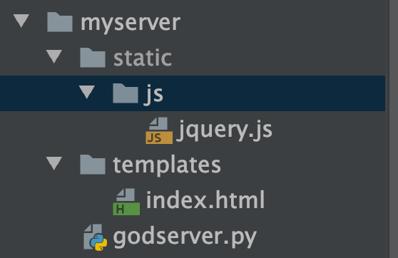

# jQuery和Ajax

jQuery是一个曾经火遍大江南北的一个Javascript的第三方库. jQuery的理念: write less do more.  其含义就是让前端程序员从繁琐的js代码中解脱出来. 我们来看看是否真的能解脱出来. 

python  => 基础语法 => 系统模块 => 第三方的库

关于jQuery的版本: 这里有必要说一下, jQuery一共提出过3个大版本. 分别是1.x, 2.x和3.x. 这里注意, 虽然目前最新的是3.x. 但各个公司都不约而同的选择了1.x. 说明jQuery1.x在编程界的地位是非常非常高的. 而且从其执行效率, 代码兼容性以及代码可靠性上讲. 1.x确实做到了极致. 所以, 我们学习的版本自然也是1.x了. 我们选择和腾讯课堂同一个版本. 1.9.1 

jQuery的下载, 推荐直接去cdn下载即可. 他本质就是一个js文件. 去哪儿都一样. 

字节cdn:  https://cdn.bytedance.com/

jquery:  https://cdn.bytedance.com/?query=jquery&version=1.9.1

只需要把上面这个jquery下载的网址复制到浏览器上, 然后保存(ctrl+s)成js文件就可以了.

## 一. jQuery初使用

我们用jQuery来完成一个按钮的基本点击效果. 当然, 得和传统的js对比一下

先准备好html. 页面结构. 这里复制粘贴就好

```html
<!DOCTYPE html>
<html lang="en">
<head>
    <meta charset="UTF-8">
    <title>Title</title>
    <style>
        .div-out{
            width: 400px;
            height: content-box;
            margin: 0 auto;
            padding: 0;

        }
        .mydiv{
            width: 400px;
            height: 200px;
            line-height: 200px;
            text-align: center;
            background: pink;
            margin:0;
            padding: 0;
            font-size: 18px;
        }
        .btn{
            width: 400px;
            height: 50px;
            padding: 0;
            border: none;
            margin: 0;
            box-sizing: content-box;
            font-size: 18px;
            color: #000;

            background: #999999;
        }
        .btn:hover{
            cursor: pointer;
            color: pink;
        }
        .btn:active{
            color: #666;
            background-color: #eee;
        }
    </style>
</head>
<body>
    <div class="div-out">
        <input type="button" class="btn" value="我是按钮. 你怕不怕">
        <div class="mydiv">我怕死了...</div>
    </div>
</body>
</html>
```


需求: 点击按钮. 更改mydiv中的内容. 

```js
// 传统js
// 版本1
window.addEventListener('load', function(){
    document.getElementsByClassName("btn")[0].addEventListener('click', function(){
        document.getElementsByClassName('mydiv')[0].innerText = "真的不怕啊";
    });
})

// 版本2
window.onload = function(){
    document.querySelector(".btn").onclick = function(){
        document.querySelector('.mydiv').innerText = "我好啪啪啊";
    };
}
```

```js
// jQuery
$(function(){  // $(document).ready(function(){
    $(".btn").click(function(){
        $(".mydiv").text('我要上天');
    })
})
```

除了`$`外, 其他东西貌似都挺容易理解的.  而且代码简洁. 异常舒爽. 

`$`是什么鬼, 在jQuery中, `$`可以认为是jQuery最明显的一个标志了. `$()`可以把一个普通的js对象转化成jQuery对象. 并且在jquery中 \$的含义就是jQuery. 


## 二. jQuery选择器

jQuery的逻辑和css选择器的逻辑是一样的. 

```js
// 语法:
$(选择器)
```

可以使用jQuery选择器快速的对页面结构进行操作. 

案例:

```html
<!DOCTYPE html>
<html lang="en">
<head>
    <meta charset="UTF-8">
    <title>Title</title>
    <script src="jquery.min.js"></script>
    <script>

        $(function(){
            $(".btn").on('click', function(){
                $(".info").text("");
                let username = $("#username").val();
                let password = $("#password").val();
                let gender = $("input:radio[name='gender']:checked").val();  // input标签中radio 并且name是gender的. 并且被选择的.
                let city = $("#city").val();

                let flag = true;
                if(!username){
                    $("#username_info").text('用户名不能为空!');
                    flag = false;
                }

                if(!password){
                    $("#password_info").text('密码不能为空!');
                    flag = false;
                }

                if(!gender){
                    $("#gender_info").text('请选择性别!');
                    flag = false;
                }

                if(!city){
                    $("#city_info").text('请选择城市!');
                    flag = false;
                }

                if(flag){
                    $("#login_form").submit();
                } else {
                    return;
                }
            })
        })

    </script>
</head>
<body>
    <form id="login_form">
        <label for="username">用户名: </label><input type="text" id="username" name="username"><span class="info" id="username_info"></span><br/>
        <label for="password">密码: </label><input type="password" id="password" name="password"><span class="info" id="password_info"></span><br/>
        <label>性别: </label>
            <input type="radio" id="gender_men" name="gender" value="men"><label for="gender_men">男</label>
            <input type="radio" id="gender_women" name="gender" value="women"><label for="gender_women">女</label>
            <span class="info" id="gender_info"></span>
        <br/>

        <label for="city">城市: </label>
            <select id="city" name="city">
                <option value="">请选择</option>
                <option value="bj">北京</option>
                <option value="sh">上海</option>
                <option value="gz">广州</option>
                <option value="sz">深圳</option>
            </select>
            <span class="info" id="city_info"></span>
        <br/>

        <input type="button" class="btn" value="登录">
    </form>
</body>
</html>
```


## 三. 属性控制

属性相关的控制主要有以下几个功能

```js
val()  => 处理value属性
text()  => 处理innerText
html()  => 处理innerHTML

attr()  => 处理所有属性的
css()  => 处理所有css样式的
```

一起看吧. 简单的很

```html
<!DOCTYPE html>
<html lang="en">
<head>
    <meta charset="UTF-8">
    <title>Title</title>
    <script src="jquery.min.js"></script>
    <script>
        $(function(){
            // 如果给参数, 就是设置值, 如果没参数, 就是获取值
            $("#text_1").val("我是谁?");
            console.log($("#text_1").val());
            // attr() 如果给一个参数. 就是获取值. 如果给2个参数就是设置属性值
            $("#text_2").attr("type", "button").val("god");
            console.log($("#text_2").attr("type"));
            // css() 如果一个参数, 取值, 如果2个参数, 设置值
            $("#mydiv").css("background", "#eee");
            console.log($("#mydiv").css("background"))
            
            // text()和html()很像. 
            console.log($("#mydiv_2").text())  // 拿到纯文本
            console.log($("#mydiv_2").html())  // 拿到html标签
            // 如果传参. 则text(xxx)把xxx作为文本放入标签内.  
            //          则html(xxx)把xxx作为html放入标签.
        })
    </script>
</head>
<body>
    <input type="text" name="" id="text_1">
    <input type="text" name="" id="text_2">
    <div id="mydiv" style="width: 200px;height:100px; background:pink;"></div>
    <div id="mydiv_2" >
        <span>哈哈</span>
        <span>呵呵</span>
    </div>
</body>
</html>
```


## 四. 遍历器

如果jquery一次性选择了很多元素节点. 而我们又希望能拿到每一个元素中的相关信息. 此时可以考虑用jQuery的遍历器来完成对元素的循环遍历 

例, 

```html
<!DOCTYPE html>
<html lang="en">
<head>
    <meta charset="UTF-8">
    <title>Title</title>
    <script src="jquery.min.js"></script>
    <script>
        $(function(){
            // 此时确实能拿到所有li的内容, 但是我想一个一个拿. 分别处理
            // li_text = $('li').text();
            // console.log(li_text);

            // 分别处理
            $('li').each(function(i, el){
                console.log(i);
                //console.log(el.text()); // 注意, 遍历器拿到的东西是JS的DOM对象, 并不是jquery对象
                console.log($(el).text()); // 此时el和this是同一个东西.
                console.log($(this).text());
            })
        })

    </script>
</head>
<body>
    <ul>
        <li>吃饭</li>
        <li>睡觉</li>
        <li>打豆豆</li>
        <li>吹牛</li>
    </ul>
</body>
</html>
```


## 五. 发送ajax请求(扩展, 延伸) 21.30继续

首先, 我们用Flask创建一个后台服务器(自己做网站了哈)

目录结构:



服务端

```python
from flask import Flask, render_template, request  # pip install Flask


app = Flask(__name__)


@app.route("/")
def index():
    # 跳转到首页
    print("你曾经来过服务器")
    name = "alex"
    # 数据是在这里渲染后, 返回个客户端的html
    return render_template("index.html", name=name)  


if __name__ == '__main__':
    app.run()
```

html

```html
<!DOCTYPE html>
<html lang="en">
<head>
    <meta charset="UTF-8">
    <title>Title</title>
    <script src="/static/js/jquery.js"></script>
</head>
<body>
    我就是一个传统的html页面, 我的名字是{{name}}
</body>
```


### 5.1 发送get请求

接下来. 我们使用jquery来发送ajax. 

```html
<!DOCTYPE html>
<html lang="en">
<head>
    <meta charset="UTF-8">
    <title>Title</title>
    <script src="/static/js/jquery.js"></script>
    <script>
        function setCookie(name, value) {
            let Days = 30;
            let exp = new Date();
            exp.setTime(exp.getTime() + Days * 24 * 60 * 60 * 1000);
            document.cookie = name + "=" + escape(value) + ";expires=" + exp.toGMTString();
        }
        $(function(){
            // 可以在js任意位置设置cookie信息
            setCookie("name", "i-have-a-dream")
            $(".get_btn").click(function(){
                $.ajax({
                    url:"/ajax_get", // 服务器地址: 域名+url
                    method:'get',  // 发送get请求
                    headers:{  // 添加请求头信息
                        "token":"mememmememe",
                    },
                    data:{   // 传递参数
                        name:'alex',
                        _: new Date().getTime()
                    },
                    contentType:'application/json;charset=utf8',  
                    beforeSend: function(req){  // 也可以这样添加请求头信息
                        req.setRequestHeader("tokken", "i-can-do-it-haha");
                    },
                    success: function(back){  // 请求成功后. 返回数据了. 要做什么?
                        console.log(back);
                    }
                });
            })
        })
    </script>
</head>
<body>
    我就是一个传统的html页面, 我的名字是{{name}}
    <br/>
    <input type="button" class="get_btn" value="点我发送get_请求">
    <hr/>
    <a href="javascript:void(0);" class="post_btn" >点我发送post_请求</a>
</body>
</html>

```

服务器处理ajax_get请求

```python
@app.route("/ajax_get")
def ajax_get_req():
    # 接收cookie中的信息
    n = request.cookies.get('name')
    if not n:
        return "没有cookie就不要来了."
    # 接收header中的信息
    token = request.headers.get('token')
    if not token:
        return "没token还想来?"

    # Flask接收get请求的参数
    name = request.args.get('name')
    _ = request.args.get('_')
    if name and _:
        # 返回json
        return {"name":'alex', "id": 10086, "isMen": True}
    else:
        return "回家去吧"

```


### 5.2 发送post请求(json)

```html
<!DOCTYPE html>
<html lang="en">
<head>
    <meta charset="UTF-8">
    <title>Title</title>
    <script src="/static/js/jquery.js"></script>
    <style>
        #mask{
            position:fixed;
            top:0;
            left:0;
            right:0;
            bottom: 0;
            background-color: rgba(0,0,0, .3);
            color: #fff;
            font-size:30px;
            text-align: center;
            padding-top:300px;
            display:none;
        }

    </style>
    <script>
        $(function(){
            $(".post_btn").click(function(){
                $('#mask').css("display","block");
                $("#data_tbody").remove();
                $.ajax({
                    url:'/ajax_post',
                    method:'post',
                    data: JSON.stringify({
                        name:'alex',
                        id:'10086'
                    }),
                    headers: {  // 发送json数据. 要换这个头, 否则服务器收不到数据
                        "Content-Type": "application/json;charset=utf-8"
                    },
                    dataType:"text",
                    success:function(d){
                        $('#mask').css("display","none"); // 设置不遮罩
                        let data = JSON.parse(d);
                        let tbody = $("<tbody id='data_tbody'></tbody>")
                        data.forEach(function(item){
                            let tr = `<tr><td>${item.id}</td><td>${item.name}</td><td>${item.age}</td></tr>`;
                            tbody.append(tr);
                        });
                        $('table').append(tbody);
                    }
                })
            });
        })
    </script>
</head>
<body>
    我就是一个传统的html页面, 我的名字是{{name}}
    <br/>
    <input type="button" class="get_btn" value="点我发送get_请求">
    <hr/>
    <a href="javascript:void(0);" class="post_btn" >点我发送post_请求_加载一个表格试试</a>
    <hr/>
    <table width="80%" border="1">
        <thead>
        <tr>
            <td>id</td>
            <td>name</td>
            <td>age</td>
        </tr>
        </thead>

    </table>
    <div id="mask"><span>正在加载中......</span></div>
</body>
</html>
```

python服务器:

```python
from flask import Flask, render_template, request  # pip install Flask
import time
import json

app = Flask(__name__)

@app.route("/")
def index():
    # 跳转到首页
    print("你曾经来过服务器")
    name = "alex"
    return render_template("index.html", name=name)  # 数据是在这里渲染后, 返回个客户端的html


@app.route("/ajax_post", methods=['POST'])
def ajax_get_post():

    # time.sleep(3)
    # 接收JSON数据
    print(request.json)

    lst = [
        {"id": 1, "name": "张飞", "age": 16},
        {"id": 2, "name": "孙斌", "age": 16},
        {"id": 3, "name": "樵夫", "age": 16},
        {"id": 4, "name": "大佬", "age": 16},
    ]

    return json.dumps(lst)

if __name__ == '__main__':
    app.run()
```

