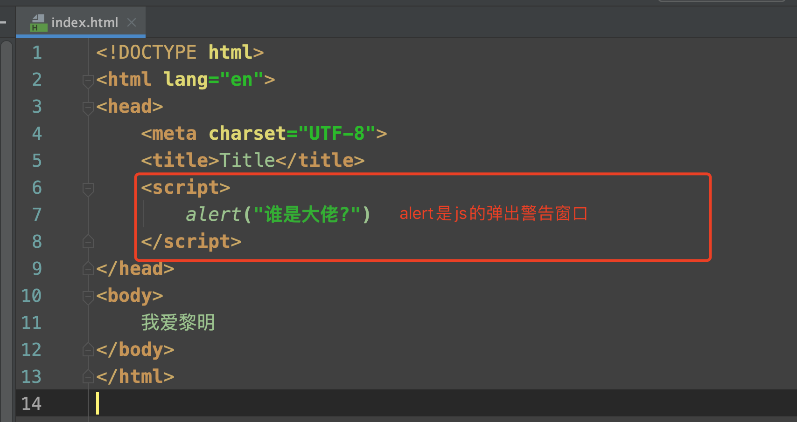
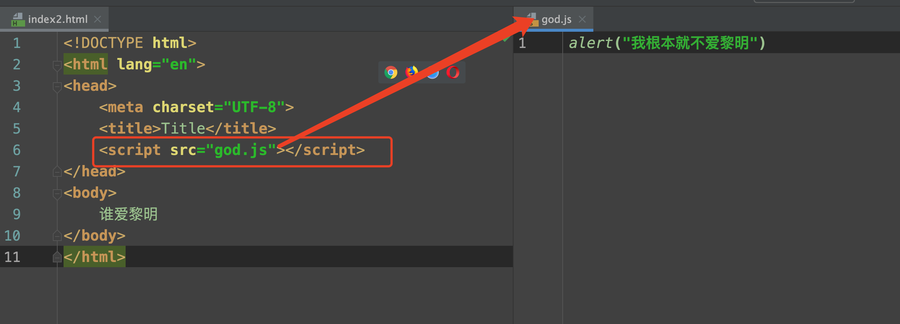
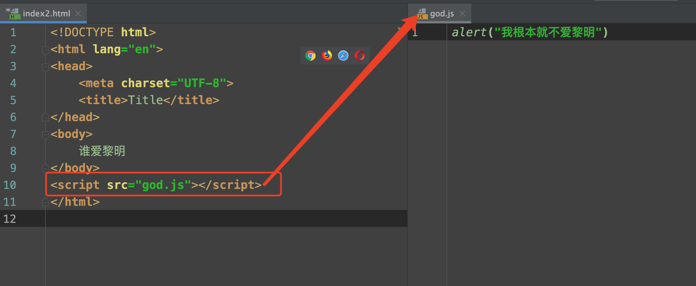
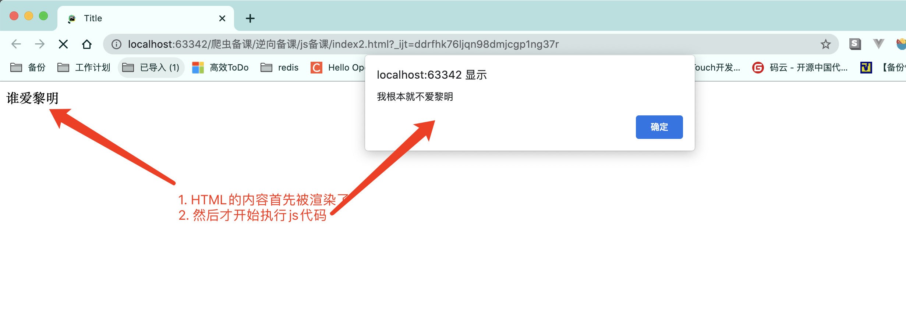

# Javascript基础入门


​		JavaScript, 是一门能够运行在浏览器上的脚本语言. 简称JS. 首先, Javascript这个名字的由来就很有意思, 不少人认为Javascript和Java貌似很像. 容易想象成Java的脚本. 但其实不然, 两者之间没有任何关系. 纯粹是商业碰瓷.

​		那么既然JS是可以运行在浏览器上的脚本. 并且, 我们知道本质上, 浏览器是执行HTML程序的. 那么如何在HTML中引入JS呢?

​		方案一, 直接在<script>标签中引入编写js代码

​		

​		方案二, 将js代码写在js文件中, 然后通过script标签的src属性进行引入



两种方式运行出的效果是一致的.  但是需要各位注意一点, HTML程序在执行的时候是从上到下进行渲染的. 

那么如果我把脚本放在下面和放在上面是有一些不同的. 






## 一. Javascript基本数据类型

JS虽然是一个脚本语言. 麻雀虽小, 五脏俱全. 在js中也是可以像其他编程语言一样. 声明变量, 条件判断, 流程控制等等. 我们先看一下JS中的数据类型

在js中主要有这么几种数据类型(基本)

```javascript
number  数字, 不论是整数还是小数, 数据类型都是number
string  字符串, 这个没啥可聊的. 就是很单纯的字符串
boolean  布尔值, 只有两个, true和false. 注意不是大写T和F. 
object 对象, 这个比较特殊. 你可以理解为所有被new出来的东西都是对象  
undefined, 这个表示未定义. 所有没有被定义过的东西默认都是该类型 类似像空一样的东西
```

在js中声明变量用var来声明

在js中使用// 来表示单行注释. 使用/* */表示多行注释. 

```js
var 变量名; // 创建变量, 此时该变量除了被赋值啥也干不了. 
var 变量名 = 值; // 创建一个变量, 并且有值. 
var 变量名 = 值1, 变量名2 = 值2, 变量名3 = 值3.....; // 一次创建多个变量.并都有值
var 变量名1, 变量名2, 变量名3 = 值3;  // 创建多个变量. 并且只有变量3有值
```


JS中的运算符和Python几乎一致. 但有些特殊的. 

and, or, not 到了js中注意,换成了&&, ||, !, 其含义和概念是一致的. 

```js
var a = 10, b = 20, c = 30 ;
console.log(a > b && b > c);  // false
console.log(!(a > b)) // 注意括号
```


== 和 ===,  

​	== 只是判断值是否一致,  
​	=== 会判断数据类型和数据是否都一致. 

```js
var a = "123";
var b = 123;
console,log(a == b);  // true
console.log(a === b); // false
```


数据类型转换:

```js
// string -> number  :  parseInt(字符串)
var a = "10086";
a = parseInt(a);  // 变成整数
console.log(a + 10); // 10096

// number -> string  : 数字.toString() 或者 数字 + ""
var a = 100;
var b = a.toString();
var c = a + "";  
console.log(b);
console.log(c);

// number -> string: 数字转化成16进制的字符串
var m = 122;
var n = m.toString(16);
console.log(n);

// 进制转换
var a = 10;
// 16进制的数字是多少
var x = a.toString(16);  // a

// AB的十进制是多少
var d = parseInt("AB", 16); // 171
```


遇见的第一个难点.....关于++

```js
// 在python中是没有++操作的. 但是在js中是有的. 
a++;  // 翻译一下就是a = a + 1 
++a;  // 翻译一下就是a = a + 1
a--;  // 翻译一下就是a = a - 1
--a;  // 翻译一下就是a = a - 1

//困扰无数初学者的疑惑, a++ 和 ++a有什么区别
// 两句话, 
//	1. 不论是a++还是++a. 目的都是让a自增1. 
//	2. 
//		a++这个表达式整体运算出来的结果是 a
//		++a这个表达式整体运算出来的结果是 a + 1

/*
	理解一下, 这里还好理解
	a = 10
	b = a++
	console.log(b)  // ?
	console.log(a)  // ?
	
	a = 10
	b = ++a
	console.log(b)  // ?
	console.log(a)  // ?
	
	难度升级, 这里非常绕. 答案就在上面那两句话上. 
	a = 10
	a = a++
	console.log(a)  // ?
	
	a = 10
	a = ++a
	console.log(a)  // ?
*/ 

```


字符串操作:

```js
s.split()  字符串切割
s.substr(start, len)  字符串切割, 从start开始切, 切len个字符
s.substring(start, end)  字符串切割, 从start切割到end
s.length  字符串长度
s.charAt(i) 第i索引位置的字符  s[i]
s.indexOf('xxx')  返回xxx的索引位置, 如果没有xxx. 则返回-1
s.lastIndexOf("xxx") 返回xxx的最后一次出现的索引位置，如果没有xxx. 则返回-1
s.toUpperCase() 转换成大写字母
s.startsWith("xxx")  判断是否以xxx开头
s.charCodeAt(i) 某个位置的字符的ascii
String.fromCharCode(ascii) 给出ascii 还原成正常字符
```


关于null和undefined. 这两个会很容易混. 你可以这样来记. null就是空对象. undefined就是空变量. 两者都可以表示空. 啥也没有. 本质其实是一样的. 都啥也干不了. 两者都可以当做false来看待就好了. 


## 二. JS条件分支

​		除了HTML以外. 几乎所有的编程语言都有条件判断的功能.  比如, python, 我们用if语句来做条件判断. 到了javascript中也是一样的, 也使用javascript来做条件上的判断. 

```js
// 语法
if(条件1){
    代码块1    
}

// 解读: 当`条件1`成立时, 执行代`码块1`中的内容, 如果`条件1`不成立. 则不执行该`代码块1`中的内容
// 注, 如果代`码块1`中的内容只有一行. 则可以省略外面的大括号(一些逆向工程里会有)
```


```js
// 语法
if(条件1){
    代码块1
} else {
    代码块2
}
// 解读: 当`条件1`成立时, 执行`代码块1`中的内容, 如果`条件1`不成立. 则执行`代码块2`中的内容
```


```js
// 语法
if(条件1){
    代码块1
} else if(条件2) {
    代码块2
} else if(条件3) {
    代码块3
} ... {
	代码块n
} else {
    代码块else
}
// 解读: 当`条件1`成立时, 执行`代码块1`中的内容, 如果`条件2`不成立. 则执行`代码块2`中的内容...如果都不成立, 最终执行`代码块else`中的内容. 
```


switch语句. 该语句是python中不存在的. 但是在Java和C, 以及JS中依然会有使用

```js
switch(变量){
    case 值1:
        代码块1
        break  // 可选
    case 值2:
      	代码块2
        break  // 可选
    case 值3:
        代码块3
        break  // 可选
        
    default:   // 可选
        default代码块
}

/*
	解读: 
		执行时, 
		switch会判断变量的值是否是`值1`, 
		如果是, 则执行代码块1以及代码块1中的break, 
		如果不是, 则继续判断`值2`...
		如果前面的`值`都没有和`变量`相等的.则执行`default代码块`. 
		
	注意, 
		每一个`case`中都可以选择`break`, 也可以不选择`break`, 需要注意的是, 如果不写`break`. 
		那么就会形成`case穿透`现象. 
		
	例, `变量`的值如果和`值1` 相等. 并且case1中没有写`break`, 
	则在执行的时候. 会执行完`case1`中的代码. 
	然后会自动穿透到`case2`中去执行里面的代码, 而不经过case2中的数据的验证. 

*/
```


## 三. JS中的循环语句

在js中有三种循环语句. 首先是while循环. 它的逻辑和咱们python中的while几乎一模一样, 就是符号上有些许的区别. 

```js
// 语法
while(条件){
    循环体 ->  里面可以有break和continue等关键字
}


/*
	判断`条件`是否为真, 如果`真`, 则执行`循环体`.执行完`循环体`, 会再次判断`条件`....
	并且在循环中也可以使用`break`和`continue`等关键字来控制循环的走向. 
*/
```

```js
// 语法
do{
    循环体
} while(条件);

/*
	解读:
		先执行`循环体`, 然后判断`条件`是否成立, 如果成立.在来一次. 
	注意, 由于do..while是先执行的`循环体`. 所以, 不论条件如何, 至少执行一次`循环体`
*/
```

```js
// 语法: for的第一种语法
for(表达式1; 表达式2; 表达式3){
	循环体
}
/*
	解读: 
		for循环和我们python中的循环是完全不一样的. 解读起来会有点儿麻烦. 
		首先, 在执行的时候, 先执行`表达式1`, 
		然后, 判断`表达式2`得到的结果是否真, 如果`真`, 则执行循环体, 
		再然后, 执行`表达式3`, 
		再然后, 判断`表达式2`执行的结果是否为`真`, 如果`真`, 则执行`循环体`
        再然后, 执行`表达式3`
        .....
        直到, `表达式2`得到的结果是`假`, 则跳出循环
*/
// 看起来很绕. 我们用for循环来跑一个1~99
for(var i = 1; i < 100; i++){
    console.log(i);
}
/*
	首先, i = 1, 
	然后, 判断 i < 100 成立
		打印i
	在然后, i++, i变成2
	再然后, 判断 i < 100 还是成立
		打印i
	再然后, i++, i变成3
	再然后, 判断 i< 100 还是成立
		打印3....
	....
	当i = 100了. i < 100不成立. 程序结束 
*/

// for循环的固定逻辑也就这样了
for(变量声明; 条件判断; 改变变量){
 	循环体
}

```

```js
// for的第二种用法
var a = [11,22,33,44,55,66]
for(let i in a){
    console.log(i + "_" + a[i])
}
// 这种写法非常类似python中的for循环. 但是要注意. 这里的`i`拿到的仅仅是 `数组a`的索引信息. 
// 如果需要数据 a[i]
```


## 四.JS中的数组和对象

在JS中创建数组非常简单. 直接[ ]即可. 也可以用正规军的new Array(). 不过效果都是一样的. 

```js
var as = [11,22,33,44,55];
var bs = new Array(11,22,33,44,55);
```

数组的常用操作

```js
arr.length;  // 数组长度
arr.push(data);  // 添加数据
arr.pop();  // 删除数据, 从后面删除, 并返回被删除的内容
arr.shift()  // 删除数据, 从前面删除, 并返回被删除的内容 

// arr中的每一项循环出来. 分别去调用function函数, 会自动的将`数据`传递给函数的第一个参数
arr.forEach(function(e, i){  // 第二个参数是可选的
    console.log(i+"__"+e);
});
arr.join("连接符");  // 使用`连接符`将arr中的每一项拼接起来. 和python中的 "".join()雷同
```


在JS中创建一个对象非常容易. 和python中的字典几乎一样{ }

```js
var p = {
    name: "汪峰",
    age: 18,
    wife: "章子怡",
    
    chi: function(){
        console.log("吃饭")
    }
};
```

使用对象

```js
p.name
p.age
p['wife']
p.chi()
p['chi']()
```

从上述内容中几乎可以看到. JS对象的使用几乎是没有门槛的. 十分灵活

```js
for(var n in p){
    if(typeof(p[n]) != 'function'){
        console.log(p[n])
    }
}
```


## 五. JS中的函数(重点)

​		在JS中声明函数和python差不多. 也要有一个关键字顶在前面. python是`def`, 到了JS里换成了`function`, 只不过在JS中没有像python那么死板, 必须`def`后面必须跟上函数名. 这也为我们未来做逆向提供了第一个超大的伏笔. 

```js
// 语法
// 声明函数
function 函数名(形参1, 形参2, 形参3....){
    函数体
    return 返回值
}
// 调用函数
函数名(实参1, 实参2, 实参3....)

// 除了写法换了一丢丢. 其他的东西和python完全一致,
```

简单来个案例看看

```js
function an(a, b){
    return a + b
}

ret = an(1, 2)
console.log(ret);  // 3
```

很简单不是么?  那为什么我们在网页上看到一些网站的JS是如此的复杂呢? 

注意了, JS其实没有一个非常非常严格的语法规则. 只要能够形成 xxx()  并且xxx是一个函数的话就可以执行. 

例如:

```js
var an = function(a, b){
    return a + b 
}
an(1, 2)  // an虽然是var声明的, 但是它的指向是一个函数. 那就可以执行

var $ = function(a, b){
    
}
$(1, 2) // $没有被JS使用. 我就可以用啊. _也OK


// 这个也很过分. 这个东东要拆开来看 第一个括号里面放的就是一个函数啊. 所以依然可以执行. 
(function(a, b){
    return a + b
})(1, 2)

c = (function(){
    var m = {
        name:'alex',
        age:'18',
        xijiao: function(a){
            console.log(a+"来帮我洗脚");
        }
    }
    return m
})

//  还有最后一个问题. 未来我们也会遇到的. 就是它这个return
var an = function(){
    return console.log("我爱你"), console.log("爱你妹"), "哈哈"
}
// 注意我们发现js会把return后的每一个,都执行一次. 但是最终真正的返回值其实是最后的那个"哈哈"
```
