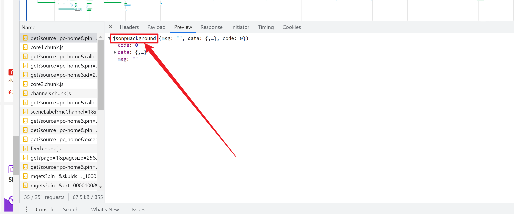
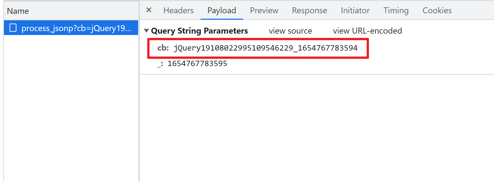
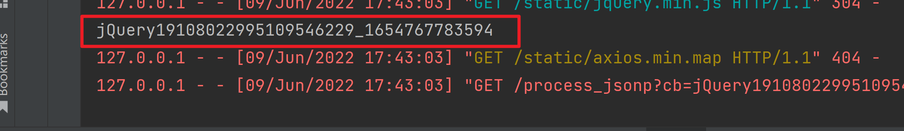
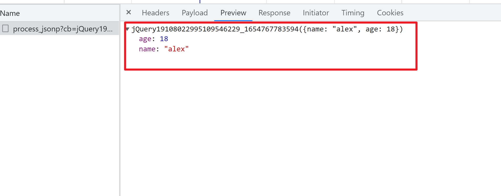
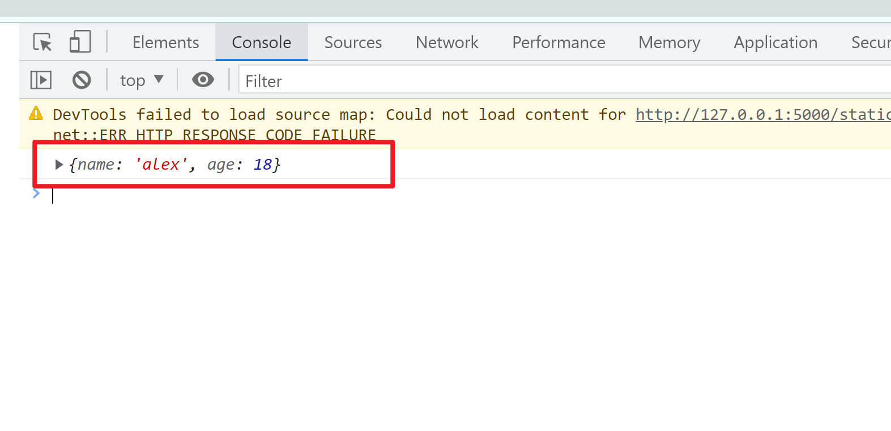
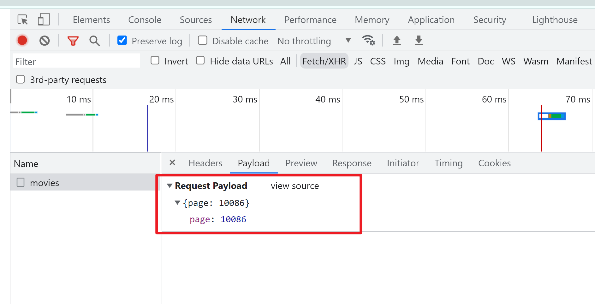

# JavaScript进阶


## 一. jsonp

为了解决浏览器跨域问题. jquery提供了jsonp请求. 

在网页端如果见到了服务器返回的数据是: 

​	xxxxxxxxxxdjsfkldasjfkldasjklfjadsklfjasdlkj({json数据})

​	在Preview里面可以像看到json一样去调试

這就是jsonp。 这东西依然是ajax.

jsonp的逻辑是. 在发送请求的时候. 带上一个callback字符串. 该字符串自动发送给服务器. 服务器返回数据的时候. 会带上该callback字符串. 我们在抓包中看到的就是这样的效果:



在Python中. 接下来, 我们还原一下该效果. 

首先, 在flask中. 必须接收到前端返回的callback, 然后在返回数据的时候. 需要用前端返回的callback字符串. 将数据包裹

```python
@app.route("/process_jsonp", methods=["GET"])
def process_jsonp():
    # 获取回调字符串
    cb = request.args.get("cb")
    print(cb)
    data = {
        "name": "alex",
        "age": 18
    }
    import json
    #      用回调字符串将真实要返回的数据包裹起来
    #      如果不包裹起來。前端ajax中的success将无法获取到数据
    return cb + "("+json.dumps(data)+")"

```

在发送ajax的时候. 需要指定dataType为jsonp, 以及自由配置回调函数的参数名

```js
$(function(){
    $.ajax({
        url: "/process_jsonp",
        method:"get",
        // 典型, 京东.
        dataType: "jsonp", // 它的执行逻辑是. 请求服务上的一个js. 然后会自动执行该js.将js函数内的东西. 丢给success
        jsonp:"cb", // 传递给服务器的时候. 自动带上cb=xxxxxx  服务器端接收cb即可
        success: function(data){ // 此时data可以直接收取到数据
            console.log(data);
        }
    });
});
```

抓包效果:



服务器处理cb时的效果:



抓包中. 看到的服务器返回的数据



success中接收到的数据效果




我们以后见到这种网站. 如何处理?

首先, 固定好callback的值. 如上述案例. 我们就可以直接给出一个固定的cb值. 如果原网站就是固定的值. 此步骤可以忽略

http://127.0.0.1:5000/process_jsonp?cb=haha&_=1654767783595

然后, 得到返回值后. 用正则. 或者字符串操作. 即可处理. 

```python
import json
s = 'haha({"name": "alex", "age": 18})'  # 得到这样一个字符串. 处理成json很容易的
s = s.strip("haha(").strip(")")
print(s)
dic = json.loads(s)
print(dic)
# 现在请思考. 为什么要让你把callback的值固定?
```


## 二. axios

​	    由于jquery有严重的地狱回调逻辑. 再加上jquery的性能逐年跟不上市场节奏. 很多前端工程师采用axios来发送ajax. 相比jquery. axios更加灵活. 且容易使用. 更加美丽的是. 这玩意是用promise搞的. 所以更加贴合大前端的项目需求.  来吧. 上手试试吧

```html
<script src="/static/axios.min.js"></script>
<script>
    window.onload = function(){
        axios.post("/movies", {"page": 10086}).then(function(resp){
            console.log(resp.data);
        })
    }
</script>
```

看到没. 这玩意比jquery简单n多倍. 而且, axios为了更加适应大前端. 它默认发送和接收的数据就是json. 所以, 我们在浏览器抓包时. 



直接就是request payload. 这对于前端工程师而言. 爽爆了. 

## 三. axios拦截器

在前端, 我们能看到有些网站会对每次请求都添加加密信息. 或者每次返回数据的时候, 都有解密逻辑. 那此时. 你思考. 不可能每次请求都要程序员去手动写加密逻辑. 例如:

```js
window.onload = function(){
    // 加密数据
    axios.post("/movies", {"page": 10086}).then(function(resp){
        明文 = 解密(resp.data);
        console.log(明文);
    })

    // 加密数据
    axios.post("/movies", {"page": 10086}).then(function(resp){
        明文 = 解密(resp.data);
        console.log(明文);
    })
}
```

这样很麻烦. 也很蛋疼.  axios想到过类似的问题. 它提供了拦截器. 一次性处理好这种问题

```js
axios.interceptors.request.use(function(config){  // 拦截所有请求
    console.log("我是拦截器. 我可以对数据进行加密");
    console.log(config)
    return config;
}, function(error){
    return Promise.reject(error);
});

axios.interceptors.response.use(function(response){  // 拦截所有响应
    console.log("我是响应回来之后拦截器. 我可以对数据进行解密")
    return response.data;  
}, function(error){
    return Promise.reject(error);
});
```

这样. 对于业务层的代码而言就简单很多了

```js
window.onload = function(){
    // 加密的逻辑拦截器帮我完成了
    axios.post("/movies", {"page": 10086}).then(function(data){
        // 解密的逻辑拦截器帮我完成了
        console.log(data);
    })
    // 加密的逻辑拦截器帮我完成了
    axios.post("/movies", {"page": 10086}).then(function(data){
        // 解密的逻辑拦截器帮我完成了
        console.log(data);
    })
}
```

